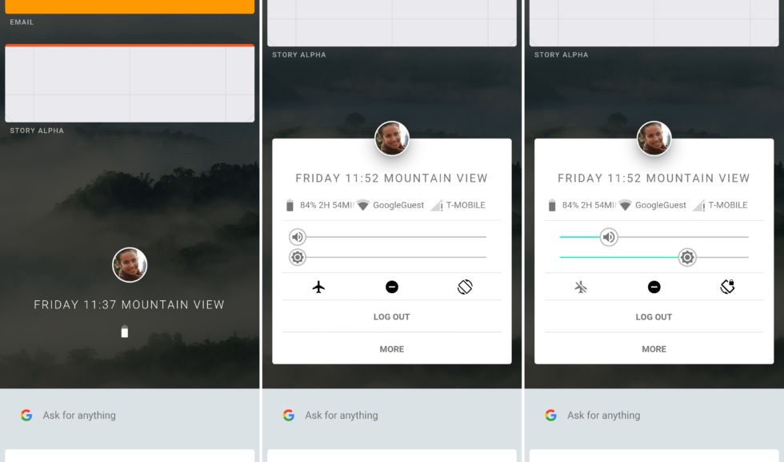
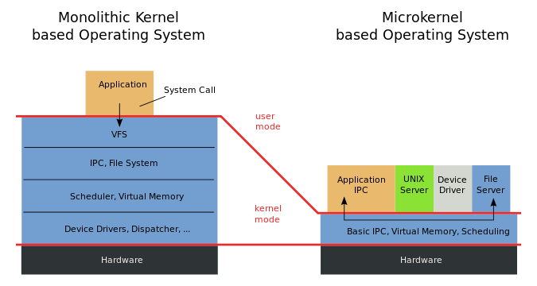
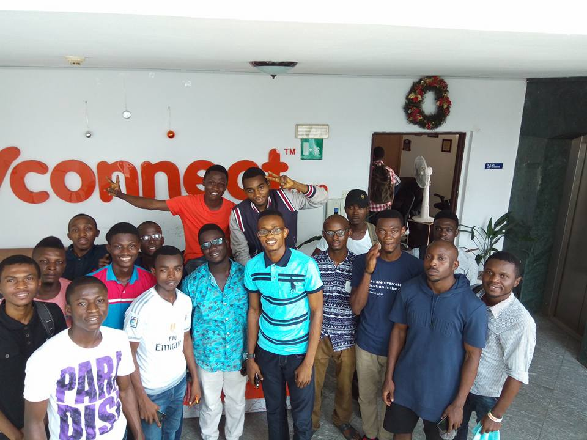

Google seems to be building a replacement for Android called [Fuchsia](https://fcc.im/2qYTsEx). Yesterday, they revealed what their new Armadillo user interface looks like (see photo above, courtesy of Ars Technica).

Here’s what we know about Fuchsia so far:

-   It’s written partially in Dart, an open source programming language developed by Google, which compiles to JavaScript
-   Unlike Chrome OS and Android, Fuchsia doesn’t use the Linux kernel. Instead, it has its own microkernel called Magenta.

You may be wondering: what the heck is a [microkernel](https://fcc.im/2qYUTTp)? It’s basically a stripped down version of a traditional kernel (the core of an operating system that controls a computer’s underlying hardware).

This image illustrates some of the tasks kernels manage that mircokernels don’t:

Google hasn’t officially said anything about the purpose of this operating system, so I’ll speculate:

-   Since Oracle’s 2010 acquisition of Sun Microsystems, the Java ecosystem (which Android is built on top of) hasn’t been as friendly to open source as it used to be. In fact, [Oracle unsuccessfully sued Google for $9 billion last year](https://fcc.im/2qof8gu) claiming Android violated Sun’s licenses. Google’s new operating system represents an opportunity for Google to stop using Java all together (and so far, none of Fuchsia’s open source code is written in Java).
-   By moving away from the Linux kernel and focusing all its energy on Magenta, Google may be able to introduce specific features it needs faster than the Linux community — with its more diverse interests — would be able to.
-   Android wasn’t designed with virtual reality or augmented reality in mind. This [seems to be where computing is heading](http://amzn.to/2mKbbNW). Starting fresh with Fuchsia will allow Google to focus on virtual reality from the beginning.

Here’s a full analysis of Fuchsia ([6 minute read](https://fcc.im/2q3xBgK))

### Here are three links worth your time:

1.  Why I left a big, prestigious law firm, learned to code, and became a product manager at a startup ([5 minute read](https://fcc.im/2qWOkzR))
2.  How to build complex user interfaces without going completely insane ([5 minute read](https://fcc.im/2qZ2CkB))
3.  How to use JavaScript’s Window object to move, open, close, and resize a browser window ([7 minute watch](https://fcc.im/2qOKwVa))

Bonus: Someone asked on Quora: “Would you hire a freeCodeCamp camper as a developer?” A manager answered that he has already hired one and plans to hire a second one ([1 minute read](https://fcc.im/2pZCuHB))

### Thought of the day:

> “We only see what we know.” — Goethe

### Funny of the day:

Webcomic by [CampComic.com](http://campcomic.com/)

### Study group of the day:

[freeCodeCamp Lagos](https://fcc.im/2qZ4Tfz)

Happy coding!

– Quincy Larson, teacher at [freeCodeCamp](http://bit.ly/2j7Q1dN)

If you get value out of these emails, please consider [supporting our nonprofit](http://bit.ly/donate-to-fcc).
