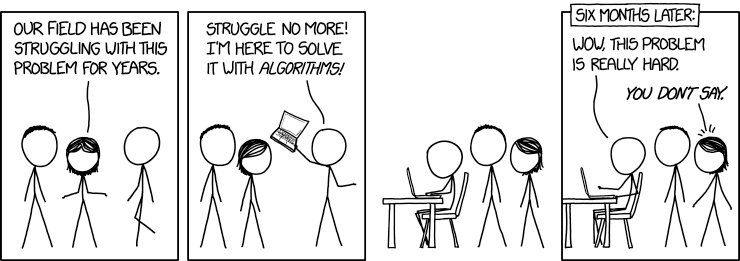
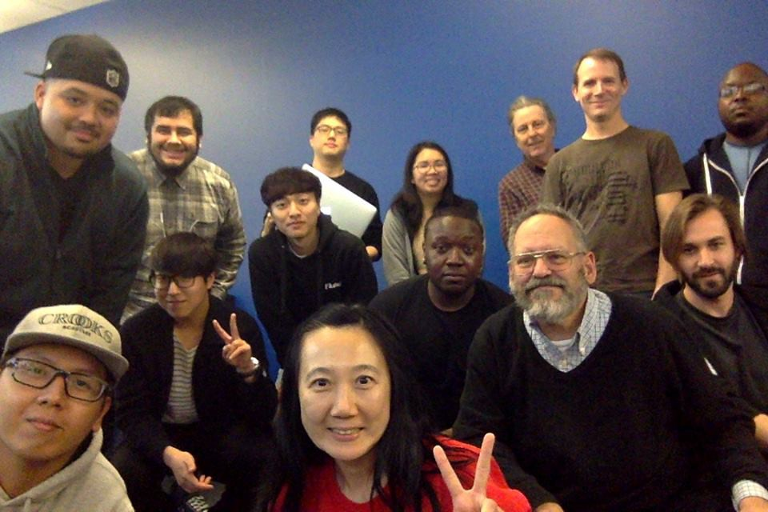

Here are three links worth your time:

1.  438 free online programming and Computer Science courses you can start in May ([browsable list](https://fcc.im/2oV2XHw))
2.  A step-by-step guide to making pure-CSS tooltips ([3 minute read](https://fcc.im/2oXNBSq))
3.  JavaScript ES6 functions: the good parts ([6 minute read](https://fcc.im/2qFte9j))

Bonus: The founder of Stack Overflow shares how he built a business around his new open source project, Discourse — even though lots of communities, including freeCodeCamp, are able to [use it for free as our forum](http://bit.ly/2eN1RH7) ([9 minute read](https://fcc.im/2pI6DLI))

### Thought of the day:

> “When a flower doesn’t bloom you fix the environment in which it grows, not the flower.” — Alexander Den Heijer

### Funny of the day:

Webcomic by [XKCD](https://fcc.im/2p5Su78).

### Study group of the day:

[freeCodeCamp Santa Clara](https://fcc.im/2qyQM0k)

Happy coding!

– Quincy Larson, teacher at [freeCodeCamp](http://bit.ly/2j7Q1dN)

If you get value out of these emails, please consider [supporting our nonprofit](http://bit.ly/donate-to-fcc).
