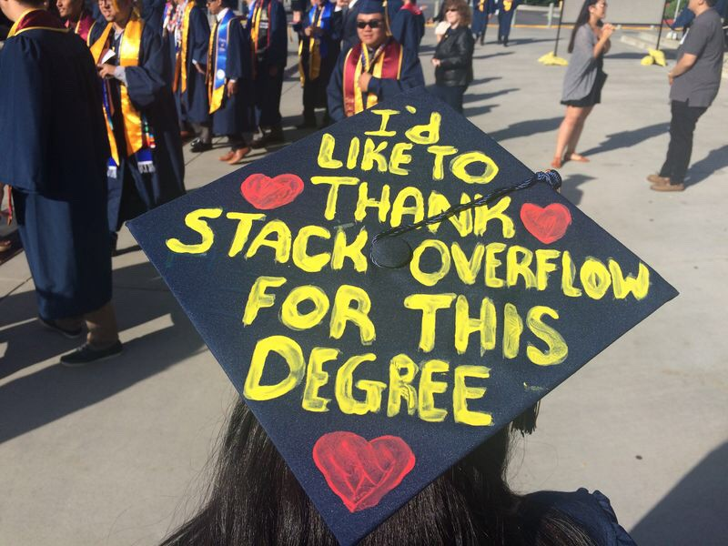
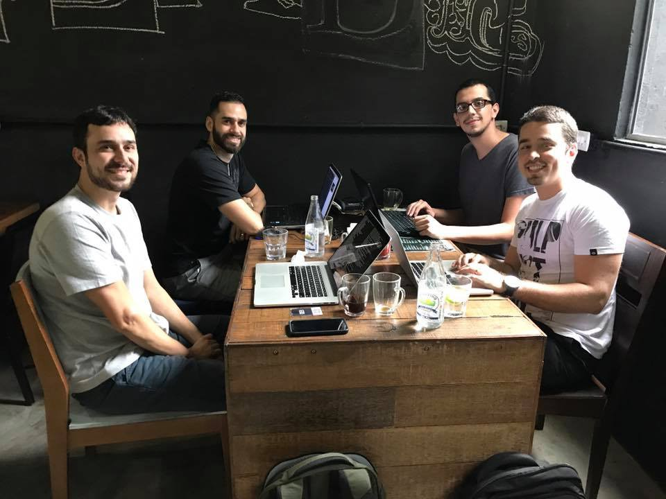

Here are three links worth your time:

1.  Here are 9 legit master’s degrees you can now earn completely online ([7 minute read](http://bit.ly/2nVP5wf))
2.  A developer’s guide to interviewing, or how to interview a company ([17 minute read](http://bit.ly/2oilhWt))
3.  How to make scavenger hunts more fun with artificial intelligence ([6 minute read](http://bit.ly/2pJXOOy))

Bonus: What would an Apple MacPad Pro actually look like? ([11 minute read](http://bit.ly/2pJX9g0))

### Thought of the day:

> “Writing in C or C++ is like running a chain saw with all the safety guards removed.” — Bob Gray

### Image of the day:

Webcomic by [Loryn Brantz](http://bit.ly/2oEG4EX)

### Study group of the day:

[freeCodeCamp Foz do Iguaçu](http://bit.ly/2oPDWMD)

Happy coding!

– Quincy Larson, teacher at [freeCodeCamp](http://bit.ly/2j7Q1dN)

If you get value out of these emails, please consider [supporting our nonprofit](http://bit.ly/donate-to-fcc).
