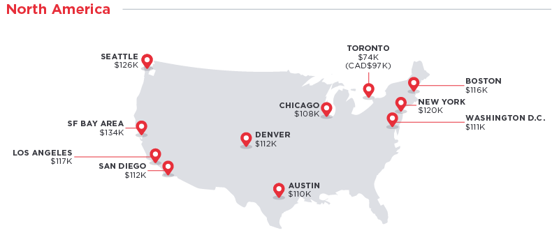
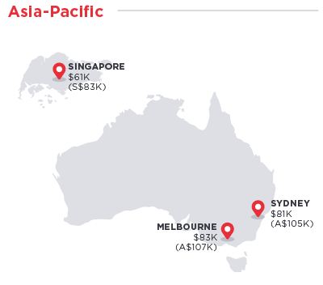
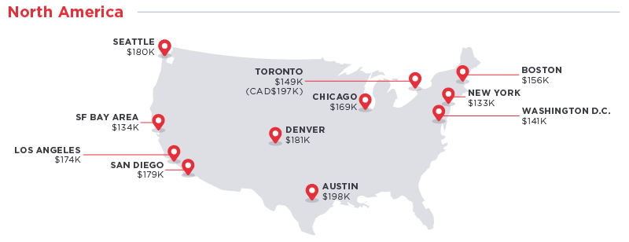
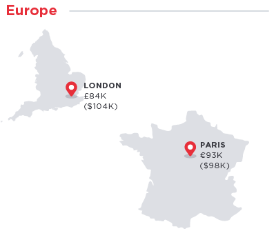
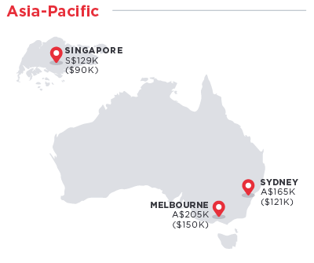

And here are those same salaries adjusted to San Francisco’s cost of living:

As you can see, cost of living is an important consideration. Also, you don’t need to move to San Francisco to get a good job as a software engineer (thought there are a lot of prestigious jobs there).

You can read the full analysis here ([5 minute read](http://hrd.cm/2kQnac1))

**I only write about programming and technology. If you** [**follow me on Twitter**](https://twitter.com/ossia) **I won’t waste your time. 👍**
