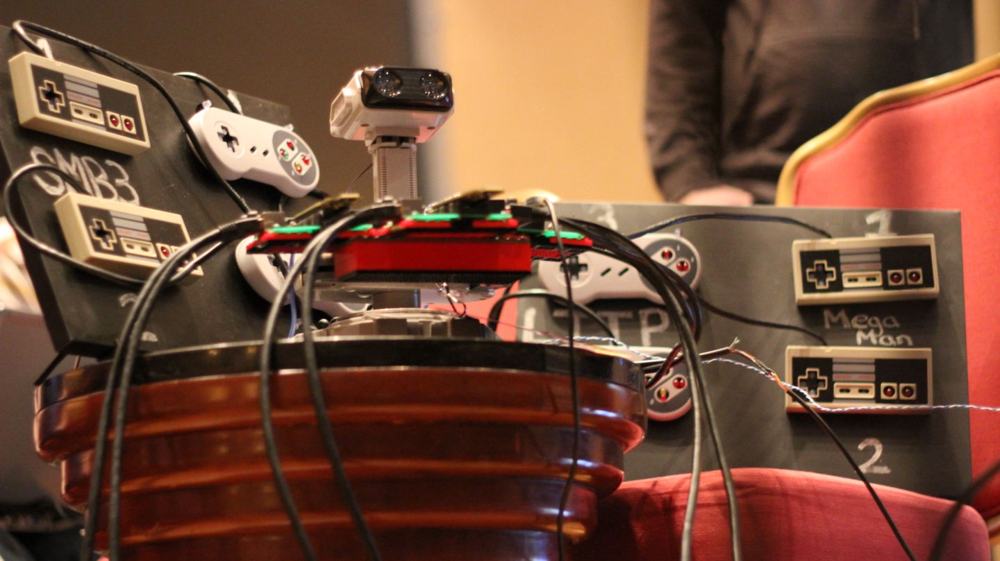
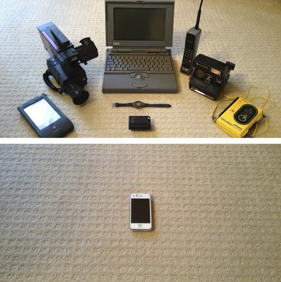

Here are three links worth your time:

1.  How a robot got Super Mario 64 and Portal “running” on an Super Nintendo from 1990 ([6 minute read](http://bit.ly/2jV5g7o))
2.  The concept of “caching” explained in 1 minute with pictures ([1 minute read](https://cachingexplained.com/))
3.  NHTSA’s full final investigation into Tesla’s Autopilot shows a 40% crash rate reduction ([1 minute read](http://tcrn.ch/2iJLYVH))

Bonus: Instead of writing about technology this week, I wrote about space. I hope you find this motivational ([2 minute read](http://bit.ly/2jV3u5V))

### Thought of the day:

> “If usability were the only design consideration, we would all be riding around on tricycles.” — Unknown

### Image of the day:

Moore’s Law over 20 years:

([Image credit](http://imgur.com/nuUGHaY))

Happy coding!

– Quincy Larson, teacher at [freeCodeCamp](http://bit.ly/2j7Q1dN)
