There are a lot of ways us editors can lead the Medium publication together. It can be a truly fluid experience. Together we can decide which submissions to publish. Then we can edit those submissions and publish them. We can even publicize them to the community through freeCodeCamp’s Facebook, Twitter, and LinkedIn accounts.

In this guide— which is just intended for my fellow freeCodeCamp editors (don’t publish it 😃) — I’m going to share some of these ideas with the hopes that you all can take a look and give me feedback on them.

### Part 1: Raising Awareness — how we can all leverage freeCodeCamp’s social media accounts to publicize our authors’ stories

The freeCodeCamp community is a bit strange in that it has thousands of volunteer contributors, and only two full-time staff: Berkeley Martinez who oversees our infrastructure and open source codebase, and myself, who oversees everything else.

And yet the freeCodeCamp community reaches millions of people each month through the Medium publication, YouTube channel, forum, and learning platform.

As a result, a lot of people follow us on social media. But these accounts have been neglected because in the past, the only person who has had access to them is me.

Just to give you a glimpse at their potential:

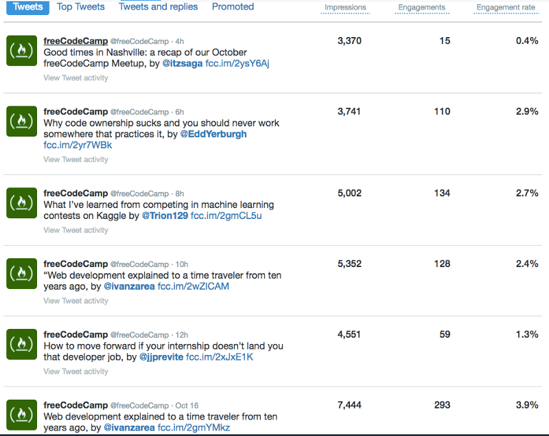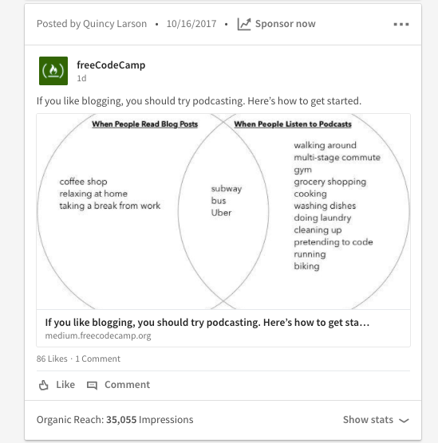

If we use these social media accounts to properly publicize Medium stories, we can help these authors get a lot more readers.

So how do I propose we do this? By using Buffer. Buffer also allows us to schedule posts to Twitter, Facebook, and LinkedIn. And it also offers some pretty cool analytics that can help us better understand our readership and what resonates with them.

And access to this single Buffer account gives us all the ability to share stories on these accounts without needing my personal Facebook or LinkedIn passwords (no offense, but I’d rather not give those out to anyone, even to you all 😅).

Here’s what Buffer’s interface looks like:

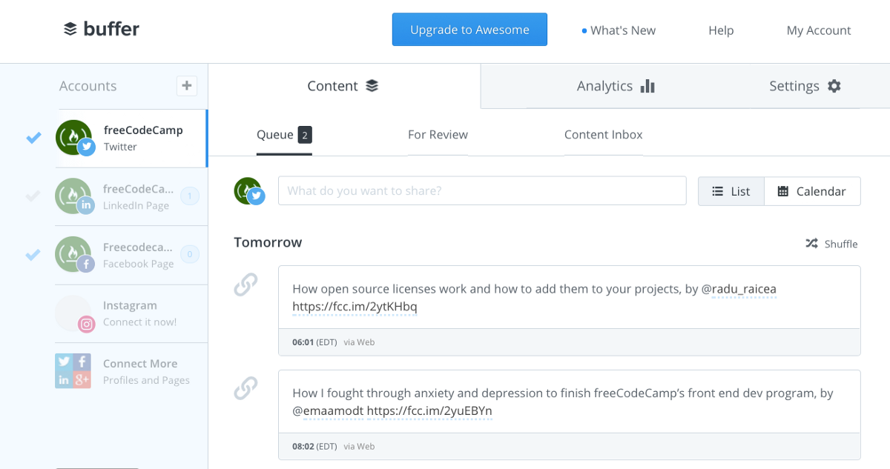

It has analytics, too:

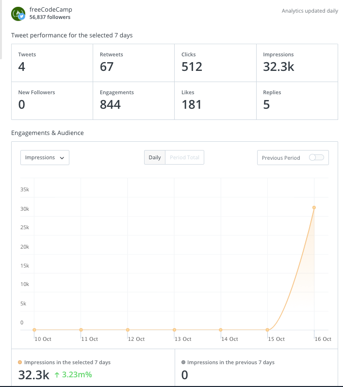

Social media is hard. Millions of marketers around the world get paid to come up with witty tweets and funny images. But our social media philosophy is different. We just give campers what they want, in a straight-forward, matter of fact way.

All of our social media posts are just sharing the headline from the story. The social media platforms do the rest.

So here’s how we publicize our authors’ stories.

#### Step #1: Publish the story

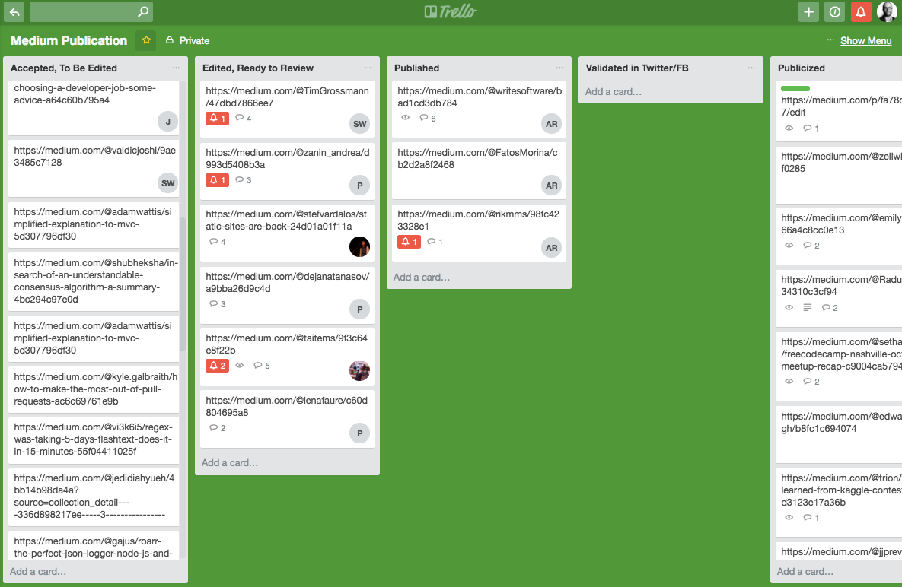

Once us editors have edited an story, we drag its card from “Accepted, To Be Edited” over to “Edited, Ready to Review.” 

Then another editor takes a look at it — especially its headlines, tags, and opening paragraphs. They make any necessary changes, then publish the story and drag its card over to the “Published” column.

#### Step #2: Get the story URL validated

Twitter and Facebook will turn Medium URLs into nice “Cards.”

Here’s what some of these look like:

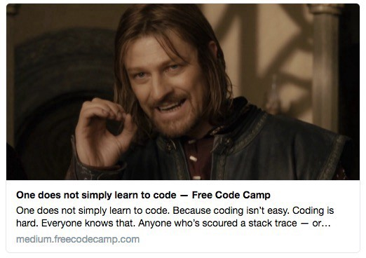

To make sure that these look right — with the right headline and the right image — you need to manually force Twitter and Facebook to re-scrape the meta data from these stories. Luckily, this is a quick process.

Note that sometimes a headline will be too long and it will be truncated with a “…” There’s not much we can do about this, other than to try to keep headlines as short as possible. Though short headlines can often be boring or unclear. I try to keep my headlines under 80 characters.

Then copy the story’s URL, then paste it into these links:

[Twitter URL validator](https://cards-dev.twitter.com/validator)

[Facebook URL validator](https://developers.facebook.com/tools/debug/)

If these cards don’t look right, Medium may just be slow with updating the story’s meta data. For example, if you change the story’s main image, it may take a few minutes for this change to propagate through Medium’s servers.

If the Headline or description look off, you should double check whether the author has manually configured the meta information:

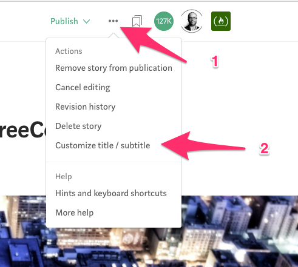

It’s OK if they did do this (some authors want special meta data so they can rank for certain Google keywords, for example). But you should copy the final headline you used and place it in their Custom title.

Then you can re-validate the card on Twitter and Facebook to make sure everything looks right.

Then you should drag the Trello card over to the “Validated in Twitter/FB” column.

#### Step #2: Publicizing the story by tweeting it on freeCodeCamp’s Twitter

You can then log into Buffer and add your story (and any other stories in “Published” column) to the freeCodeCamp Twitter buffer feed. 

You can get the tweet content by clicking on the Twitter bird symbol at the bottom of a published story, then copying the text from the popup.

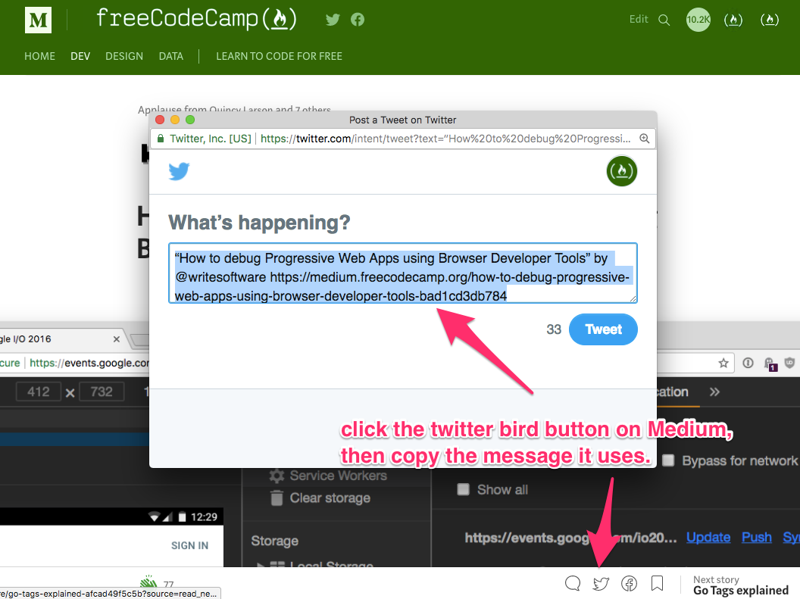

Then log into Buffer. Click the “Content” tab at the top of Buffer, then the “Queue” tab. Make sure only freeCodeCamp’s Twitter is selected.

Now paste in the text you copied from Medium, but reformat it slightly, by removing the double quotes that Medium puts around the story headline.

Here’s the format we use for tweets: 

\[headline\], by \[author’s Twitter @-handle\] \[URL\]

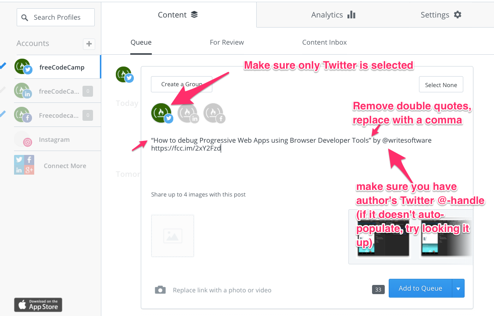

Buffer should automatically shorten the URL to an fcc.im URL and automatically choose an image — the same image that was on the Twitter card earlier when you validated the URL.

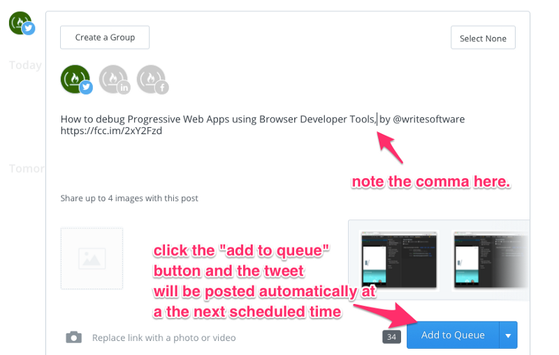

Click “Add to Queue.” Then Buffer will automatically publish the tweet at the next pre-specified time available. (We have 6 time slots each day. All of them occur around the peak time when our readers are using Twitter.)

Then the tweet will eventually show up on freeCodeCamp’s Twitter.

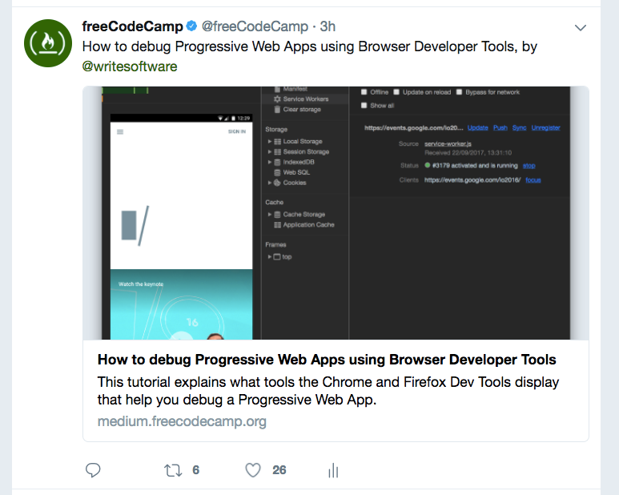

#### Step #4: Publicizing the story by sharing it on freeCodeCamp’s Facebook and LinkedIn

Next, unselect freeCodeCamp’s Twitter account and instead select LinkedIn and Facebook. Now paste the text you copied from Medium’s pre-populated Tweet in again. 

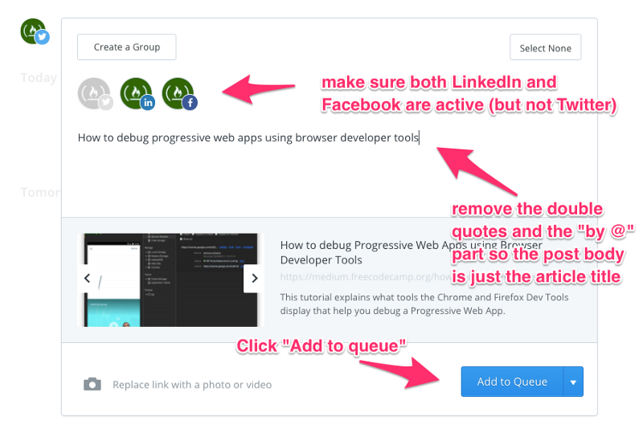

Buffer should show a preview of the how the story will look on Facebook and LinkedIn below, with an image and a headline. Now remove everything from the text you pasted in except for the headline itself. Then click “Add to Queue.”

At the next scheduled slot, Buffer will automatically share the story on both freeCodeCamp’s Facebook and LinkedIn.

#### Step #5: Drag the Trello card form “Validated on Twitter/FB” over to “Publicized”

Congratulations! You’ve helped the author reach thousands of additional potential readers!

That’s it for this story. Readers will take it from here — clapping, commenting, and sharing.

### The conclusion of a story’s journey from an author’s mind to a reader’s newsfeed

So to recap, you’ve:

1.  edited some of these stories
2.  published them
3.  and publicized

I go through all the stories in the “Publicized” column and give each of them 50 claps from both my own personal Medium account and freeCodeCamp’s Medium account, further boosting the reach of each story. You’re welcome to do this too if you really like a story, but please don’t feel obligated.

Most authors will get hundreds — even thousands — of claps as a result from being associated with the freeCodeCamp publication and having their stories strengthened through our rigorous editing process.

Thanks again for contributing your time and energy toward helping people learn about technology as part of this the community! If you have any ideas for how this article can be clearer, or how we can further improve (simplify?) these processes, we can discuss them in the “Questions” column on Trello.
