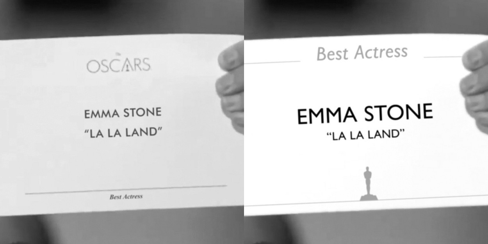
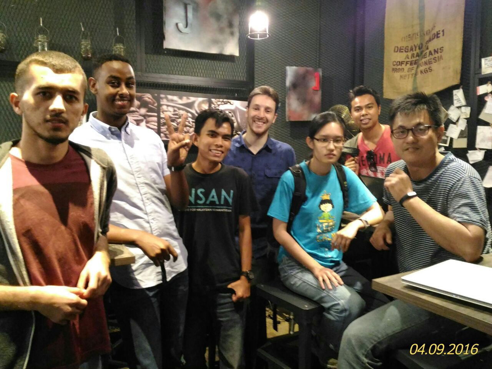

Here are three links worth your time:

1.  Why Typography Matters — Especially At The Oscars ([6 minute read](http://bit.ly/2ldN79c))
2.  How I built a fully-automated system that restocks my kitchen’s coffee from Amazon ([5 minute read](http://bit.ly/2muEQ0Q))
3.  Client-side VS server-side rendering: why it’s not all black and white ([6 minute read](http://bit.ly/2lXPkT0))

### Thought of the day:

> “Any fool can use a computer. Many do.” — Ted Nelson

### Funny of the day:

### Study group of the day:

[freeCodeCamp Kuala Lumpur](http://bit.ly/2m9Z9j7)

Happy coding!

– Quincy Larson, teacher at [freeCodeCamp](http://bit.ly/2j7Q1dN)
