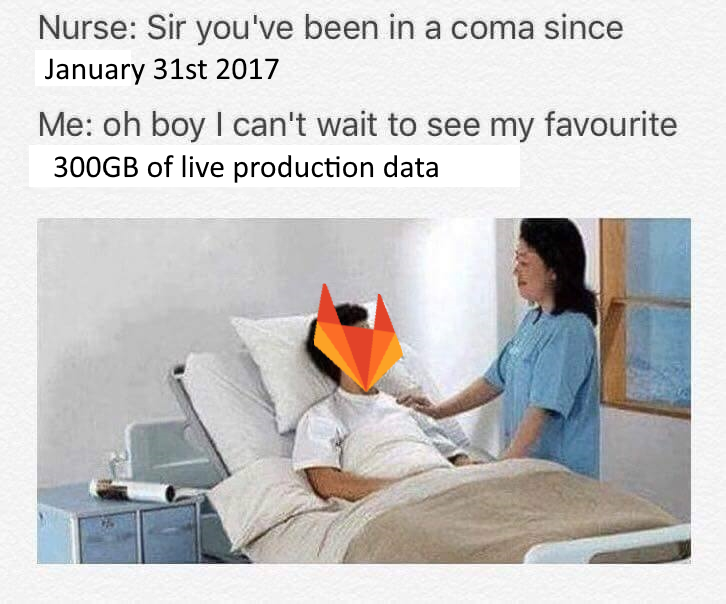
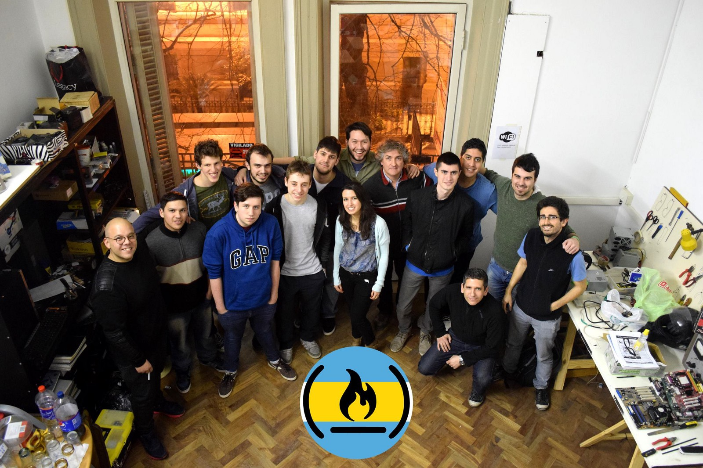

Here are three links worth your time:

1.  An interactive intro to Blockchain, the distributed database that powers Bitcoin ([18 minute watch](http://bit.ly/2kzvjSc))
2.  Material Design and the Mystery Meat Navigation Problem ([8 minute read](http://bit.ly/2kjl59S))
3.  The Right Way to Test React Components ([13 minute read](http://bit.ly/2jUCgLy))

Bonus: GitLab published a full timeline of what happened when one of their engineers accidentally deleted their production database ([3 minute read](http://bit.ly/2jIS88Y))

### Thought of the day:

> “Schrödinger’s Backup: the condition of any backup is unknown until a restore is attempted.” — Nixcraft

### Funny of the day:

This GitLab-related meme by [cnewmanJax2012](http://bit.ly/2jN9MDv)

### Study group of the day:

[freeCodeCamp Buenos Aires](http://bit.ly/2kKokrU)

Happy coding!

– Quincy Larson, teacher at [freeCodeCamp](http://bit.ly/2j7Q1dN)
