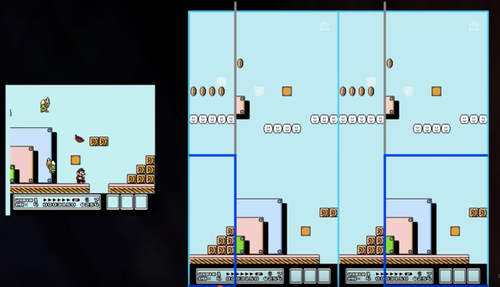
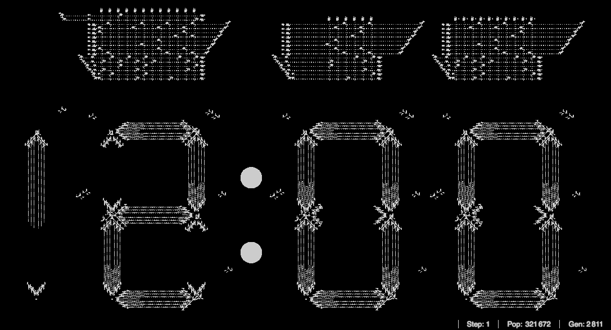

Here are three links worth your time:

1.  How developers programmed old Nintendo games to scroll so smoothly ([5 minute watch](http://bit.ly/2mFfMDA))
2.  LinkedIn endorsements are dumb. Here’s the data ([8 minute read](http://bit.ly/2ndHeWH))
3.  Beau’s screencast introduction to Clean Code ([6 minute watch](http://bit.ly/2mtxauh))

Bonus: We’re building a massive public dataset on people who started programming in the past 5 years ([2 minute read](http://bit.ly/2mKKGuv))

### Thought of the day:

> “I used to joke that Google knew more about me than my wife does. Now I know that Google knows more about me than I do.” — [Bruce Schneier](http://amzn.to/2mjheuO)

### Image of the day:

Someone built a [functioning digital clock](http://bit.ly/2mPHwph) out of Conway’s Game of Life.

### Study group of the day:

[freeCodeCamp Taipei](http://bit.ly/2nmH1jk)

Happy coding!

– Quincy Larson, teacher at [freeCodeCamp](http://bit.ly/2j7Q1dN)
