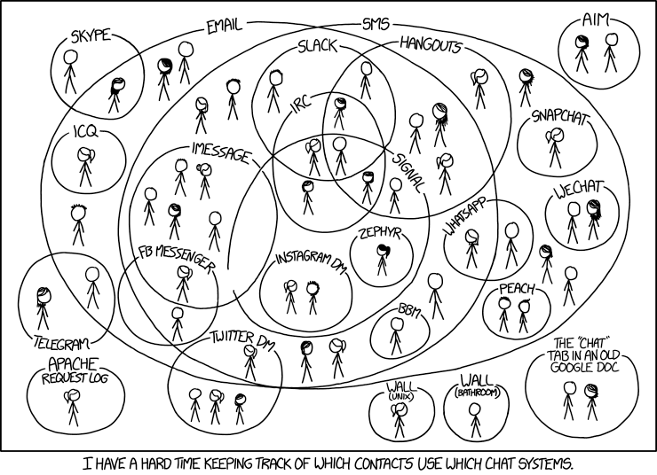
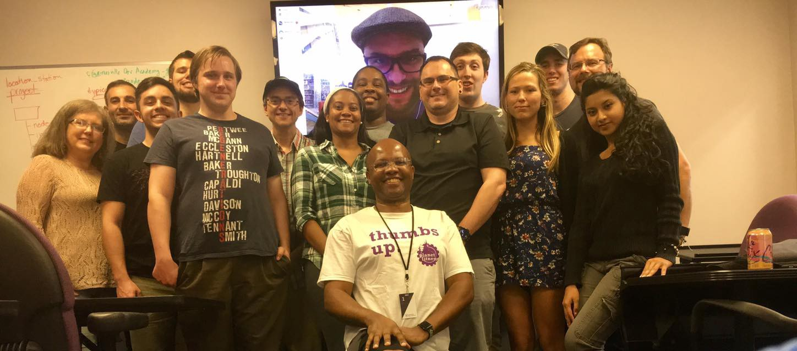

Here are three links worth your time:

1.  How GitHub adapted to Google’s newly discovered SHA-1 collision vulnerability ([4 minute read](http://bit.ly/2mMh100))
2.  Why I quit Google and built an app that teaches personal finance to kids ([6 minute read](http://bit.ly/2nxorsl))
3.  Requiring modules in Node.js: Everything you need to know ([16 minute read](http://bit.ly/2nOwsXn))

Bonus: We’re building a massive public dataset about people who started coding in the past 5 years ([2 minute read](http://bit.ly/2mKKGuv))

### Thought of the day:

> “Iron rusts from disuse; stagnant water loses its purity and in cold weather becomes frozen; even so does inaction sap the vigor of the mind. So we must stretch ourselves to the very limits of human possibility. Anything less is a sin against both God and man.” — Leonardo DaVinci

### Funny of the day:

Webcomic by [XKCD](http://bit.ly/2n9UFcm).

### Study group of the day:

[freeCodeCamp Gainsville](http://bit.ly/2nOA7Ev) (I’m the giant face on the monitor)

Happy coding!

– Quincy Larson, teacher at [freeCodeCamp](http://bit.ly/2j7Q1dN)
