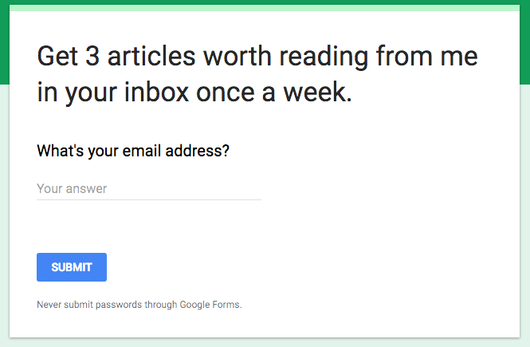
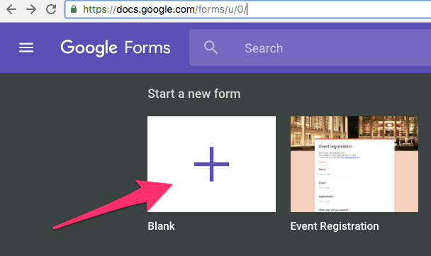
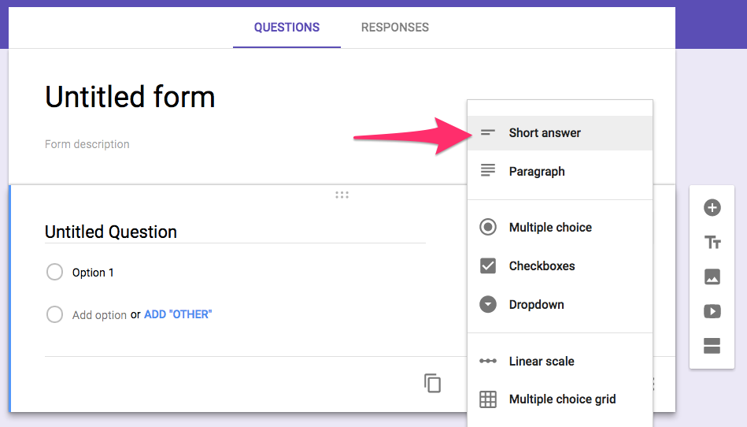
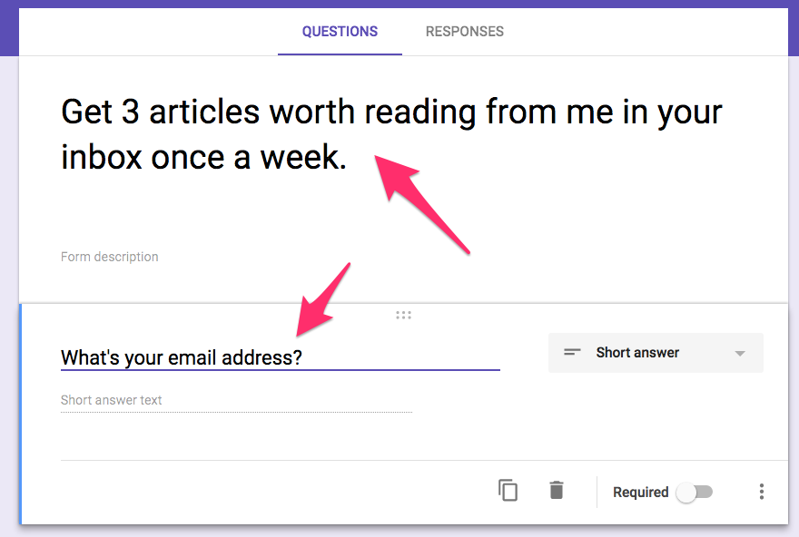
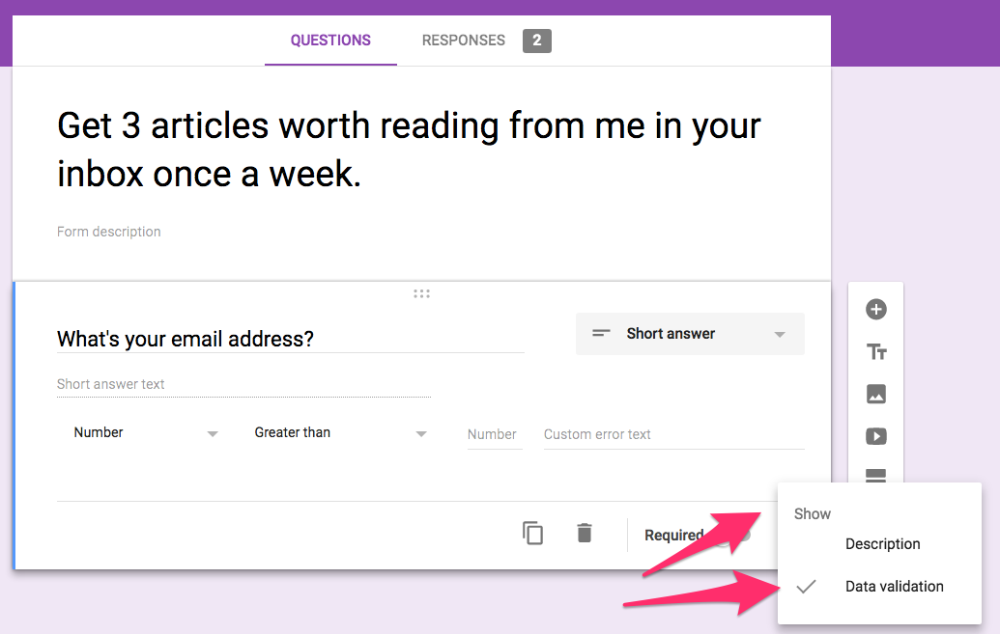
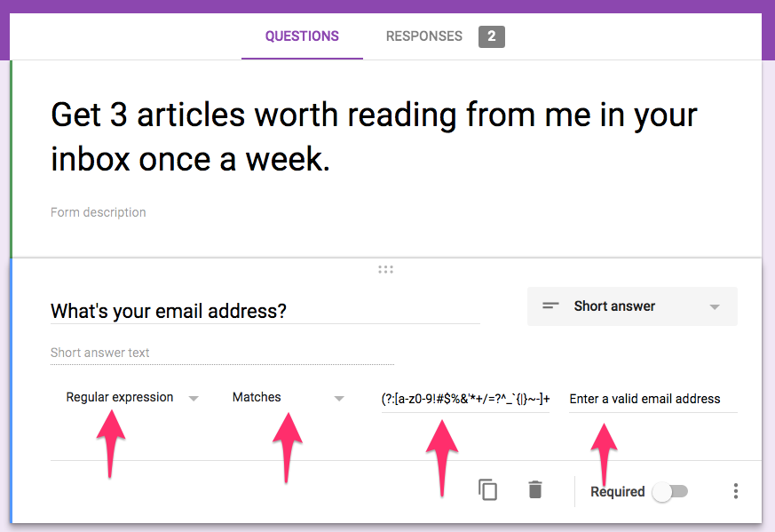
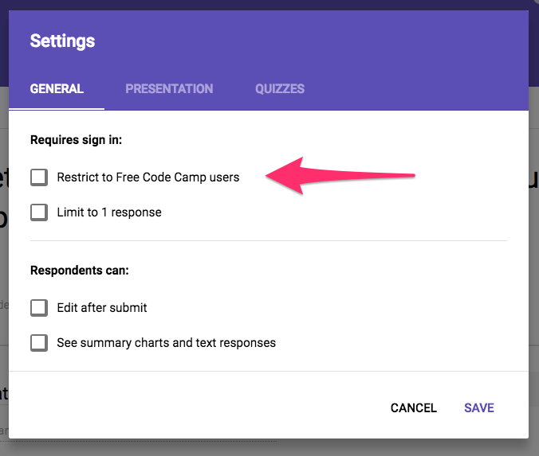
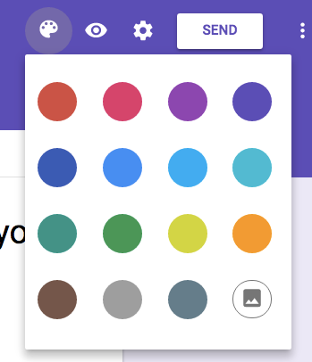
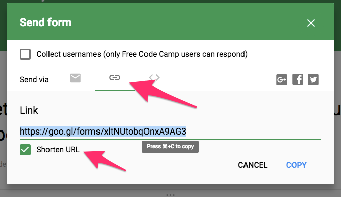
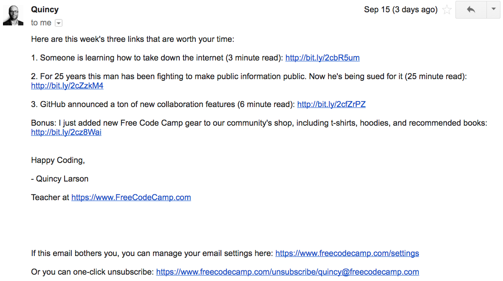

There are a ton of paid tools for gathering email addresses here on Medium. And boy do they offer a lot of features.

But what if you don’t care about those features?

What if you just want your readers’ email addresses, and that’s all?

That’s where Google Forms comes in. It’s simple, free, and exports directly CSV.

And unlike paid tools, Medium natively supports Google Forms embedding. So if your reader is viewing your story in a browser, they’ll see the form embedded right in the Medium post.

If your reader is viewing your story in the Medium Android or iOS app, they won’t be able to see the embed. So I recommend also including a link that they can follow to go to your form.

Let’s build a mailing list signup form together, then embed it into a Medium story.



### How to build your signup form with Google Forms

#### Step #1: Create the form

Go to [https://forms.google.com](https://forms.google.com) and click



#### Step #2: Create the input field

The first question will default to “Multiple Choice.” Change it to “short answer”



#### Step #3: Add titles to your form and your question



#### Step #4: Add data validation

First, let’s enable data validation on our form by clicking the “…” in the lower right corner then clicking “data validation.”



Now let’s enable regular expression matching to ensure that your readers enter a valid email address.



Here is the regular expression I use, which [emailregex.com](http://emailregex.com/) says will identify a valid email address 99.99% of the time. Just copy and paste this into the regular expression field:

```
(?:[a-z0-9!#$%&'*+/=?^_`{|}~-]+(?:\.[a-z0-9!#$%&'*+/=?^_`{|}~-]+)*|"(?:[\x01-\x08\x0b\x0c\x0e-\x1f\x21\x23-\x5b\x5d-\x7f]|\\[\x01-\x09\x0b\x0c\x0e-\x7f])*")@(?:(?:[a-z0-9](?:[a-z0-9-]*[a-z0-9])?\.)+[a-z0-9](?:[a-z0-9-]*[a-z0-9])?|\[(?:(?:25[0-5]|2[0-4][0-9]|[01]?[0-9][0-9]?)\.){3}(?:25[0-5]|2[0-4][0-9]|[01]?[0-9][0-9]?|[a-z0-9-]*[a-z0-9]:(?:[\x01-\x08\x0b\x0c\x0e-\x1f\x21-\x5a\x53-\x7f]|\\[\x01-\x09\x0b\x0c\x0e-\x7f])+)\])
```

If you’re curious how regular expressions work and would like to learn more, [here’s an interactive lesson](https://www.freecodecamp.com/challenges/sift-through-text-with-regular-expressions).

I don’t recommend making this question required, because it will add a scary-looking red asterisk and say “required.” This may give your readers the incorrect perception that you’re demanding their email address. You can easily filter out blank responses after the fact.

#### Step #5: Make sure it’s public

Click the gear up top and verify that your email isn’t restricted to people who share the same domain as your email address.



#### Step #6: Add a splash of color. Why not?

Click the pallet icon in the upper right hand corner. You can also upload an image if you so desire.



### Now let’s add your signup form to Medium

Click the “send” button in the upper right hand corner of your Google Form.



Click the chain-looking link icon, then click “shorten URL.” Copy the URL, then come back to Medium, paste it in, and hit enter.

After a moment, Medium will show a thumbnail of your form. Once you hit the publish button, your form will be embedded within your Medium publication, and will be fully operational.

Voilà! Here’s what mine looks like:

<Embed src="https://docs.google.com/forms/d/e/1FAIpQLSePzScuv9hP8d0qnY5WQ8MqM0ShvCdjpgRjuN-kZnay_YEuWw/viewform?embedded=true" aspectRatio={undefined} caption="" />

Get 3 articles worth reading from me in your inbox once a week. [Sign up here](https://goo.gl/forms/dsvfK1dRz5zePih02).

### Bonus section: How I send out my emails

Here’s the script I currently use to send out my weekly email to around 350,000 people:

[**FreeCodeCamp/massification**  
_massification - An emailing service built on Amazon SES and Node_github.com](https://github.com/FreeCodeCamp/massification "https://github.com/FreeCodeCamp/massification")[](https://github.com/FreeCodeCamp/massification)

This script uses AmazonSES for high deliverability. It costs $0.01 per hundred emails, which means my entire weekly email blast only costs me $35.

Currently the script takes about 18 hours to send out 350,000 emails. But it’s fully open-source, so if anyone spots a way to make it more efficient, pull requests are welcome.

If you’re curious, here’s what one of my emails looks like:



And here’s the JSON that produces this email:

```
{
 “subject”: “Someone’s learning how to take down the internet.”,
 “text”: “Here are this week’s three links that are worth your time:\n\n1. Someone is learning how to take down the internet (3 minute read): http://bit.ly/2cbR5um\n\n2. For 25 years this man has been fighting to make public information public. Now he’s being sued for it (25 minute read): http://bit.ly/2cZzkM4\n\n3. GitHub announced a ton of new collaboration features (6 minute read): http://bit.ly/2cfZrPZ\n\nBonus: I just added new Free Code Camp gear to our community’s shop, including t-shirts, hoodies, and recommended books: http://bit.ly/2cz8Wai\n\n\nHappy Coding,\n\n- Quincy Larson\n\nTeacher at https://www.FreeCodeCamp.com\n\n\n\n\n\nIf this email bothers you, you can manage your email settings here: https://www.freecodecamp.com/settings\n\nOr you can one-click unsubscribe: https://www.freecodecamp.com/unsubscribe/<%= email %>”
}
```

You’ll note the bonus link at the bottom directs readers to [Free Code Camp’s shop](https://www.freecodecamp.com/shop). This makes it easier for readers to support our open source community, and helps me offset the cost of sending all these emails.

You’ll also note that I’ve written a crude but reliable unsubscribe function. All of the logic behind this runs on Free Code Camp’s servers, where I maintain this list.

You will need to come up with some sort of unsubscribe solution yourself.

If your list isn’t very big, you could just tell readers to reply “unsubscribe” if they don’t want any more of your mails, then manually remove them from your list in the Google Docs spreadsheet.

Another thing you may notice is that I’m sending emails as plain text, rather than HTML.

A lot of designers write me offering to create an HTML template for me. What they don’t realize is that [people like text emails more than they like HTML emails](http://blog.hubspot.com/marketing/plain-text-vs-html-emails-data).

My theory is that friends don’t send you HTML emails — they just write text. So you’re more likely to interpret a text email as friendly, and an HTML email as spammy.

Also, HTML emails raise accessibility and mobile responsivity concerns that you’d have to deal with. Ever tried to code an email template? It isn’t fun.

So my advice is to just use text.

And yes, I have A/B tested this myself and concluded that my own text emails perform better than my HTML emails.

So I thank these designers for their offer, then ask if they could instead help create Creative Commons-licensed [assets for our community](https://github.com/FreeCodeCamp/assets).

Finally, you’ll note that I’m using bit.ly to handle analytics. This doesn’t give me received/opened statistics, but it does give me click statistics:


If anyone knows a reliable way to track receive/open statistics with plaintext, let me know in the comments section.

### And of course, you have to ask people to sign up 😊

<Embed src="https://docs.google.com/forms/d/e/1FAIpQLSePzScuv9hP8d0qnY5WQ8MqM0ShvCdjpgRjuN-kZnay_YEuWw/viewform?embedded=true" aspectRatio={undefined} caption="" />

Get 3 articles worth reading from me in your inbox once a week. [Sign up here](https://goo.gl/forms/dsvfK1dRz5zePih02).

Also, click the 💚 below so more people will see this article here on Medium.


