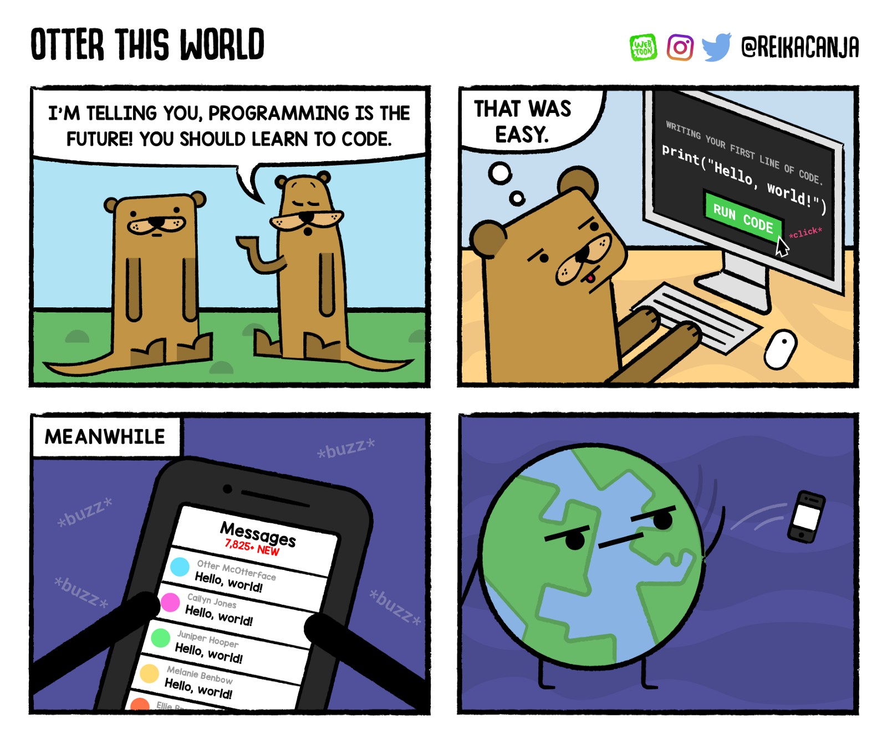
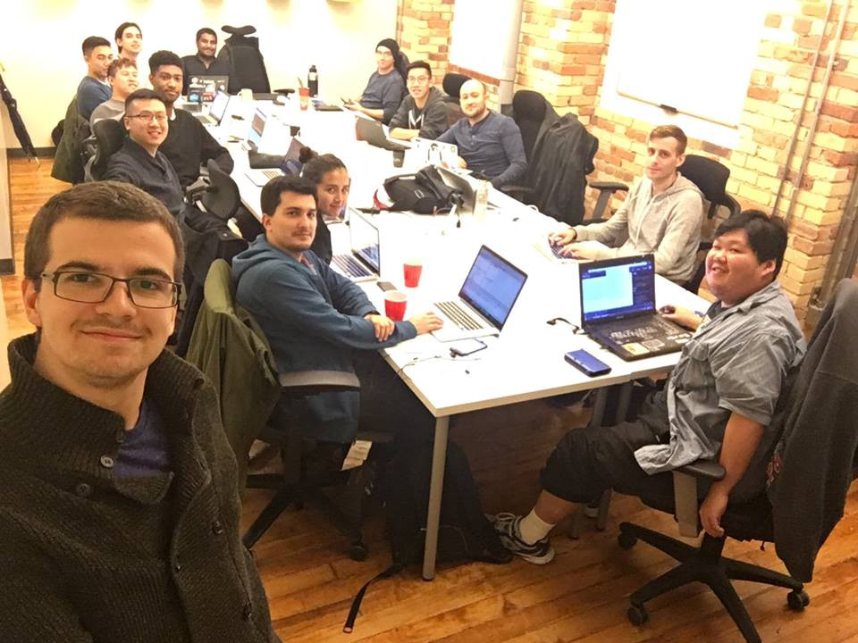

Here are three links worth your time:

1.  How I left my consulting career behind and broke into tech ([24 minute read](http://bit.ly/2ooUzg3))
2.  How to build a math expression tokenizer using JavaScript ([8 minute read](http://bit.ly/2nEZD2J))
3.  An epic 3-part series of tutorials that will walk you through creating Tesla’s Battery Range Calculator with React, Redux, and CSS animations ([24 minute read](http://bit.ly/2otjb8T))

Bonus: freeCodeCamp’s open source community was featured in Tech Crunch today ([1 minute read](http://tcrn.ch/2op1Vjj) + [optional 55 minute podcast interview](http://tcrn.ch/2op1Vjj))

### Thought of the day:

> “We will bankrupt ourselves in the vain search for absolute security.” —US President Dwight D. Eisenhower

### Image of the day:

Webcomic by [Otter This World](http://bit.ly/2op5IgH)

### Study group of the day:

[freeCodeCamp Toronto](http://bit.ly/2oYdrFQ)

Happy coding!

– Quincy Larson, teacher at [freeCodeCamp](http://bit.ly/2j7Q1dN)

If you get value out of these emails, please consider [supporting our nonprofit](http://bit.ly/donate-to-fcc).
