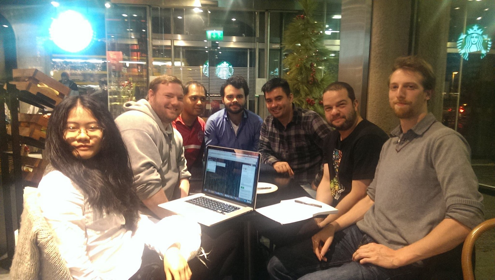

Here are three links worth your time:

1.  How Reddit designed and coded its elaborate April Fool’s experience, /r/place ([17 minute read](http://bit.ly/2nNeEiX))
2.  These hackathon hustlers make their living from corporate coding contests ([7 minute read](https://bloom.bg/2octHPc))
3.  What does “Minimum Viable Product” actually mean, anyway? ([5 minute read](http://bit.ly/2ocugsg))

Bonus: The Post JavaScript Apocalypse JavaScript: The Good Parts author Douglas Crockford ([47 minute watch](http://bit.ly/2oHKwF3))

### Thought of the day:

> “I do not fear computers. I fear the lack of them.” — Isaac Asimov

### Funny of the day:

Source: [Reddit](https://www.reddit.com/r/funny/comments/65bsf3/we_can_repair_anything/)

### Study group of the day:

[freeCodeCamp Dublin](http://bit.ly/2pfmOk1)

Happy coding!

– Quincy Larson, teacher at [freeCodeCamp](http://bit.ly/2j7Q1dN)

If you get value out of these emails, you should [support our nonprofit](http://bit.ly/donate-to-fcc). 😉
