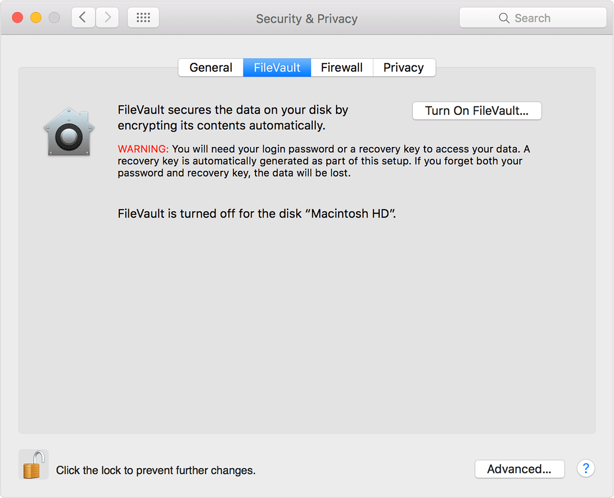
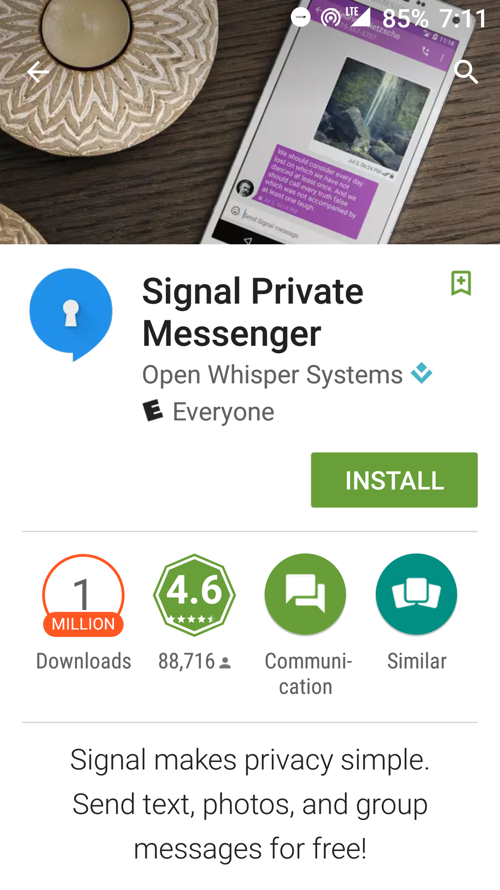
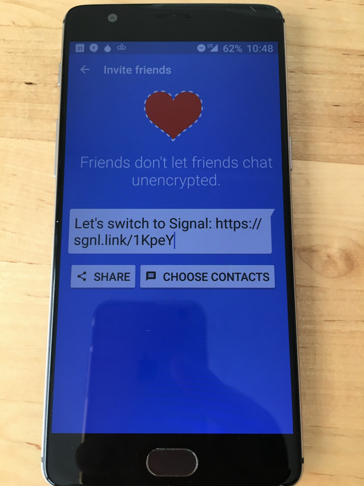
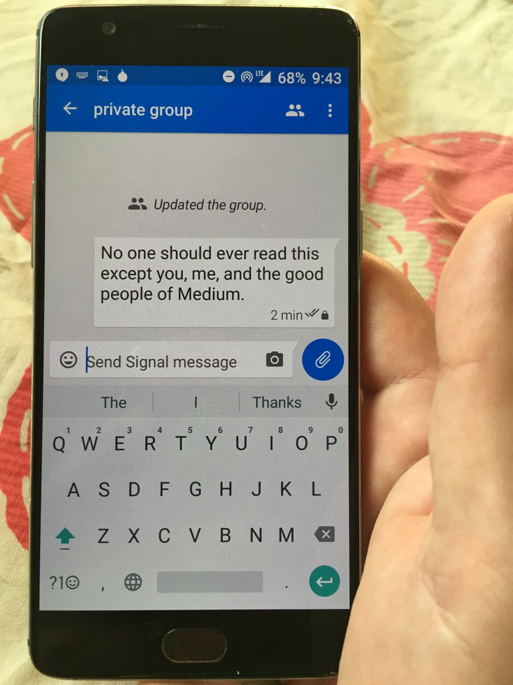
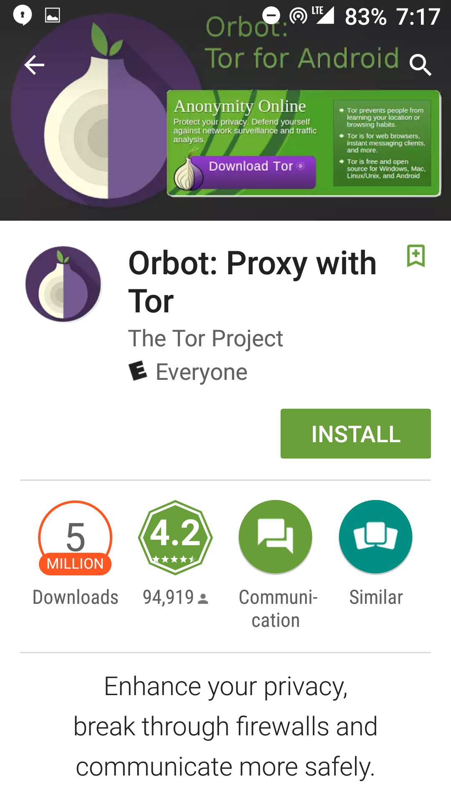
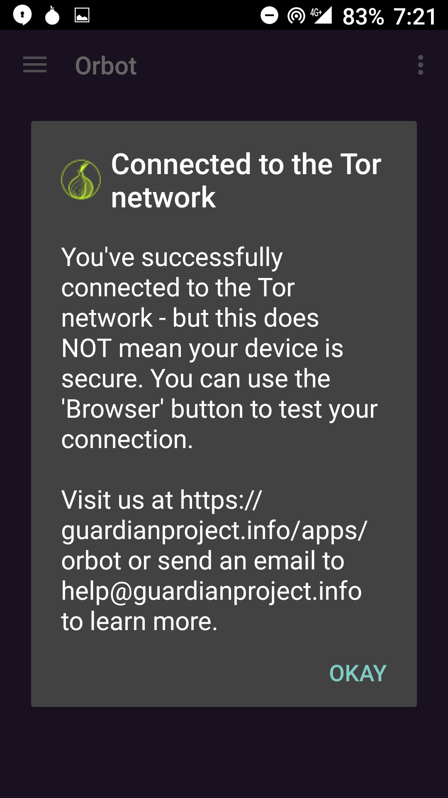
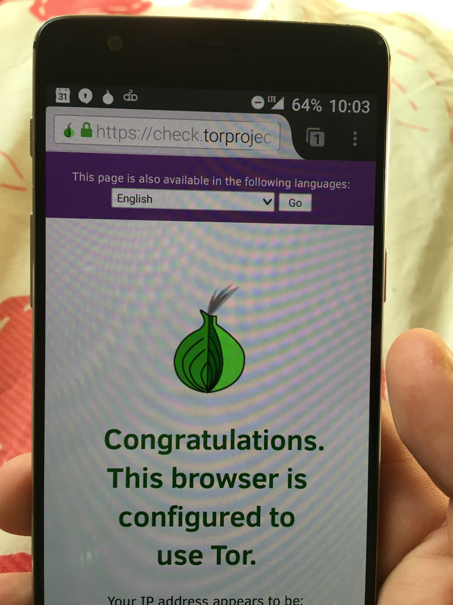
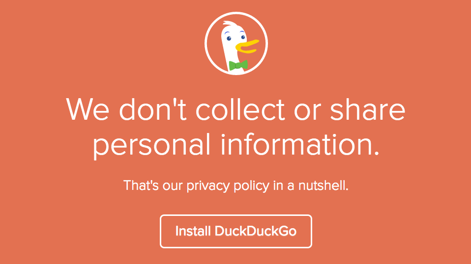
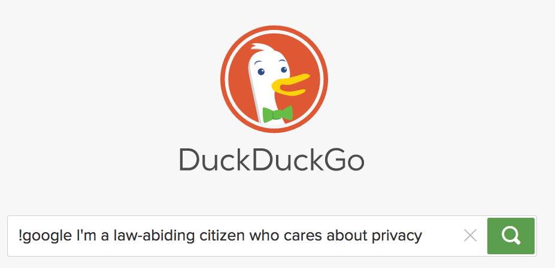

> “Only the paranoid survive.” — Andy Grove

Andy Grove was a Hungarian refugee who escaped communism, studied engineering, and ultimately led the personal computer revolution as the CEO of Intel. He died earlier this year in Silicon Valley after a long fight with Parkinson’s disease.

When one of the most powerful people in the world encourages us to be paranoid, maybe we should listen.

And Grove isn’t the only powerful person urging caution. Even the director of the FBI — the same official who recently paid hackers a million dollars to unlock a shooter’s iPhone — is [encouraging everyone to cover their webcams](http://thehill.com/policy/national-security/295933-fbi-director-cover-up-your-webcam).

But you obey the law. What do you have to worry about? As the motto of the United Kingdom’s surveillance program reminds us, “If you’ve got nothing to hide, you’ve got nothing to fear.”

Well, law-abiding citizens do have reason to fear. They do have reasons to secure their devices, their files, and their communications with loved ones.

> “If one would give me six lines written by the hand of the most honest man, I would find something in them to have him hanged.” — Cardinal Richelieu in 1641

In this article, I will show you how you can protect yourself by leveraging state-of-the-art encryption. **In a single sitting, you can make great strides toward securing your privacy**.

### Common sense security for everyone

To be clear, everything I recommend here is 100% free and 100% legal. If you bother locking your doors at night, you should bother using encryption.

> “Be prepared” — The Scout Motto

Let’s get prepared.

First, a couple definitions. When I use the term “attacker” I mean anyone trying to access your data whom you haven’t given express permission to — whether it’s a hacker, a corporation, or even a government.

And when I use the terms “private” or “secure”, I mean reasonably so. The reality is that — as long as humans are involved — no system will ever be 100% private or 100% secure.

As long as your phone, computers, and accounts are sufficiently protected, their contents will remain an “encrypted lump” and there’s not much anyone — regardless of how powerful they are — can do about it.

### Tip #1: Use two-factor authentication on your inbox

Your inbox is the skeleton key to your life. If an attacker compromises it, they can not only read your emails, they can use it to reset your passwords for pretty much anything. This includes social media accounts and even bank accounts.

The simplest thing you can do to dramatically improve your personal security is to turn on two-factor authentication on your inbox.

Basically, two-factor authentication is a second layer of security when signing in. It usually involves receiving a text message with a special code whenever you sign into your account.

Two-factor authentication substantially reduces the likelihood of your inbox getting hacked.

If you use Gmail, you should [activate two-factor auth here](https://myaccount.google.com/security#signin).

Now.

Seriously.

I’ll still be here when you get back.

### Tip #2: Encrypt your hard drive



Both [Windows](https://support.microsoft.com/en-us/instantanswers/e7d75dd2-29c2-16ac-f03d-20cfdf54202f/turn-on-device-encryption) and [MacOS](https://support.apple.com/en-us/HT204837) have built-in full-disk encryption. You just need to turn it on.

### Tip #3: Turn on your phone’s password protection

Thumbprint identification is better than nothing, but it’s often not enough.

The fifth amendment (against self-incrimination) allows you to keep your password secret. But a court can compel you to unlock your phone with your thumbprint.

Also, you can’t exactly change your thumbprint after an attacker gets ahold of it.

An attacker will usually get 10 tries before your phone will completely lock them out. So if your 4-digit password is one of these common ones, change it.

```
1234  
9999
1111  
3333
0000  
5555
1212  
6666
7777  
1122
1004  
1313
2000  
8888
4444  
4321
2222  
2001
6969  
1010
```

**Pro Tip**: if you insist on enabling thumbprint identification for convenience’s sake, and are ever arrested, immediately power off your phone. When the authorities turn your phone back on, they won’t be able to unlock it without your password.

### Tip #4: Use different passwords for each service.

Passwords [are inherently insecure](https://medium.freecodecamp.com/360-million-reasons-to-destroy-all-passwords-9a100b2b5001).

Mark Zuckerberg used the password “dadada” on his LinkedIn account. Earlier this year, when hackers released 117 million email-password combinations, his was among them. Hackers were then able to use his email and password to gain access to his Twitter and Pinterest accounts.


So don’t use the same password more than one place.

Of course, remembering a ton of passwords is a hassle, so use a [password manager](https://en.wikipedia.org/wiki/Password_manager).

### Tip #5: Send private text messages with Signal

Signal is a popular messaging service that got a perfect score from the [Electronic Frontier Foundation](https://www.eff.org/node/82654). You can do all the things you would normally do through text messages, like have group messages and send photos and videos. Except that everything’s encrypted.

Signal is free, open source, and available in iOS and Android app stores. I was able to set it up and start messaging securely with friends and family in less than 5 minutes.

#### Step #1: Install Signal



#### Step #2: Invite friends to install it



#### Step #3: Send messages



Congratulations — you can now talk with your friends and family about whatever you want, and it will be practically impossible for anyone to spy on your conversation.

You can also use Signal to make secure phone calls.

### Tip #6: Your browser’s incognito mode isn’t private enough

Even if you use Chrome’s “Incognito Mode” or Firefox’s “Private Browsing”, the following parties will still be able to snoop in on your network activity:

-   Internet service providers
-   System administrators in charge of the network at your school, workplace, or wherever get online
-   Google, or whoever made your browser

Internet Explorer, Safari, Opera, and other browsers are no more private.

If you want reasonably private browsing (no system can ever be 100% secure), you should use Tor.

### Tip #7: Browse in private with Tor

Tor stands for “The Onion Router” which is a reference to its use of many onion-like layers to mask network activity. It’s free, open source, and reasonably easy to use.

#### Step #1: Download the Orbot



#### Step #2: Download the Orfox browser


#### Step #3: Open Orbot



#### Step #4: Open Orfox



#### Step #5: Verify it worked

Visit check.torproject.org to verify everything worked. Congratulations — you can now use the internet with peace of mind that it would be extremely difficult for anyone to track you.

### Tip #8: Search in private

If Tor isn’t convenient enough for you, you can at least search privately using [DuckDuckGo](https://duckduckgo.com/privacy), the search engine that doesn’t track you.



DuckDuckGo doesn’t have all the thousands of engineer-years poured into its search engine that Google has, but it does have a shortcut to get encrypted Google searches when you need them. You just need to prefix your search with !google



I encourage you to read computer security expert Bruce Schneier’s book “[Data and Goliath: The Hidden Battles to Collect Your Data and Control Your World](http://amzn.to/2mjheuO).” I learned a ton from it, and am listening to it a second time.

[**Data and Goliath: The Hidden Battles to Capture Your Data and Control Your World**  
_Edit description_amzn.to](http://amzn.to/2mjheuO "http://amzn.to/2mjheuO")[](http://amzn.to/2mjheuO)

**I only write about programming and technology. If you** [**follow me on Twitter**](https://twitter.com/ossia) **I won’t waste your time. 👍**
