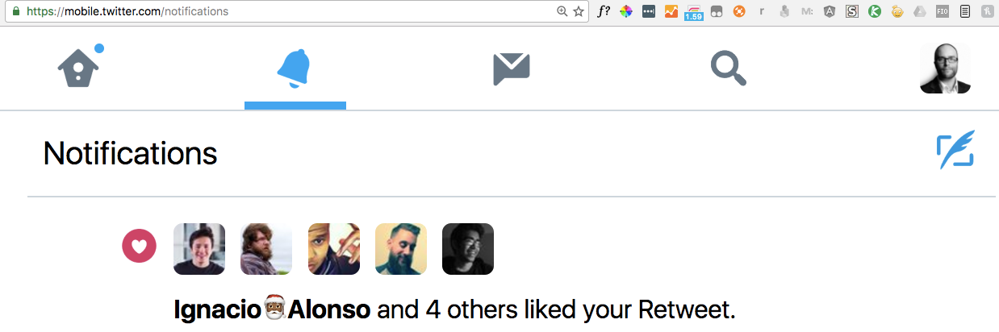
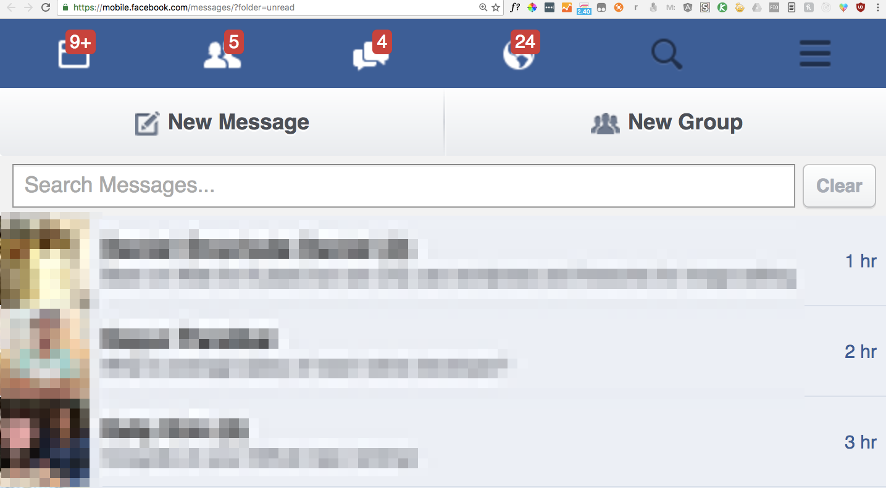
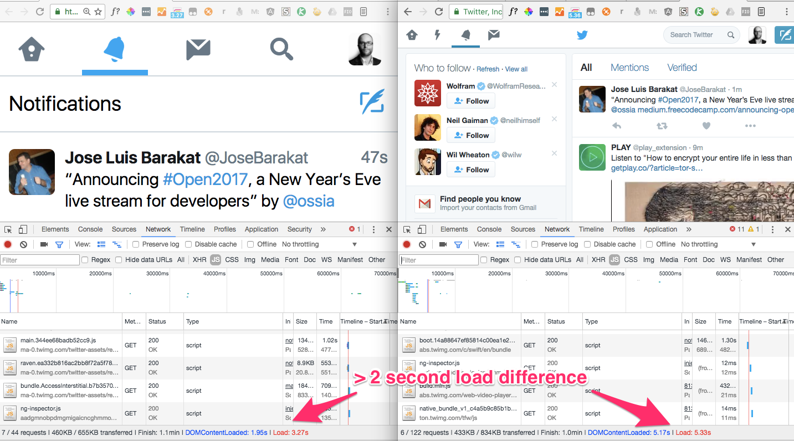
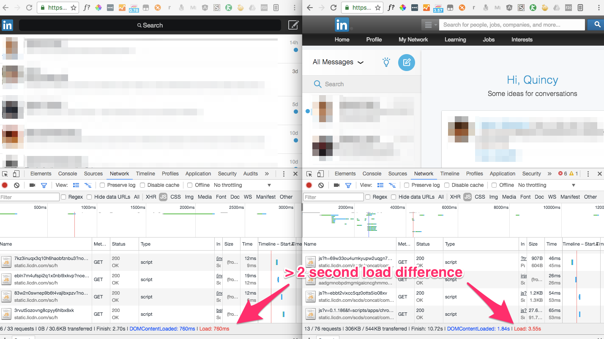
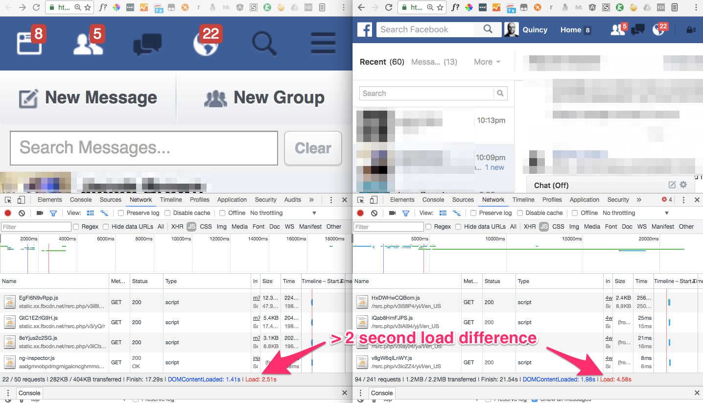

_An hour after I published this, the news broke that Hollywood legend and Star Wars actress Carrie Fisher had died. Instead of removing the Star Wars references, I’ve decided to dedicate this article in her memory. Rest in peace, Carrie._

The fastest things in the universe:

1.  Hyperdrive
2.  Warp 9
3.  light
4.  the mobile web running on a desktop

### Life Pro Tip: Use the mobile web versions of websites

Wait. It’s 2017. We got responsive websites way back in 2011. Are there still any websites that have dedicated mobile web versions?

Amazingly, yes. Facebook, Twitter, and LinkedIn are three such websites. And all of these are way better than their desktop and mobile app equivalents.

Here’s why:

-   They’re faster
-   They have far fewer ads
-   They have cleaner, less distracting interfaces

So let’s start using the web in zen mode.

### Tiny Twitter

You get:

-   your newsfeed
-   your notifications
-   your messages

You don’t get:

-   trending
-   videos playing in the margin
-   a moments button to accidentally click on

### Little LinkedIn

You get:

-   your notifications
-   your messages
-   your invitations to connect

You don’t get:

-   a newsfeed of people posting things irrelevant to work or careers
-   LinkedIn pestering you to “complete your profile”
-   LinkedIn pestering you to [spam all your email contacts](http://fortune.com/2015/10/05/linkedin-class-action/) for the Nth time

### Fast Facebook

You get:

-   your newsfeed
-   your friend requests
-   your messages
-   your notifications

You don’t get:

-   trending (which are basically ads on Facebook)
-   auto-playing videos
-   chat boxes popping up everywhere
-   fake news stories in the sidebar

### And did I mention it’s faster?

Here’s a side-by-side hard refresh of Twitter with Chrome’s Network tab open:

And LinkedIn:

And Facebook:

Since these pages use less multimedia, less styling, and less JavaScript, everything you do within them feels snappier. You get in, get stuff done, and get out much faster.

### Start using the mobile web on your desktop.

Bookmark these links:

-   Mobile web Twitter notifications: [https://mobile.twitter.com/notifications](https://mobile.twitter.com/notifications)
-   Mobile web LinkedIn messages: [https://touch.www.linkedin.com/#inbox](https://touch.www.linkedin.com/#inbox)
-   Mobile web Facebook messages: [https://mobile.facebook.com/messages](https://mobile.facebook.com/messages/?folder=unread)

And there may be mobile web versions for other sites you use a lot. For example, here’s Amazon’s zen-like [mobile web shopping experience](https://www.amazon.com/gp/aw) with its core search functionality.

So join me where the web is faster.

**I only write about programming and technology. If you** [**follow me on Twitter**](https://twitter.com/ossia) **I won’t waste your time. 👍**
