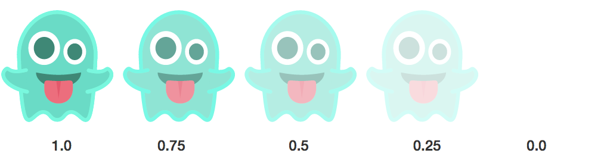

We all want to disappear sometimes. HTML elements are no different. Sometimes they want to hide out for a while. Not cease to exist completely — just keep things on the down-low.

Thankfully, when it comes to making HTML elements disappear, CSS offers a variety of options.

### The CSS of becoming invisible

Let’s take an HTML element with the class “ghost” and hide it.

```
//index.html

<div class=”ghost”>
  <p>I’m friendly!</p>
</div>

//style.css

.ghost {

}
```

### Dead pixels

By default, HTML elements are visible. Their default **visibility** CSS property is **visible**, but you can flip the script and go:

```
.ghost {

  visibility: hidden;

}
```

Now the ghost is hidden, but it will still take up space on the page.

### Without a trace

If you want to make something invisible, and also not take up any space, You can also use the CSS **display** property.

Developers usually use the display property to dictate whether an HTML element should be displayed as a block element or an inline element, but it can also hide the element completely:

```
.ghost {

  display: none;

}
```

And unlike **visibility: hidden**, an element hidden with **display: none** won’t take up any space on the page.

### See-through souls



You can also make an element so transparent that it’s invisible using the **opacity** CSS property.

```
.ghost {

  opacity: 0.0;

}
```

Like **visibility: hidden, opacity: 0.0** will leave an empty space where the HTML element is. Remember, with all of these techniques, the element remains a part of the DOM — it’s just not visible to normal users in their browsers.

### Run away! Run far, far away!

One final way you can hide an element is just to move it so far off the page that you would need to zoom out tremendously to see it.

To do this, first you use the **position** CSS property to give the element an **absolute** position on the page (as opposed to **relative** to other HTML elements).

Then you can move the element off the page an arbitrarily large number of pixels:

```
.ghost {
  position: absolute;
  left: -999999px;
}
```

Why would you do this? Well, it’s good for the accessibility of your content. Screen readers — which visually impaired people use to browse the internet — can pick up this content, and everyone else won’t know the content is there.

For best results, position these invisible elements to the left instead of the top or bottom, which can confuse screen readers.

### Being a ghost for Halloween

When you put all 4 of these techniques together, you’ve got a pretty cool [low-effort Halloween costume](https://www.freecodecamp.com/shop):


I made this with the help of Austin-based designer and camper Wes Searan.

You can [pick one up](https://www.freecodecamp.com/shop) through the end of this weekend — in mens and fitted women’s sizes.

**I only write about programming and technology. If you** [**follow me on Twitter**](https://twitter.com/ossia) **I won’t waste your time. 👍**
