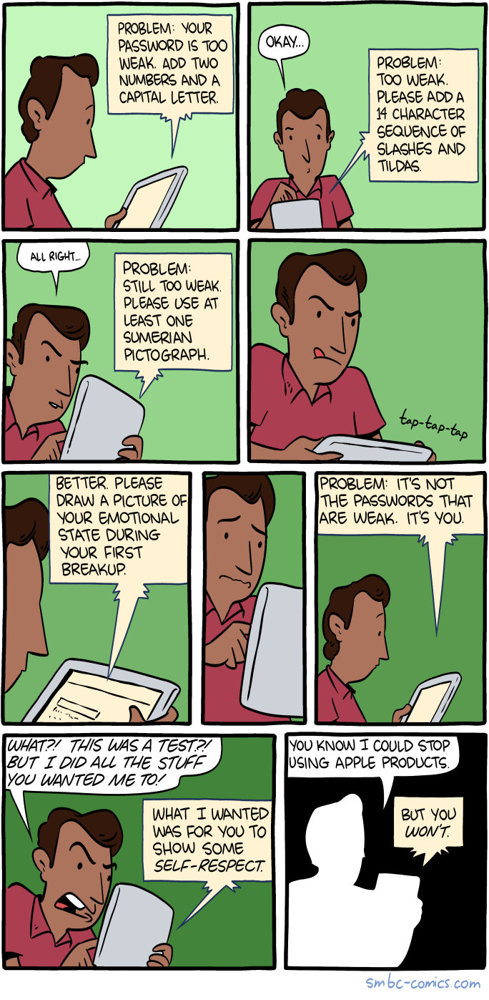
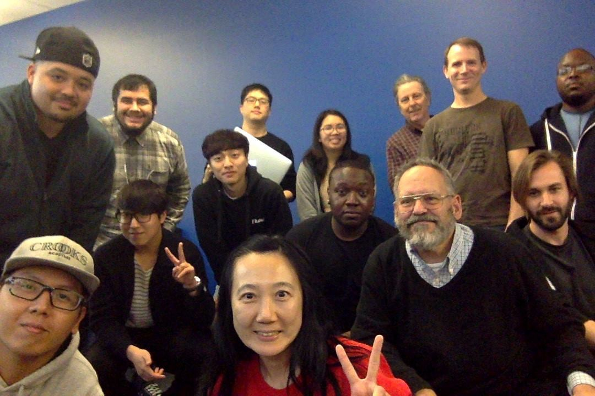

Here are three links worth your time:

1.  How to set up a VPN in 10 minutes for free (and why you urgently need one) ([9 minute read](http://bit.ly/2nEY2IU))
2.  The 10 GitHub repos new developers mention the most ([3 minute read](http://bit.ly/2nnt4CS))
3.  The CSS box model explained by living in a boring suburban neighborhood ([4 minute read](http://bit.ly/2oq7zR5))

### Thought of the day:

> “A computer lets you make more mistakes faster than any invention in human history — with the possible exceptions of handguns and tequila.” — Mitch Ratliff

### Funny of the day:

Webcomic by [Saturday Morning Breakfast Cereal](http://bit.ly/2nYcBHU)

### Study group of the day:

[freeCodeCamp Santa Clara](http://bit.ly/2nYd1yj)

Happy coding!

– Quincy Larson, teacher at [freeCodeCamp](http://bit.ly/2j7Q1dN)
