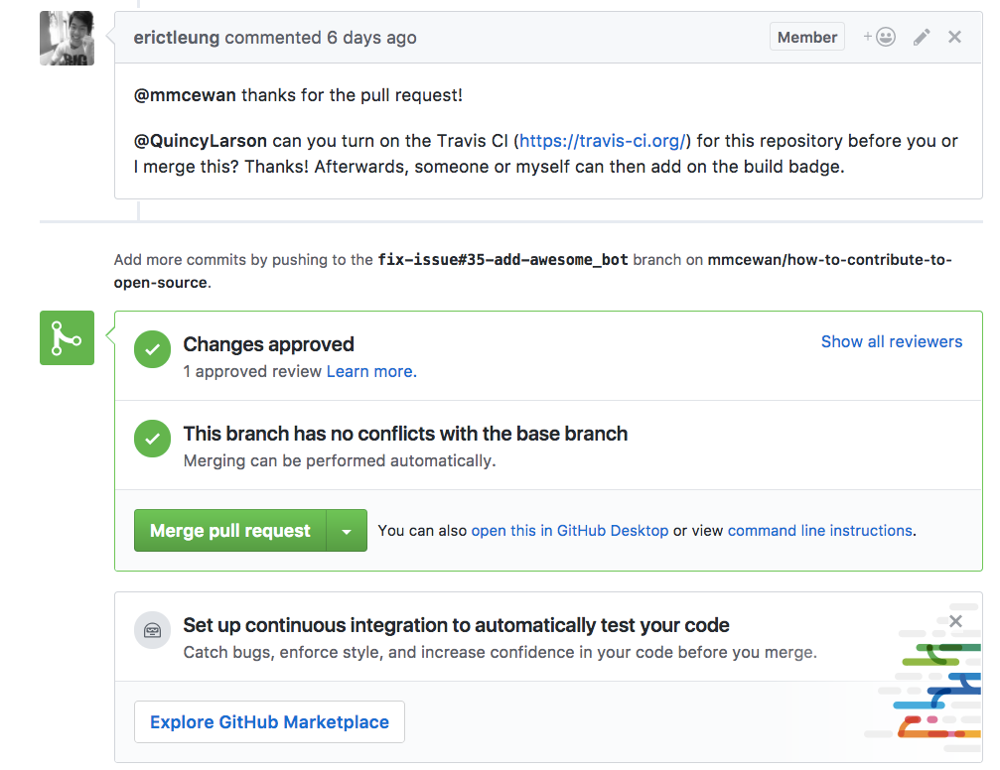
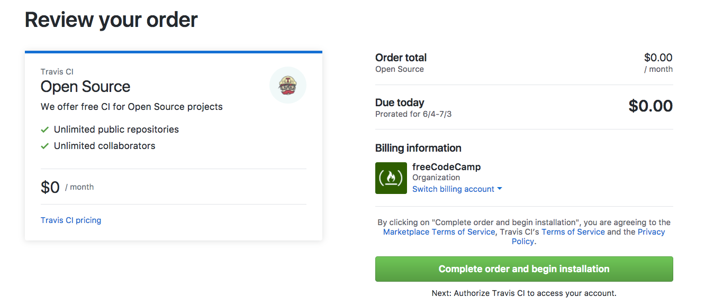
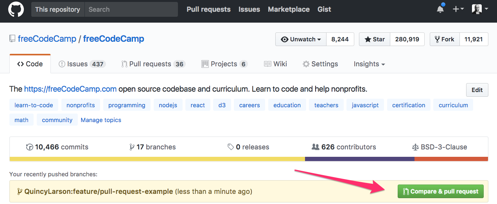
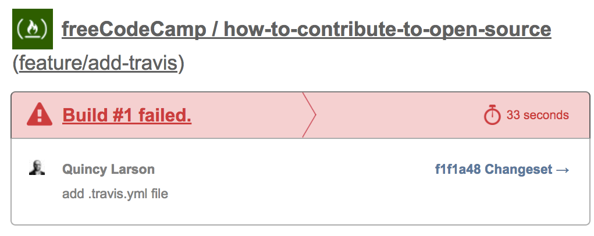
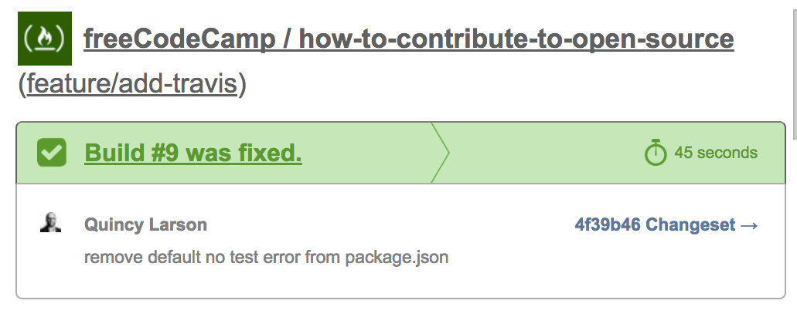
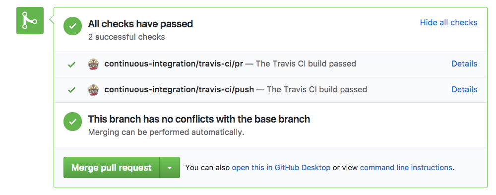

A single misplaced comma in a single JSON file can wreck your app. But only if you let it.

The best way to stop this from happening is to catch that error before it ever gets accepted into your codebase. That means tests. And for file formats like JSON, it also means linting.

I’m going to walk you through how to set up Travis CI and ESLint on your GitHub repository, so you can detect linting errors in pull requests, before they ever make it into your codebase.

But first a bit of backstory on how I learned to do this.

In medical school, they have a learning process called [see one, do one, teach one](https://www.ncbi.nlm.nih.gov/pmc/articles/PMC4785880/):

-   see someone perform an operation
-   do that operation yourself
-   teach someone else how to do that operation

Well, [Berkeley Martinez](https://github.com/BerkeleyTrue) walked me through setting Travis CI + ESLint up on one of our repositories. Then [Eric Leung](https://github.com/erictleung) asked me to do it on another repository. And now I’m teaching you how to do it.

See one, do one, teach one.

In this case, [Eric Leung](https://github.com/erictleung) asked me to configure Travis CI so [Mark McEwan](https://github.com/mmcewan) can install awesome\_bot.



You’ll note that at the bottom of the pull request, GitHub included a little banner encouraging us to set up continuous integration (CI) using their newly-launched Marketplace. This is a perfect place to get started.

### Step #1: Install Travis CI in the GitHub Marketplace



Travis CI is free and open source. So you can just choose it from the menu and go through the checkout process.

### Step #2: Create a new branch

If you’ve already [cloned the repository](https://help.github.com/articles/cloning-a-repository/) to your local computer, you can create a new branch, by opening up the repository in your terminal and typing:

```
git checkout -b feature/add-travis
```

### Step #3: Create a .gitignore file (if you don’t already have one)

Type this into your terminal:

```
touch .gitignore
```

Then open the .gitignore file in your favorite code editor and add the following line:

```
node_modules
```

Presto. Now you won’t accidentally commit any npm pacakge files to your repository.

### Step #4: Initialize npm (if you haven’t already)

You’ll need npm for ESLint. In your terminal, run:

```
npm init
```

Now you get to answer a lot of questions. If you’re in a hurry, you can respond these by smacking your enter button repeatedly to accept the default answers.

```
This utility will walk you through creating a package.json file.
It only covers the most common items, and tries to guess sensible defaults.

See `npm help json` for definitive documentation on these fields
and exactly what they do.

Use `npm install <pkg>` afterwards to install a package and
save it as a dependency in the package.json file.

Press ^C at any time to quit.
package name: (how-to-contribute-to-open-source) 
version: (1.0.0) 
description: 
entry point: (index.js) 
test command: 
git repository: (https://github.com/FreeCodeCamp/how-to-contribute-to-open-source.git) 
keywords: 
author: 
license: (ISC)
About to write to /Users/michaelq/web/how-to-contribute-to-open-source/package.json:

{
  "name": "how-to-contribute-to-open-source",
  "version": "1.0.0",
  "description": "This is a list of resources for people who are new to contributing to open source.",
  "main": "index.js",
  "scripts": {
    "test": "echo \"Error: no test specified\" && exit 1"
  },
  "repository": {
    "type": "git",
    "url": "git+https://github.com/FreeCodeCamp/how-to-contribute-to-open-source.git"
  },
  "author": "",
  "license": "BSD-3-Clause",
  "bugs": {
    "url": "https://github.com/FreeCodeCamp/how-to-contribute-to-open-source/issues"
  },
  "homepage": "https://github.com/FreeCodeCamp/how-to-contribute-to-open-source#readme"
}

Is this ok? (yes) 
```

You now have a package.json file in your repository.

### Step #5: Install ESLint and your linting packages

Depending on what types of files are in your repository, you can install a variety of different linting packages. The repository I am working on is [How to Contribute to Open Source](https://github.com/freeCodeCamp/how-to-contribute-to-open-source) (give it a ⭐️, 😉).

The only files it currently uses are Markdown files, but we’ll inevitably add JSON at some point. So I included both the Markdown and JSON ESLint packages.

Here’s the command I ran in my terminal to install all of these using npm:

```
npm install --save-dev eslint eslint-plugin-json eslint-plugin-markdown
```

Note that the `--save-dev` part will add these packages to your repository’s package.json file.

### Step #6: Create and configure your .eslintrc file

In your terminal, type:

```
touch .eslintrc
```

Then open it with your favorite code editor. Here’s what mine looks like for JSON and Markdown:

```
{
  "plugins": [
    "json",
    "markdown"
  ]
}
```

### Step #7: Create and configure your .travis.yml file

In your terminal, type:

```
touch .travis.yml
```

Then open it with your favorite code editor. Here’s what mine looks like:

```
language: node_js

node_js:
  - '6'

before_install: if [[ `npm -v` != 3* ]]; then npm i -g npm@3; fi

cache:
  directories:
    - node_modules

sudo: false
```

### Step #8: Update your package.json file

In Step #4, your `npm initialize` command created a package.json file. When you did so, npm added the following line to the `“scripts”` object by default:

```
"echo \"Error: no test specified\" && exit 1"
```

This line will cause Travis CI’s build to fail. So let’s replace it with something more meaningful.

Here’s what my package.json file looks like after I’ve replaced that line with three new lines, which are in bold:

```
{
  "name": "how-to-contribute-to-open-source",
  "version": "1.0.0",
  "description": "This is a list of resources for people who are new to contributing to open source.",
  "main": "index.js",
  "dependencies": {},
  "devDependencies": {
    "eslint": "^3.19.0",
    "eslint-plugin-json": "^1.2.0",
    "eslint-plugin-markdown": "^1.0.0-beta.6"
  },
  "scripts": {
    "lint": "eslint . --ext .json --ext .md",
    "pretest": "npm run lint",
    "test": "echo \"No tests\""
  },
  "repository": {
    "type": "git",
    "url": "git+https://github.com/FreeCodeCamp/how-to-contribute-to-open-source.git"
  },
  "author": "",
  "license": "BSD-3-Clause",
  "bugs": {
    "url": "https://github.com/FreeCodeCamp/how-to-contribute-to-open-source/issues"
  },
  "homepage": "https://github.com/FreeCodeCamp/how-to-contribute-to-open-source#readme"
}
```

Note that there are two ways that Travis CI can runs tests. The default is using `npm test`. But the other way is to use it within the `package.json` file. You can read more about this [here](https://docs.travis-ci.com/user/languages/javascript-with-nodejs/#Default-Test-Script).

Also note that in your `package.json` file, you can define scripts that you want npm to run first before it runs other scripts by adding a new script with the `pre` prefix, like we did here with `pretest`, which runs before `test`.

### Step #9: Stage, commit, then push

In your terminal, stage your new files:

```
git add .gitignore
git add .travis.yml
git add .eslintrc
git add package.json
```

And commit:

```
git commit -m "add and configure Travis CI and ESLint"
```

Then push to your own branch of the repository on GitHub.

```
git push origin feature/add-travis
```

### Step #10: Open a pull request in GitHub’s user interface

GitHub has a nice feature where it detects your recent push and offers to help you create the pull request. Navigate to the repository on GitHub and go through its pull request workflow.



### Step #11: Verify that the build passed

OK — the moment of truth!

On your pull request, Travis CI should immediately get to work. If it fails, it will send you an email saying so:



You can view the log and try to figure out why it failed.

Once you fix it, it will send you another email like this:



And the pull request interface will look something like this — indicating that all your tests and ESLint processes have passed.



### Step #12: Party!

If you played along at home, congratulations! Grab a beverage of your choosing and pat yourself on the back. You will now be able to detect linting errors in pull requests before you merge them. And your entire team can rest a little easier.

From here, you can continue gradually add more tests, and Travis CI will always be standing by, ready to dutifully run those tests for you. That’s the power of open source!

Thanks for reading, and happy coding!

**I only write about programming and technology. If you** [**follow me on Twitter**](https://twitter.com/ossia) **I won’t waste your time. 👍**
