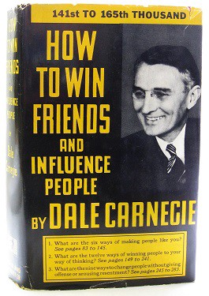

What can we learn from an 80 year old book written by a poor farmer’s boy turned soap salesman? Quite a bit, actually.

This isn’t a book review. You should unequivocally read this book. And if you last read it 15 years ago like I did, you should read it again.

I first read [How to Win Friends and Influence People](https://www.amazon.com/gp/product/B0006IU7JK/ref=as_li_tl?ie=UTF8&camp=1789&creative=9325&creativeASIN=B0006IU7JK&linkCode=as2&tag=out0b4b-20&linkId=4b64396a7082f061bfb9195171a8f8e4) in college, at a time when I — for no particular reason — felt alienated from my peers.

I’d seen the book on my grandpa’s bookshelf for years, but I’d never thought to pick it up and read it. 

Self help books always struck me as intellectually lazy. Surely my critical thinking skills would be more helpful than the platitudes of some motivational speaker. Even if that motivational speaker was the wrote the grandaddy of all motivational books and established the genre.

Then one day my grandma invited me over for lasagna. It had been a rough day where every conversation with a coworker had felt like a steel-toed march through quicksand. I’d counted no fewer than four conversation-ending eye-rolls.

In between bites of my lasagna, I pulled the worn off the shelf, gazed at its dusty jacket, and asked if I could borrow it.

I didn’t have any 8 a.m. classes, so I walked half a block to Denny’s, grabbed a corner booth, and ordered some coffee. I tore through the book in four hours.

I closed the book and leaned back against the padded seat. My sixth cup of coffee was now cold. I gazed out the window into the blackness, the book’s philosophy sparring inside my head with my old world view.

So many books promise to change your life. At best, they can only change your perspective. Over time, your perspective changes your life.

How to Win Friends and Influence People is one of these books.

But instead of just leaving it at that, I’m going to break down the three points that Carnegie introduces first, which I found to be the most profoundly useful.

#### **Don’t criticize, condemn, or complain.**

> “Any fool can criticize, complain, and condemn — and most fools do. But it takes character and self-control to be understanding and forgiving.”

When I first read this, I was like, “really?” I almost closed the book. How could a book open with such a preposterously impractical maxim. 

  

#### **Give honest and sincere appreciation.**

  

#### **Arouse in the other person an eager want.**

  

  

  

> “You can make more friends in two months by becoming interested in other people than you can in two years by trying to get other people interested in you.”

  

Closing and link to book.

  

John Dewey, one of America’s most profound philosophers, phrased  
it a bit differently. Dr. Dewey said that the deepest urge in human  
nature is “the desire to be important.”

[http://www.yourcoach.be/blog/wp-content/uploads/2014/02/Dale-Carnegie-How-to-win-friends-and-influence-people.pdf](http://www.yourcoach.be/blog/wp-content/uploads/2014/02/Dale-Carnegie-How-to-win-friends-and-influence-people.pdf)

[http://www.hubspot.com/sales/how-to-win-friends-and-influence-people-summary](http://www.hubspot.com/sales/how-to-win-friends-and-influence-people-summary)

[https://www.goodreads.com/work/quotes/2370171-how-to-win-friends-and-influence-people](https://www.goodreads.com/work/quotes/2370171-how-to-win-friends-and-influence-people)
