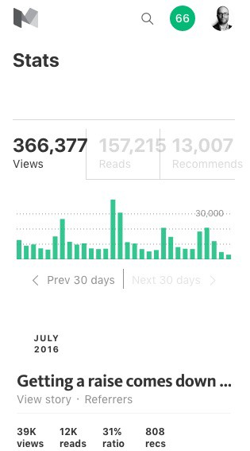
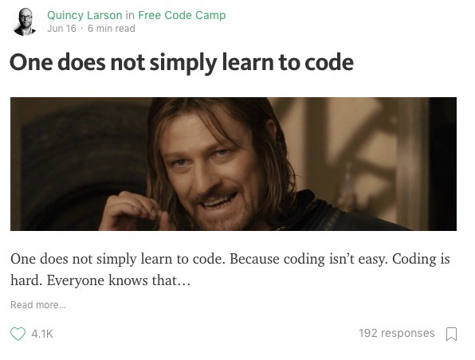
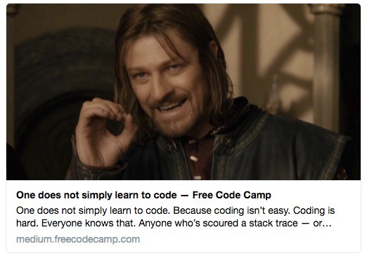
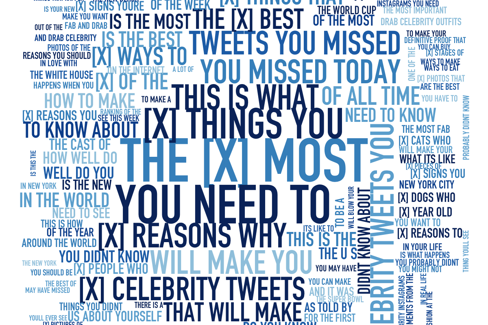
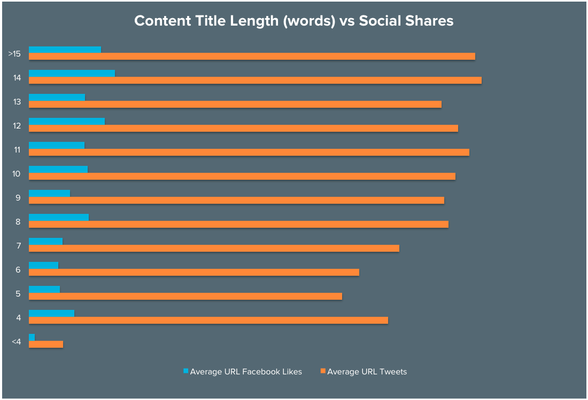
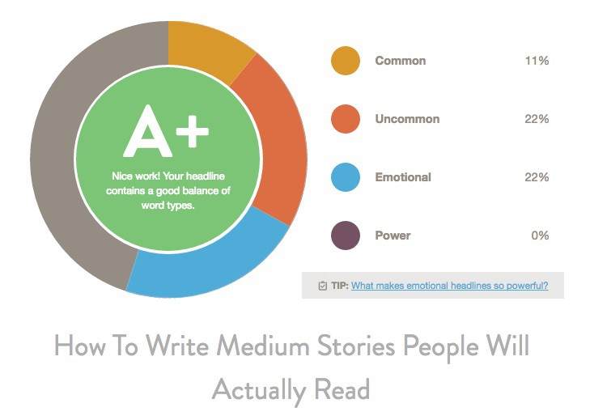

More than 30 million people use Medium each month. They come here in search of something worth reading. Something substantial. And you can give it to them.

Medium’s algorithms put you on a level playing field. Your stories can dominate news feeds. You can crack Medium’s Top Stories list. You can beat out professional writers and celebrities.

I’ll show you how.

But why should you care what some software developer has to say about writing?

Because over the past 30 days, I’ve averaged 12,000 views per day on my Medium stories. Medium’s readers have recommended my stories 13,000 times. And I’m the editor of one of Medium’s largest publications.

In short, I know what writing works here on Medium.

But good writing won’t help you if you can’t get people’s attention.

#### Weapons of mass attraction

As a writer, you fight a war against indifference. You have to force people to care enough to click through to your story. You have to convince them to take a chance on you.

You have only two weapons against the relentless scroll of news feeds: a headline and an image.

Here’s what a story looks like in Medium’s news feed:

Here’s what it looks like on Facebook:

And here’s what it looks like on Twitter:

Your headline and opening image are the only things people have to judge your story on. Before they can even read your story’s first paragraph, they must answer a question. It’s the same question that we all ask ourselves every day: **is this going to be worth my time?**

Your first job as a writer is to choose a headline and image that will make people answer “yes.”

#### Headlines: part art, part science

Your headline is the most important part of your story. Spend time refining it.

BuzzFeed built a publishing empire on the back of compelling headlines. Here’s a a [lexical analysis](http://minimaxir.com/2015/01/linkbait/) of 60,000 BuzzFeed headlines, and what works best for them.

I am not saying you should use BuzzFeed-like headlines. But you should be aware of them. They’re filled with hyperbole and fear-of-missing-out. Think about what their effectiveness says about human psychology and the nature news feeds.

Here are some types of headlines that work well on Medium:

-   grand pronouncements like “X is over”, “X is broken”, or “X is bull\*\*\*\*”
-   Headlines that use negative words like “stop”, “never”, and “don’t ever \_\_\_\_ again”
-   The “I \_\_\_\_\_ and it was \_\_\_\_\_” pattern (for example: “I ate pizza for breakfast and it was glorious”)

How long should your headline be? HubSpot [analyzed](http://blog.hubspot.com/marketing/seo-social-media-study#sm.00000z83pnwr7kdwxvrrsinzxyr7l) 6,000 blog posts and found that stories with 8 to 14-word headlines get more social media shares.

Another consideration is how emotional a headline is. The more emotional (positive or negative) a headline is, the more likely people will click it.

Here’s a [tool](http://coschedule.com/headline-analyzer) that helps you balance the length and sentiment of your headlines.

Headlines are traditionally written in “title case.” The Associated Press says to “capitalize the first letter of every word except articles, coordinating conjunctions, and prepositions of three letters or fewer.”

On Medium, I often throw title case out the window and just write headlines like a normal sentence. I even include punctuation as necessary. This format is more conversational, and easier to read.

#### Arresting Images

The second most important aspect of your story is its opening image.

Medium assigns your opening image the og-image meta property. This means that your opening image will serve as your story’s ambassador everywhere: social media news feeds, Reddit, Google News — even RSS readers.

For this story, I chose an image of Emma Stone portraying an aspiring journalist at her typewriter in the 1960s. It’s from the popular 2011 period movie “The Help.”

A stock photo of someone sitting at their laptop would have looked too generic. Our news feeds are already filled with these pictures.

If you do want to use stock photos, though, there are a ton of free [creative commons-licensed stock photos](http://finda.photo/) you can use in your stories.

I recommend keeping photos thematically consistent throughout your story. Here’s another image of Emma Stone’s character writing. This helps to break up long stretches of text.

On one story, I used only images from The Dark Knight trilogy:

[**Salary Negotiation: how not to set a bunch of money on fire**  
_Pop quiz, hot shot._medium.freecodecamp.com](https://medium.freecodecamp.com/salary-negotiation-how-not-to-set-a-bunch-of-money-on-fire-605aabbaf84b "https://medium.freecodecamp.com/salary-negotiation-how-not-to-set-a-bunch-of-money-on-fire-605aabbaf84b")

And I only used images of Peggy Olsen from Mad Men for another:

[**Getting a raise comes down to one thing: Leverage.**  
_Maybe you’ve been at your job for a while, and your salary hasn’t kept pace with your city’s cost of living._medium.freecodecamp.com](https://medium.freecodecamp.com/youre-underpaid-here-s-how-you-can-get-the-pay-raise-you-deserve-fafcf52956d6 "https://medium.freecodecamp.com/youre-underpaid-here-s-how-you-can-get-the-pay-raise-you-deserve-fafcf52956d6")

These stories don’t mention The Dark Knight or Mad Men in their text. The images are there to visually reinforce each story’s message, while lending them flavor.

> A spoonful of images helps the text go down.

Another popular technique is to emblazon your story’s headline across your opening image. My friend Kristyna did this on the most-recommended story ever on Medium:

[**The 37 Best Websites To Learn Something New**  
_There is absolutely no excuse for you not to master a new skill, expand your knowledge, or eventually boost your career…_entrepreneurs.maqtoob.com](https://entrepreneurs.maqtoob.com/the-37-best-websites-to-learn-something-new-895e2cb0cad4 "https://entrepreneurs.maqtoob.com/the-37-best-websites-to-learn-something-new-895e2cb0cad4")

Start considering images early in the writing process. And never publish without at least one image. Otherwise your story will be all but invisible in news feeds.

#### Build momentum with a strong lead

Once your reader clicks through to your story, the trial begins. They are looking for any excuse to jump back to their news feed. Reading requires a lot more effort than scrolling through cat photos.

Don’t waste time with intros or updates — start making points and telling your story immediately.

#### Establish credibility

Figure out a way to establish your credibility within the first few paragraphs. If you are a top expert in your field, say so. Don’t assume that people are going to take the time to google you.

> “Who you are speaks so loudly I can’t hear what you’re saying.” — Ralph Waldo Emerson

Are you writing about health as a non-physician? Are you writing about personal finance as a non-millionaire? You’ll need to overcome any skepticism readers may have about your credibility.

I established my credibility as a writer earlier by posting my recent Medium stats. You’ll need to find an achievement you can trumpet. Something that gives your readers the impression that “this person knows what they’re talking about.”

Reinforce your credibility throughout your story. Support your arguments with data. Use inline links to (non-paywalled) research.

This isn’t the New England Journal of Medicine. This is Medium. So don’t use footnotes.

#### Write smart

Good writing is hard. Like any skill, it takes practice. There are no shortcuts to becoming a strong writer.

Do yourself a favor: **write what you know**.

Have you ever heard the term “writers block?” Writer’s block happens when you don’t know enough about a topic to write about it. The antidote is research. Learning. Going out into the field.

Don’t publish anything you’re not proud of. Medium isn’t a numbers game. It’s a social contract. People follow you. In turn, you show respect for their scarce time.

Good Medium stories don’t come naturally. For every minute of story length, expect to spend at least an hour writing, re-writing, and editing your story.

Speaking of story length…

#### Medium readers prefer longer stories.

Medium’s data scientists found that [7 minutes](https://medium.com/data-lab/the-optimal-post-is-7-minutes-74b9f41509b#.p8jwm4wpf) is the optimal length for a Medium story.

In practice, a story should be as long as it needs to be, and no longer.

If you can’t come up with at least 5 minutes worth of thoughts, rethink the premise of your story.

One exception to this is stories that are mostly images, embeds, or code.

#### Write at a sixth-grade level

Just because many of your readers went to college does not mean they enjoy reading at a college level. And many of them will be non-native English speakers.

Paste your story into the [Hemingway Editor](http://www.hemingwayapp.com/). This will highlight dense sentences, adverbs, passive voice, and other style issues. It will also assign a grade level to your overall writing.

Despite what you may have learned in English composition class, people prefer short paragraphs to “walls of text.”

There’s nothing wrong with single-sentence paragraphs.

Err on the side of creating new paragraphs.

#### Add 5 tags

Medium allows you to add up to five tags to your story. Use them.

People follow specific topics on Medium. The [most popular ones](https://medium.freecodecamp.com/medium-isn-t-just-startup-people-30a3752b09b9#.5mxkc6mvw) are #tech, #life-lessons, #travel, #design, and #startup.

People who follow the tags you use may see your article in their news feed. Tags also make it easier for people to stumble upon your story in search results.

#### Promote your stories on social media

Once you hit publish, your story will begin to “decay” in Medium’s recommendation engine. As time passes, it will show up in fewer news feeds. The only way to counteract this decay is to get more views and recommends.

The first few hours are critical. Be sure to get a few recommends on your story immediately. These will serve as a proof of concept.

Peer pressure is powerful. Humans are much more likely to click that recommend heart if others humans have already done so.

Share your story on Facebook, Twitter, and LinkedIn. You can view your story’s [stats](https://medium.com/me/stats) in real time. Ask for feedback from your friends and followers. Incorporate this feedback into your story.

Once people have recommended your story, share it on relevant Reddit subreddits and Facebook groups.

If you have a mailing list, you can blast it out to your subscribers, too.

#### Submit your story to a large, specialized publication.

Another way to reach a much larger audience is by syndicating your story in one of Medium’s publications. These are communities of writers and editors who specialize in writing about a few key topics, such as health or education.

For example, Free Code Camp’s Medium publication (for which I’m an editor) focuses on development, design, and data science. It has more than 50,000 followers.

When a publication syndicates your story, it will show up in the news feeds of its followers. Publications can also feature your story on their landing pages.

Find out who the editors of these publications are and pitch your story to them.

#### Ask people to recommend and share.

Medium is still quite new. Most people don’t understand how its recommend and follow mechanisms work.

Here’s my final tip for expanding your readership here on Medium: include instructions and a custom GIF image at the bottom of your stories. This will show people how to recommend your story and follow you.

**I only write about programming and technology. If you** [**follow me on Twitter**](https://twitter.com/ossia) **I won’t waste your time. 👍**
