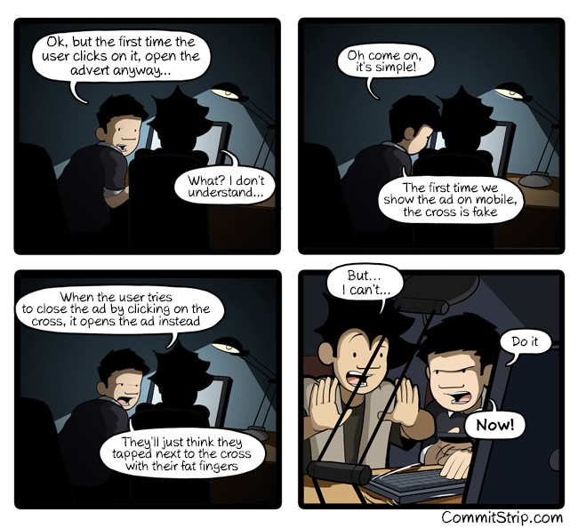
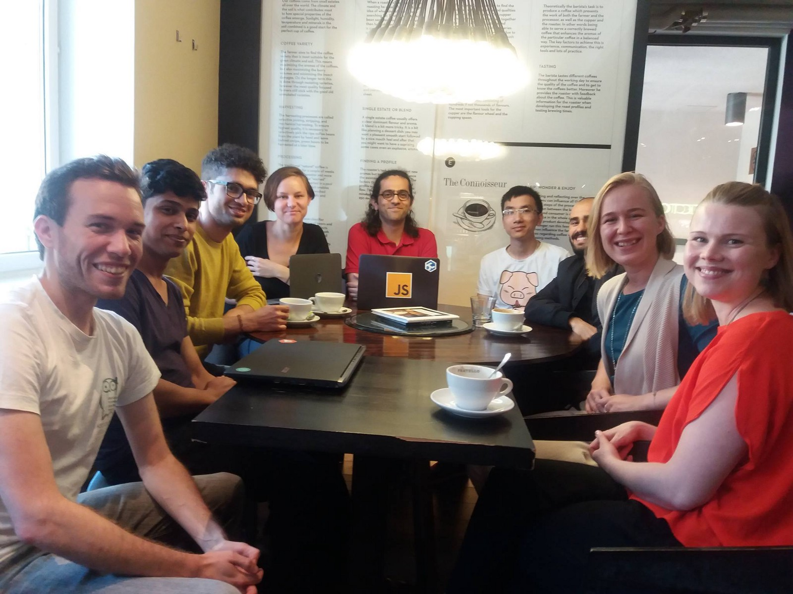

Here are three links worth your time:

1.  How my friends and I grew our side project into a $17,000/month business ([11 minute read](http://bit.ly/2m4qmkx))
2.  React’s JSX vs Vue’s templates: a showdown on the front end ([7 minute read](http://bit.ly/2m4esr7))
3.  A warning from Bill Gates, Elon Musk, and Stephen Hawking ([4 minute read](http://bit.ly/2lwufB8))

### Thought of the day:

> “No matter how slick the demo is in rehearsal, when you do it in front of a live audience, the probability of a flawless presentation is inversely proportional to the number of people watching, raised to the power of the amount of money involved.” — Mark Gibbs

### Funny of the day:

“The Dark Side of Coding” by [Commit Strip](http://bit.ly/2l00PYM)

### Study group of the day:

[freeCodeCamp Helsinki](http://bit.ly/2meYiud)

Happy coding!

– Quincy Larson, teacher at [freeCodeCamp](http://bit.ly/2j7Q1dN)
