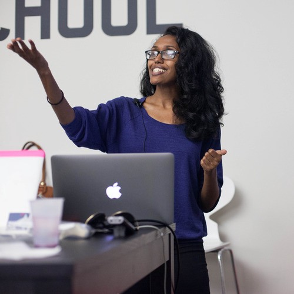

)](./asset-1.jpeg)

In the last 24 hours, 4,000 people who are new to coding have taken our anonymous 5-minute survey. We will release the full dataset as part of our commitment to Open Data once the survey ends in late April. Until then, we have links to some live statistics below.

Two weeks ago, Stack Overflow — the popular technology question-and-answer site — shared the results of their survey of 50,000 developers.

After writing a full analysis of [the survey’s eye-opening results](https://medium.freecodecamp.com/2-out-of-3-developers-are-self-taught-and-other-insights-from-stack-overflow-s-2016-survey-of-50-8cf0ee5d4c21#.yhlo2k5oz), I started to think about all the questions I had that were still unanswered. Questions about the growing number of people around the world who had only recently started to learn to code.

[Saron Yitbarek](https://twitter.com/saronyitbarek) with [CodeNewbie.org](http://codenewbie.org) and I started tweeting back and forth about the Stack Overflow results. She had a lot of unanswered questions, too.

Saron works at Microsoft during the day, and runs the CodeNewbie community and podcast at night. So we set up a midnight Skype call, and discussed the possibility of doing a survey of our own, just for new coders.

Saron liked the idea, and offered to help design and publicize the survey.

So, after getting a sanity check from Free Code Camp’s core team, I went where most people go when they want feedback on a new idea: Twitter.

I tweeted my rough list of questions I had for new coders. Considering that Friday evening is the [worst time to tweet](http://www.adweek.com/socialtimes/files/2014/05/post-pin-tweet-best-worst-times-social-media.jpg), I wasn’t expecting much of a response. But plenty of people responded with constructive criticism.

This was reassuring. So I went to Typeform and started building the survey. Typeform’s support team reassured me they could handle hundreds of concurrent survey-takers.

If you make a survey too long, people will get bored and abandon it. So I wanted to capture the data with “checkpoints” just in case. Typeform’s team sent me some tutorials on how to seamlessly glue forms together using URL parameters.

My goal was to ask as many questions as possible while maximizing the completion rate. To do this, I:

-   made the survey completely anonymous
-   made all questions optional (you can just scroll right past ones you don’t want to answer)
-   jam-packed the survey full of branching logic to keep it as concise as possible. Depending on how you answer, you could be asked 15 questions or you could be asked 30 questions.

In retrospect, this seems to have paid off. Though the survey is 5 minutes long, three out of four people who start the survey finish it.

By Monday night, I had a rough proof of concept.

I read as many literature reviews of survey design research as I could, but at the end of the day, I’m not a trained academic researcher.

Fortunately, I have access to a lot of data scientists, through [Free Code Camp’s Data Science chat room](https://gitter.im/FreeCodeCamp/DataScience). And they critiqued the wording of my questions, the constraints, and overall design of the survey.

We announced the survey to our open source community yesterday afternoon, and word has traveled from there.

If you can’t wait for the full dataset, you can view the results to many of the questions as they come in:

[learning approach data](http://bit.ly/1ZLYUp7)

[socioeconomic / demographic data](http://bit.ly/1TjBlU7)

This is just the tip of the iceberg, though. The full dataset — which we will release as a .csv file shortly after the survey ends in late April — will have tons of additional numeric insights. It will offer thousands (hopefully tens of thousands) of rows of data.

It’s hard to even imagine how much we can learn from this survey.

There are literally millions of adults around the world who are learning to code. We can discover correlations from a trove of demographic and socio-economic data. We can better understand their employment goals, and their strategies for getting there.

The more data we all have to learn from, the better we can understand one of the biggest phenomena of our time: the global movement toward coding.

**I only write about programming and technology. If you** [**follow me on Twitter**](https://twitter.com/ossia) **I won’t waste your time. 👍**
