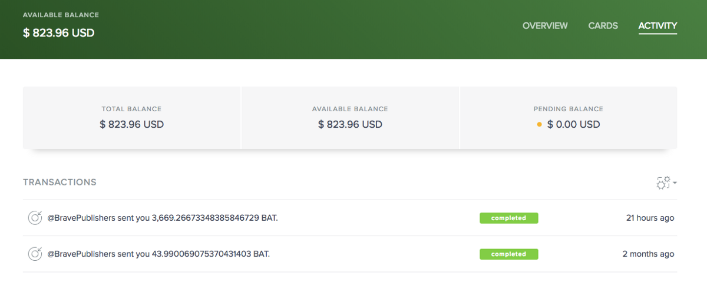
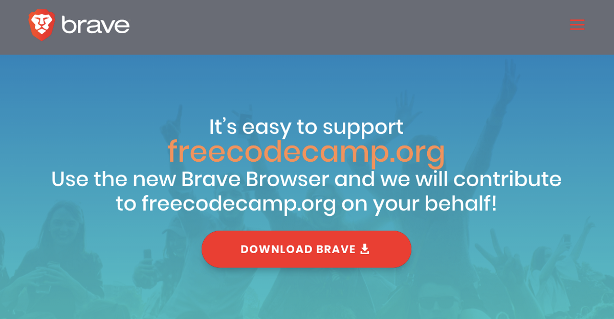

A couple months ago, a contributor to the freeCodeCamp community sent me a message encouraging me to register freeCodeCamp.org with a new web browser called Brave.

I followed his advice and spent about 10 minutes completing the registration process, thanked the camper, then promptly forgot about the whole experience and moved on to other tasks.

Then last week out of nowhere I got an email from Brave: they had just wired the equivalent of US $800 in cryptocurrency to freeCodeCamp.org!

At first I was surprised. But I was indeed able to withdraw the cryptocurrency to freeCodeCamp’s bank account with minimal effort. And the more I looked into how Brave worked, the more this $800 dollar figure seemed reasonable for a website with the levels of traffic that freeCodeCamp.org has (millions of visitors a month).

In this article, I’ll explain how Brave works, and how to start browsing with it. And I’ll to show you how you can get set up to start receiving money from Brave as well.

### The Brave Browser and why it’s

20 years ago, Brandon Eich created the JavaScript language. And now his new project — a privacy-focused web browser called Brave — is starting to take off.

Brave blocks ads, trackers, and anything that might make your browsing experience less private or less secure.

And it’s this ad-blocking feature that makes Brave so interesting. 

### Why ads are falling out of favor for some types of content

  

  

If you [install Brave using this link](https://brave.com/fre280), then use it daily for at least a month, Brave will donate $5 for freeCodeCamp.
