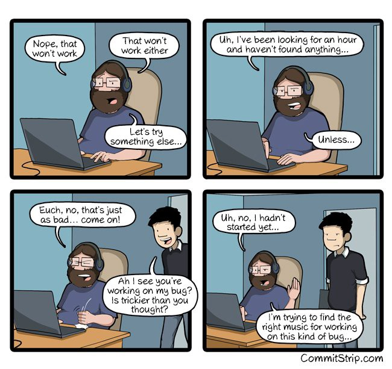

Here are three links worth your time:

1.  How we got our 2-year-old open source project to trend on GitHub in just 48 hours ([11 minute read](http://bit.ly/2kjjzWg))
2.  The Rise of the Data Engineer ([12 minute read](http://bit.ly/2jvj1Ix))
3.  Why you should have your own Twitter bot, and how to build one in less than 30 minutes ([8 minute read](http://bit.ly/2kKoqAn))

Bonus: The Founder: a dystopian business-simulator ([playable browser game](http://bit.ly/2jNukg0))

### Thought of the day:

> “It’s ridiculous to live 100 years and only be able to remember 30 million bytes. You know, less than a compact disc. The human condition is really becoming more obsolete every minute.” — Marvin Minsky

### Funny of the day:

_Comic by_ [_CommitStrip_](http://bit.ly/2jKGZ5X)

Happy coding!

– Quincy Larson, teacher at [freeCodeCamp](http://bit.ly/2j7Q1dN)
