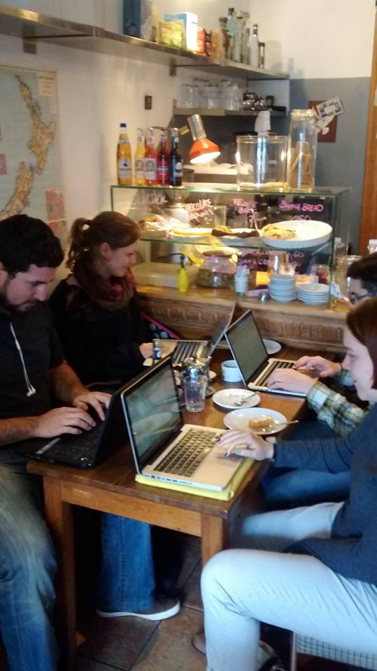

Here are three links worth your time:

1.  How you can land a 6-figure job In tech with no connections — tips that got me interviews and offers from Google, Twitter and Uber ([22 minute read](http://bit.ly/2kV6EWA))
2.  Even more about how Flexbox works — explained in big, colorful, animated gifs ([7 minute read](http://bit.ly/2kHOhcO))
3.  Rosetta Code — unlocking the mysteries of the programming languages that power our world ([17 minute read](http://bit.ly/2m4aMsv))

### Thought of the day:

> “Controlling complexity is the essence of computer programming.” — Brian Kernigan

### Funny of the day:

Webcomic by [Sephko](http://bit.ly/2kSQqNI).

### Study group of the day:

[freeCodeCamp Berlin](http://bit.ly/2kSOViK)

Happy coding!

– Quincy Larson, teacher at [freeCodeCamp](http://bit.ly/2j7Q1dN)
