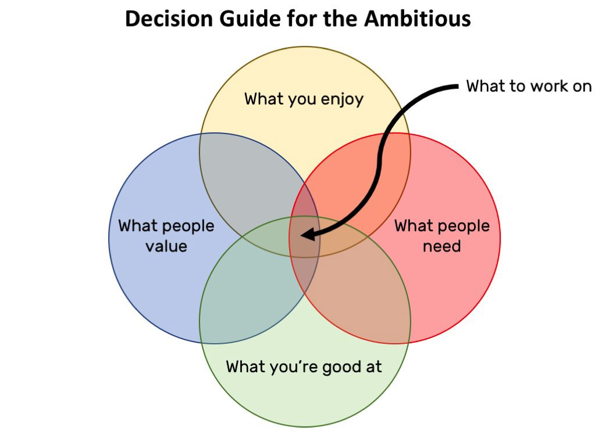
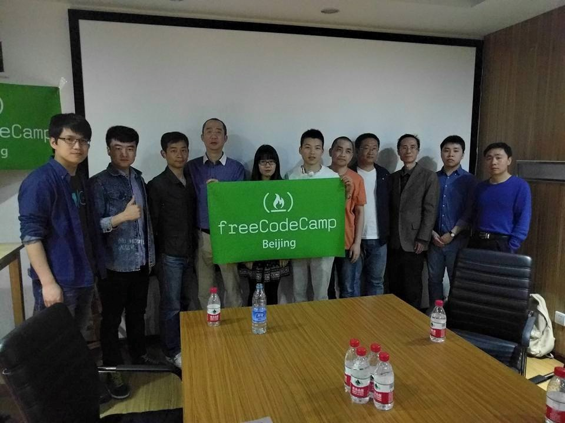

Here are three links worth your time:

1.  I’ll never bring my phone on an international flight again. Neither should you. ([7 minute read](http://bit.ly/2kPxOBI))
2.  “I literally want to hack my heart. But I can’t.” Interviews from the floor of OSCON, the biggest open source convention ([78 minute listen](http://bit.ly/2lghPgv))
3.  Watch Ewa build a GitHub Battle app on the latest episode of her video blog ([10 minute watch](http://bit.ly/2ktw3Xs))

### Thought of the day:

> “We should treat personal electronic data with the same care and respect as weapons-grade plutonium — it is dangerous, long-lasting and once it has leaked there’s no getting it back.” — Cory Doctorow

### Image of the day:

Image by [David Whittaker](http://bit.ly/2lgkwP9)

### Study group of the day:

[freeCodeCamp Beijing](http://bit.ly/2ldxs8X)

Happy coding!

– Quincy Larson, teacher at [freeCodeCamp](http://bit.ly/2j7Q1dN)
