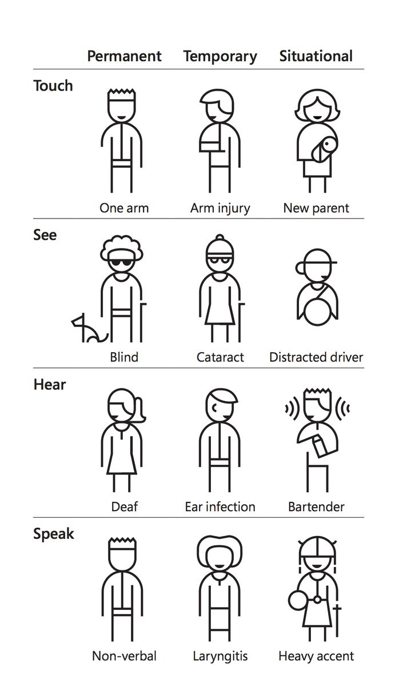
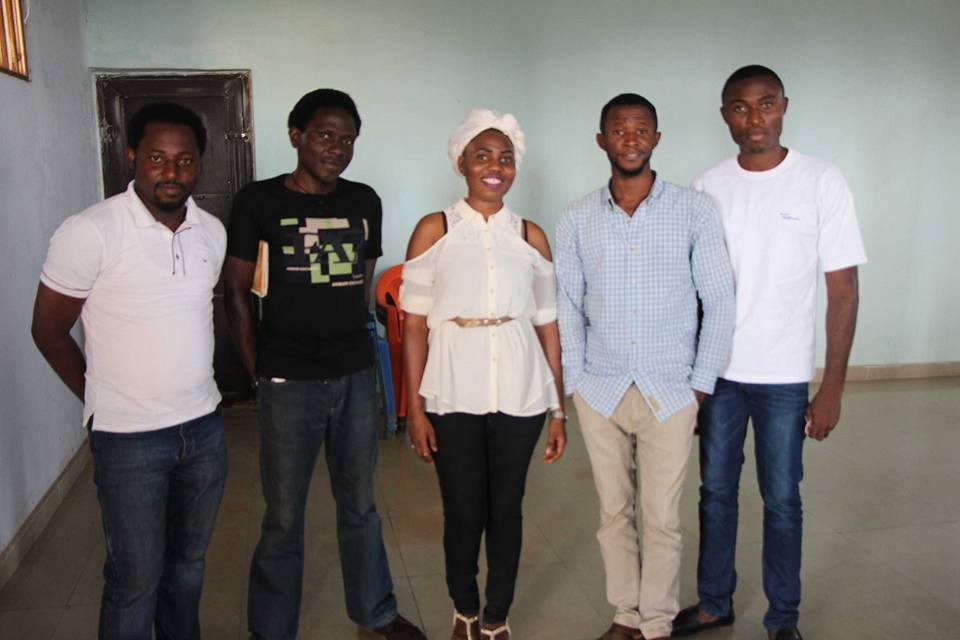

Here are three links worth your time:

1.  I camped out with a tech billionaire. The advice he gave me was priceless. ([4 minute read](http://bit.ly/2oVyAMs))
2.  Before you can master design, you must first master the fundamentals ([6 minute read](http://bit.ly/2nTwde3))
3.  And the 2016 Turing Award goes to… Sir Tim Berners-Lee, the inventor of the World Wide Web ([2 minute read](http://bit.ly/2oVQH4Z))

Bonus: I talk about learning to code — and how automation is changing society — in this podcast interview on the Reed Harvey Show ([53 minute listen](http://bit.ly/2nxkAIy))

### Thought of the day:

> “Anyone who has lost track of time when using a computer knows the propensity to dream, the urge to make dreams come true and the tendency to miss lunch.” — Sir Tim Berners-Lee

### Image of the day:

A diagram from [Microsoft’s Inclusive Design toolkit](http://bit.ly/2n38v1P) displaying types of accessibility issues.

### Study group of the day:

[freeCodeCamp Abuja](http://bit.ly/2ntYPss)

Happy coding!

– Quincy Larson, teacher at [freeCodeCamp](http://bit.ly/2j7Q1dN)

If you got value out of this email, consider [supporting our nonprofit](http://bit.ly/donate-to-fcc).
