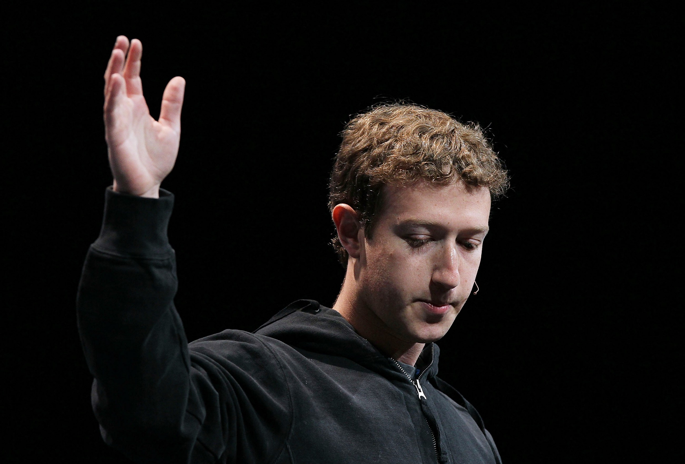
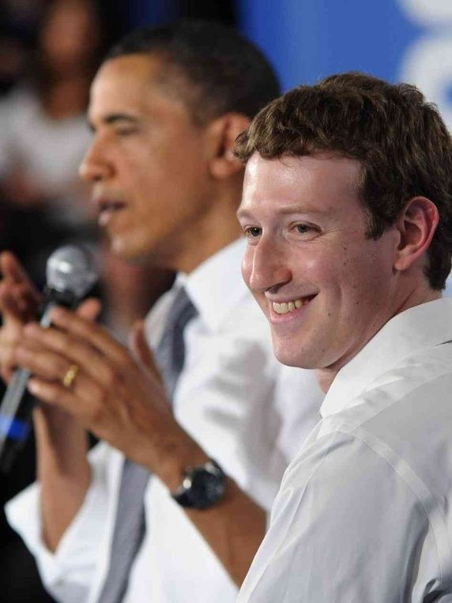
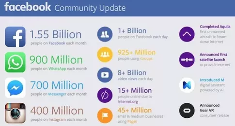
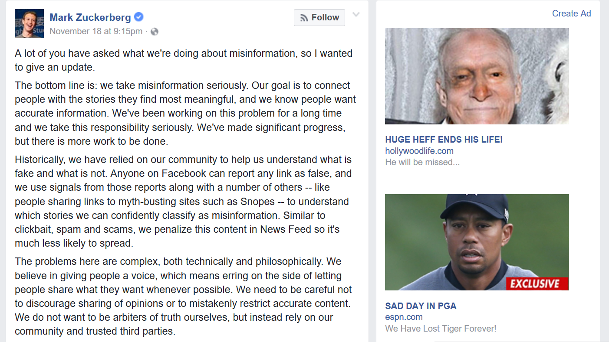
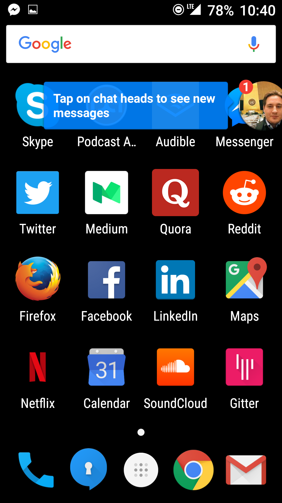
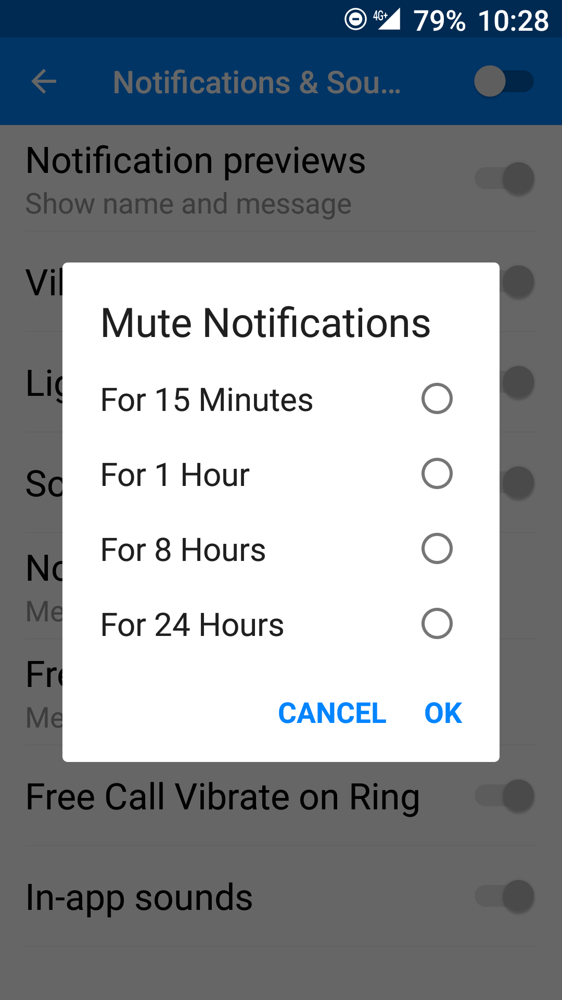

> “With great power comes great responsibility” — Uncle Ben

Mark Zuckerberg — Facebook’s CEO — is probably the most powerful person alive today. He may even be the most powerful person ever.

Traditionally, the president of the United States has been considered the most powerful person on Earth. After all, President Obama controls the most powerful military on the planet, and has considerable influence over the $18 trillion US economy.

But President Obama is beholden to systems that keep his power in check: congress and the supreme court, term limits (he will be forced to retire in January), and the will of the American electorate.

Mark Zuckerberg has none of these limitations. His power flows from Facebook, the seventh largest corporation on the planet by market capitalization, of which he owns 18% of the stock and controls 60% of the voting rights.

At 32 years of age, he could remain the CEO of Facebook for another 50 years.

But financials are just a small part of what makes Facebook so powerful. Here are some ways it dominates human attention:

1.  More than one billion people use Facebook each day. 1/4 of all time spent on the internet is spent using Facebook.
2.  For many people, Facebook is the internet. It’s the first place most people go to announce weddings, births, deaths, and other major life events.
3.  Facebook is increasingly the place where people consume other forms of media.

Through its Free Basics program, Facebook has literally [become the internet](https://en.wikipedia.org/wiki/Internet.org) for the world’s poor (who have to pay money to access websites that are outside of Facebook).

Facebook has also used its monopoly on human attention to control [what news is shown to whom](http://gizmodo.com/former-facebook-workers-we-routinely-suppressed-conser-1775461006), affecting public opinion from the shadows.

And Facebook knows far more about humanity — and individual humans — than any other company or government on Earth. **500 terabytes of our personal data flow into Facebook every day.**

So far, Zuckerberg has mainly used Facebook’s power to further grow Facebook. He’s acquired Facebook’s most serious competitors: Instagram and WhatsApp. He’s now competing with YouTube for video and Twitter for real time communication.

He’s even creating AIs and launching satellites (though his first one ended up [exploding on the launch pad](https://www.youtube.com/watch?v=pnXwURbxJSA)).

But as Facebook races toward becoming the largest corporation ever, Zuckerberg’s plans for it may change.

Even though he has pledged to [give away 99% of his Facebook stock](http://controls%2060%25%20of%20voting%20rights%20%28http//fortune.com/2016/04/29/mark-zuckerberg-facebook-power-shareholders/%29) during the course of his life, he will retain control of its board. And his power comes not from his billions of dollars, but from his access to our attention and our data.

His role in shaping humanity is so substantial that there’s even a team of university professors who log and analyze literally [everything Zuckerberg says](http://zuckerbergfiles.org/), in the hope of understanding his motivations and future plans.

For the rest of his life, Zuckerberg will be able to bring Facebook’s incredible power to bear in achieving whatever ends he desires.

### But is he responsible?

Here’s Zuckerberg’s recent post about what he’s doing to stop fake news on Facebook, in which he says, “The bottom line is: we take misinformation seriously.”

And right next to Zuckerberg’s post, there are two ads for [fake news stories](http://www.10zenmonkeys.com/2016/11/22/mark-zuckerberg-is-a-hypocrite/).

Fake news may have played a huge role in the outcome of the US presidential election, and [many other recent elections](http://www.nytimes.com/2016/11/18/technology/fake-news-on-facebook-in-foreign-elections-thats-not-new.html).

Even fake headlines — often used to trick people into clicking through ads to unrelated products — can do damage. Headlines are the only part of a news story that most people bother to read. On their own, headlines can substantially sway public opinion.

And fake news isn’t the only major Facebook controversy this week.

Yesterday, people inside Facebook [leaked to the New York Times](http://www.nytimes.com/2016/11/22/technology/facebook-censorship-tool-china.html?_r=0) that Facebook is actively working on a sophisticated censorship tool.

Zuckerberg’s apparent goal is to re-enter the Chinese market, where Facebook has been blocked since 2009.

Is it a responsible use of power for Zuckerberg to use his company’s vast wealth and army of software engineers to aid in the repression of the world’s most populous country? All so he can get more market share?

### Facebook everywhere

Facebook is already on our phones and computers, pestering us with notifications.

For example, Facebook Messenger pops up on top of whatever you’re doing every single time someone sends you a message.

If you try to shut off notifications in Facebook Messenger, here are the options it gives you:

That’s right — the only way to shut off these annoying notifications for more than 24 hours at a time is to go all the way down to the operating system level.

And Zuckerberg won’t stop at merely pervading our existence. He wants for Facebook to **be** our existence.

Here’s a demo of Facebook Social VR, built on top of Oculus, a company he acquired in 2014:

<Embed src="https://www.youtube.com/embed/YuIgyKLPt3s?feature=oembed" aspectRatio={undefined} caption="" />

It’s striking how mundane all this looks. You can go anywhere and do anything, but instead you’re going to fast-travel to your living room and take a selfie with your dog? But I digress.

Zuckerberg has been clear that he intends to create — then monetize — artificial scarcity. He envisions a future where you can pay extra money to get a better seat in a virtual reality-broadcast sporting event.

The supply of front row seats in VR should technically be unlimited. Bleachers in a VR experience are not bound by the normal rules of space and time. But you’ll have to pay extra to keep those other avatars’ heads from blocking your view of the game.

Add to this the fact that, in VR, ads can be literally everywhere. With eye tracking, you won’t be able to avert your gaze from them.

And with Facebook’s ever-growing corpus of data about you — and its capitalist mandate to maximize value for its shareholders — these ads will continue to get creepier and creepier.

### Facebook is a threat to the open web

Something like Facebook could never have emerged within Facebook. It needed an open web within which to gestate.

Despite this, Facebook is taking conscious efforts — like Free Basics — to destroy the open web. It’s destroying the very environment that made its own existence possible.

Google co-founder Sergey Brin [has condemned](https://www.theguardian.com/technology/2012/apr/15/web-freedom-threat-google-brin) Facebook, and acknowledged that Google itself couldn’t succeed in the “walled garden” web that Facebook is creating:

> “You have to play by their rules, which are really restrictive. The kind of environment that we developed Google in, the reason that we were able to develop a search engine, is the web was so open. Once you get too many rules, that will stifle innovation.”

By locking down the web, Facebook is not only sucking up more and more of humanity’s waking hours — it’s poisoning the well.

Organizations that would otherwise eventually emerge to challenge Facebook’s dominance will never even be able to find the fertile soil they need to take root in the first place.

### What can you do about it?

Many people’s instinctive reaction is to delete their Facebook account and simply ignore it.

Unfortunately, deleting your Facebook account won’t help. That will just lead to even fewer reasonable people on Facebook.

Like it or not, many of the people who need to hear your thoughtful opinions the most are right there, hanging out on Facebook.

They are your extended family. Your high school classmates. And they’re being bathed in pathos and misinformation all day long.

They need to see your reasonable opinions and your thoughtful responses to their own, often unreasonable ones.

I for one have no plans of deleting my Facebook account.

I’m not going to retreat into some literati echo chamber where I might otherwise prefer to spend my time.

I’m going to stick it out, and continue to fight misinformation with wit and reason.

And I hope you will, too.

### Making the experience more bearable

There are some ways you can make Facebook a saner place for yourself.

1.  The trending section is filled with ads and misinformation. You can block it — along with ads and many other things you don’t like about Facebook — by installing the [Facebook Purity](https://chrome.google.com/webstore/detail/fbfluffbustingpurity/nmkinhboiljjkhaknpaeaicmdjhagpep) Chrome extension.
2.  Decline Facebook’s frequent requests for your data. Don’t give them your phone number or access to your Gmail contacts. And don’t use Facebook authentication to sign into websites or apps.
3.  Think twice about sharing any personal information. It’s OK to post pictures of you with your kids, but I definitely wouldn’t post angry rants or live-stream from a happy hour. Handing Facebook these moments of weakness can only hurt you down the road.

Finally, educate yourself on how the web works, and why an open web is so critical. Read this excellent book on Net Neutrality and the ongoing battle for the internet:

[**The Master Switch: The Rise and Fall of Information Empires**  
_Edit description_amzn.to](http://amzn.to/2cjtFDH "http://amzn.to/2cjtFDH")

**I only write about programming and technology. If you** [**follow me on Twitter**](https://twitter.com/ossia) **I won’t waste your time. 👍**
