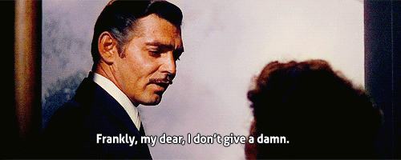
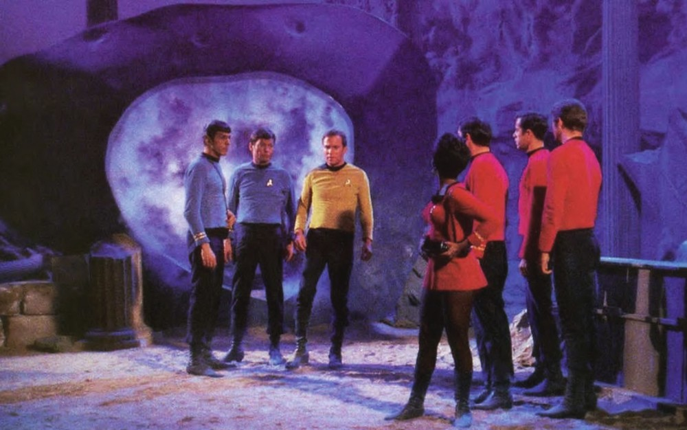

 is my power animal.](./asset-1.png)

> “No person is free who is not master of themselves.” — Epictetus

I’ve tried a number of multi-year experiments to boost my willpower:

-   giving up coffee and alcohol
-   running 10k every day
-   taking cold showers instead of hot ones

And yet by far the easiest thing I’ve done to strengthen my will was to quit saying certain 4-letter English words.

Five years ago, I decided that going forward, I would refrain from saying any cuss word that you couldn’t find in the Old Testament.

My commitment was immediately put to the test. I was at my brother’s house (a no-shoes household), and we had dimmed the lights so we could watch a movie. I was walking back to his living room with a bowl of freshly-popped popcorn, when suddenly a solid wood table leg appeared out of the shadows.

I stubbed my toe so hard that the entire table screeched across his hardwood floor.

My family went silent. They glanced down at my gushing pinky toe. Then up at my face.

“Woah!” my brother’s wife said. “Doesn’t that hurt?”

I just stood there, squeezing my popcorn bowl. Through my clenched teeth — and without really thinking about it — I said: “Not if you’re tough.”

I don’t know what came over me. In truth, my toe hurt like crazy. Whatever it was, that night a family-wide meme was born.

Ever since, whenever someone in our family gets injured somehow, they jokingly reply to inevitable questions about pain with “Not if you’re tough.” Then everybody laughs.

If this had happened before I’d taken my vow of profanity silence, I would have no doubt jumped up and down shouting curse words. But instead, a serene side began to emerge and take hold of my personality.

### Substituting profanity with “aliases”

Darn. Heck. Shoot. There were softer versions of pretty much every cuss word out there, and I quickly adopted these.

But one word was missing. The big one that everyone uses as a verb, adjective, and even a noun — sometimes all in the same sentence. And no, “fudge” wasn’t going to cut it for me.

Fortunately, my wife and I had just binge-watched the entire series of Battlestar Galactica over one rainy winter in Shanghai.

Battlestar Galactica features a civilization that is technologically advanced, but also brooding, alcoholic, and potty-mouthed. And instead of omitting the f-word from the show entirely, like similarly gritty — yet still PG-13 — shows did, the writers decided to make up their own f-word so that the actors could freely say on TV: [frak](https://en.wikipedia.org/wiki/Frak_%28expletive%29).

When you first watch the show, and notice them saying “frak,” it’s quite cheesy. The characters say things to one another like “Frak you!”, “What the frak?” and even “Go frak yourself.”

And of course, this was before the term “fracking” — the environmentally questionable act of pumping high-pressure fluid into the ground to extract oil and natural gas — had entered popular lexicon.

This made use of the word “frak” even more absurd. And that absurdity lended it a certain humor. A certain power.

So with this final addition to my array of cuss word aliases, I had everything I needed to go profanity-free.

Just like how the Mr. Robot protagonist [Elliot Alderson](https://medium.freecodecamp.com/all-i-really-need-to-know-about-infosec-i-learned-from-mr-robot-7902cca6d729#.nhwv27j9v) would later condition himself to hear the words “Evil Corp” whenever someone uttered “E Corp”, I conditioned myself to hear the Battlestar Galactica “frak” in place of other people’s f-bombs.

Over time, I reached for these aliases less and less. Sure, there were occasions where I would shout, “Oh, frak! [Our production servers are down](https://medium.freecodecamp.com/rebuilding-the-747-at-35-000-feet-165bddf4782)!” But more often than not, I would just respond to bad situations with stoic silence.

### A less %@#$ed-up tomorrow

Quitting cussing wasn’t all that hard to do. And in addition to strengthening my willpower, it seems to have made my day-to-day outlook a bit brighter.

There isn’t much solid research about the role of profanity in human psychology. There are a few one-off studies that suggest that people who cuss frequently might be [smarter](http://www.sciencedirect.com/science/article/pii/S038800011400151X) or [perceived by others as being more honest](http://journals.sagepub.com/doi/full/10.1177/1948550616681055). These conclusions seem counter-intuitive to me, but I’ll keep an open mind in case more studies support this.

I personally don’t feel I’ve lost any of my dynamic range as a result of not cussing. Not that there’s anything wrong with cussing, or that it should be censored in any way. People cuss. No big deal. As of 2017, we’ve got bigger issues to worry about.

On the contrary, I think that cuss words can often add a valuable dramatic effect.

Back in 1934, Hollywood studios asked the producers of the 1934 film “Gone with the Wind” to change the now-famous line: “Frankly, my dear, I don’t give a damn” to “Frankly, my dear, I don’t care.”

But the producers successfully argued that the word “damn” was necessary to convey the extent of the emotion, and it was left in the film.

Producers also successfully advocated for the right to use the word “hell” in Captain Kirk’s famous line, “Let’s get the hell out of here.” This was one of the first times the word “hell” had been used like this on broadcast television. It was in the classic 1967 Star Trek episode “City on the Edge of Forever.” (By the way, if you haven’t seen this episode, [it’s on Netflix](https://www.netflix.com/au/watch/70109463) and you should totally watch it).

One side benefit of not cussing is that I no longer have to self-censor my speech around polite company, or in front of kids. Profanity doesn’t just “slip out” in casual banter like it used to.

I can now just say what’s on my mind, confident that, while some people may take issue with my ideas, they probably won’t flinch at the words I use.

If you want to learn more about little hacks like this one that you can use to improve your willpower — and thus your productivity — I recommend reading [this book](http://amzn.to/2nLHzja) by Stanford psychology professor Kelly McGonigal:

[**The Willpower Instinct: How Self-Control Works, Why It Matters, and What You Can Do to Get More of…**  
_Edit description_amzn.to](http://amzn.to/2nLHzja "http://amzn.to/2nLHzja")

I plan to continue exploring habits that can boost my willpower. For as the great poet once wrote:

> “Tis in ourselves that we are thus or thus. Our bodies are our gardens to the which our wills are gardeners.”―William Shakespeare, Othello

Thanks for reading! If you liked this article, click the 💚 below so other people will see this here on Medium.

