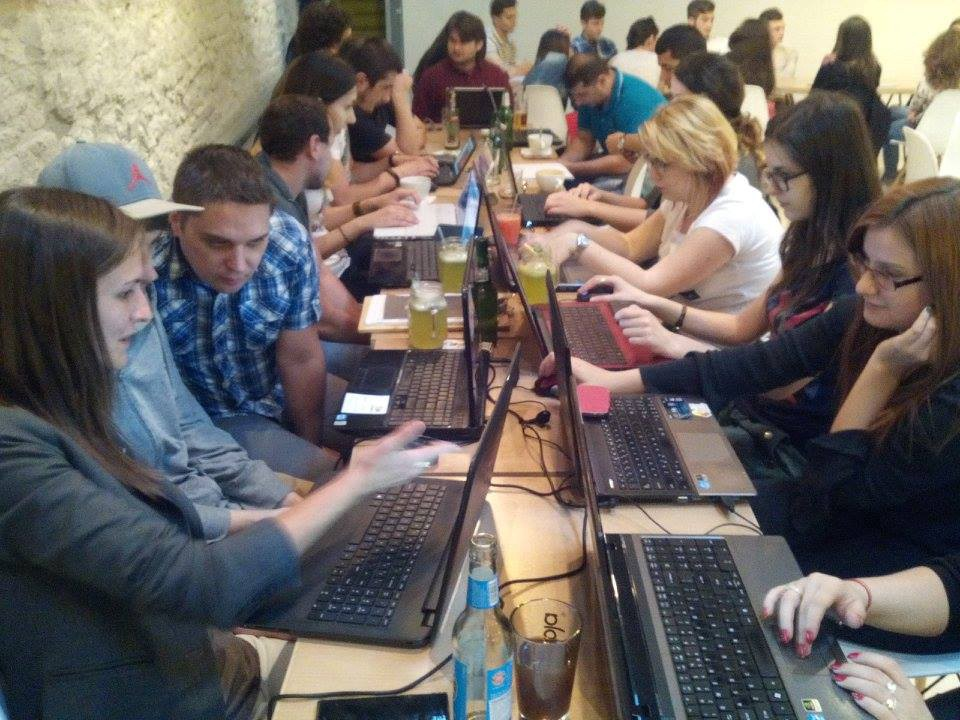
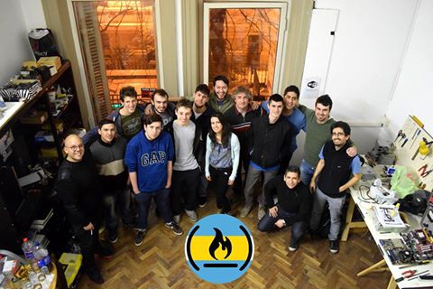

Here are three links worth your time:

1.  I hosted 40 coding events last year. Here’s what I learned. ([6 minute read](http://bit.ly/2njIXJS))
2.  I crunched the data from every episode of Netflix’s Ultimate Beastmaster ([5 minute read](http://bit.ly/2ohz7Jt))
3.  Yesterday, Congress voted to get rid of America’s internet privacy protections. Here’s how to set up a VPN in 10 minutes, and why you urgently need to ([10 minute read](http://bit.ly/2nvIQLX))

Bonus: This morning I live-interviewed JavaScript developer and author Sacha Greif about his new Meteor-based web development framework, Vulcan.js ([35 minute watch](http://bit.ly/2ohyoIa))

### Thought of the day:

> “Yesterday’s bill not only gives cable companies and wireless providers free rein to do what they like with your browsing history, shopping habits, your location and other information gleaned from your online activity, but it would also prevent the Federal Communications Commission from ever again establishing similar consumer privacy protections.” — former FCC Chairman Tom Wheeler

### Image of the day:

Photographer Charles O’Rear poses with “Bliss” — the default Windows background, and [one of the most widely viewed photographs ever](http://bit.ly/2nAuWtC).

### Study group of the day:

[freeCodeCamp Buenos Aires](http://bit.ly/2kKokrU)

Happy coding!

– Quincy Larson, teacher at [freeCodeCamp](http://bit.ly/2j7Q1dN)

If you got value out of this email, consider [supporting our nonprofit](http://bit.ly/donate-to-fcc).
