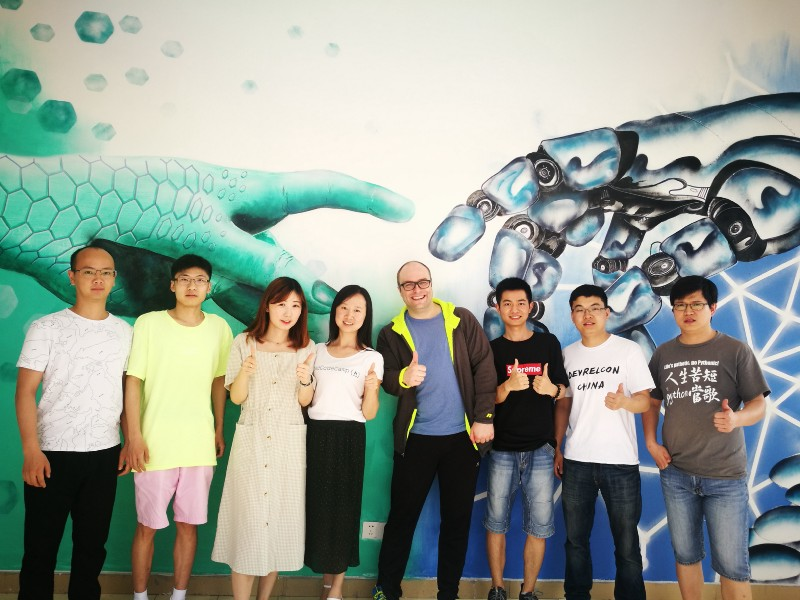

I just arrived at Dallas airport and wanted to quickly summarize my China trip.

I had limited access to the internet when I was behind the Great Chinese Firewall, but this morning I had a breakthrough and am now able to access everything. (Even though most western websites are blocked in China, freeCodeCamp isn’t blocked, and [learn.freecodecamp.org](http://learn.freecodecamp.org/) is quite fast there ^^ ).

If you’re curious, here’s a quick breakdown of what I’ve been up to for the past 4 days:

I met with the leaders of several major freeCodeCamp groups around China. They are incredibly passionate.

Two campers picked me up at the airport — one of whom is Jack — one of the leaders of freeCodeCamp.cn whom I’ve been corresponding with for the past 3 years. Jack is now the head of engineering at a blockchain company, and he manages more than 100 engineers there.

The company Jack works paid for my flight over and most of my lodging costs. They are a blockchain-focused Australian company that is operating in China without actually doing ICOs (which are now illegal here). They’re doing “air drops” and non-cryptocurrency blockchain applications (like tracking international aid with blockchain to prevent fraud). I spent a couple hours hanging out with their CEO, and went for a long walk through Shanghai so I could fight off the jet lag and go to sleep at a normal hour.

Day 2, I took a bus to Hangzhou, where I participated in the 3rd annual freeCodeCamp China reunion. Study group leaders flew in from all around China on their own dollar to hang out and give presentations. The reunion lasted about 6 hours, and the participants shared tons of details of tons of events they’d led in their cities, partnerships they’d forged with local employers, and ideas for how we can get more people in China learning to code. Many of the participants would go on to stay for the weekend. The key participant was Miya, who hosted the event. She is the co-leader of freeCodeCamp China, along with Jack.

(L->R Baozi, Justin, me, Miya, Susan, Lichuan)

The entire reunion was in Mandarin, and it ended with me giving a 30 minute presentation with live demos of Learn and Guide, entirely in Mandarin. (Other than cramming a bunch of new technology-related vocabulary on my flight over, I hadn’t spoken much Mandarin since 2010, but with the pressure on, those ~10,000 hours of practice and studying all came back to me.)

The freeCodeCamp reunion was part of a much larger event called “2050” which is kind of like the SXSW of China — thousands of participants at a newly-built conference center in the middle of an Alibaba campus.

Day 3 I was on a panel talking about distributed community development, open source, and blockchain. One of the other panelists is the CMO of a French blockchain company. He looked exactly like Jamie Lannister if you’ve seen Game of Thrones. Well it turns out he had gone through freeCodeCamp 3 years ago before getting a job in data science. And at one point he stopped in the middle of answering a question and started talking about his experience with freeCodeCamp, and how it had set him on his current trajectory. The entire audience started applauding. It was pretty surreal.

We had a large booth in the exhibition hall, and the freeCodeCamp team had 10"x10" canvases and big monitors explaining freeCodeCamp’s history, philosophy, and also the history of their .cn fork. During the day we had a crowd of around 15 people wearing freeCodeCamp shirts standing around answering questions from conference attendees. A crowd attracts a crowd, and pretty soon it became one of the most trafficked booths (despite us not having any whiz bang technology — just a bunch of friendly people demoing our webapp on laptops).

At the end of the day, 15 of us crowded into a hotel room and discussed the details of turning freeCodeCamp.cn into a proper China-based NGO so that they can operate autonomously. The Chinese market is such that foreign organizations can’t generally succeed (which is why so many companies like Google and Uber have completely exited the market). We did an impromptu video call with a law professor at 10pm on a Saturday night, and he explained in detail what the options for nonprofit incorporation were in China, and after evaluating 3 different approaches, it became clear that one was a better fit than the others.

By setting up a parallel version of freeCodeCamp running on Chinese servers, with Chinese leadership, the freeCodeCamp.cn contributors can focus on localizing freeCodeCamp.org’s curriculum and tools. They won’t have the additional regulations — nor the stigma — of being a subsidiary of an NGO (the Chinese government does not view NGOs — especially foreign ones — with the same favor that the US government traditionally does).

This way freeCodeCamp China can stay focused on creating more local events, university partnerships, and finding sponsors for study groups — things which they are already exceptionally good at.

Some high priorities for them at the moment are:

\- localizing the new curriculum

\- localizing the guide

\- launching a Mandarin-language podcast (Chinese do listen to podcasts, but there aren’t many good technical podcasts in Mandarin, so we might be able to become the most popular one)

\- launching their own Discourse instance to build up SEO on Baidu (the Chinese Google) and Bing (yeah — it still sucks, but people use it since Google is blocked there)

Currently the community is organized a bit like freeCodeCamp.org’s — broken down into hundreds of WeChat chatrooms, not unlike our Facebook groups. By launching the forum we’re optimistic that we can have a more persistent place for Q&A and discussion.

Currently, all of freeCodeCamp’s Medium and YouTube content is blocked in China. We will solve the Medium part of this by launching freeCodeCamp News in the next month or so. The video part is a bit tricker. Since data is expensive in China, we could potentially re-record some of the longer video tutorials using Scrimba, which is extremely data-light, and unlikely to ever get blocked in China (blocking almost always happens because a platform has politically sensitive content that it refuses to delete, and freeCodeCamp plans to stay out of politics to the extent possible).

In the meantime, I’ve asked them to help add Chinese subtitles to freeCodeCamp’s YouTube videos. Many of these can then be translated into Chinese and manually uploaded to a Chinese YouTube-like platform (there are many of them). Though we would want to reach out to our video authors and get their permission, first.

Day 4 I went back and helped run the booth at the expo (we still had >10 volunteers there) and took a car to Suzhou (another nearby city in Jiangsu province). We had crawfish with Jack’s family (he has 2 kids under 2 years old), then had tea with a couple professors from Suzhou who are heavily focused on blockchain.

Day 5 I met with the founder/CEO of a data science startup that is currently valued at $3 Billion. He is an Apple fanboy and had this display set up the office entryway:

I also visited the China sub-office of the Australian blockchain company and its subsidiaries, and met the first Chinese camper to earn a freeCodeCamp certificate, who now works there. It seemed like maybe half the people they’d hired were freeCodeCamp alums. I met with their CEO, Layla, and snapped some photos in front of this mural. Apparently they fly this one artist to all their offices to paint murals.

The mural — the first Chinese camper to have earned a freeCodeCamp cert to my right. His freeCodeCamp username is “bastarder” — he said if he’d realized he was going to take freeCodeCamp so seriously he would have chosen a better name than that :)

Then I grabbed some noodles and headed to the airport.

All in all, it was a fast, productive trip, and I finally got to meet a ton of people whom I’d been corresponding with for years.
