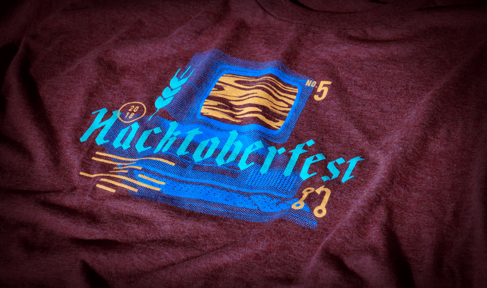
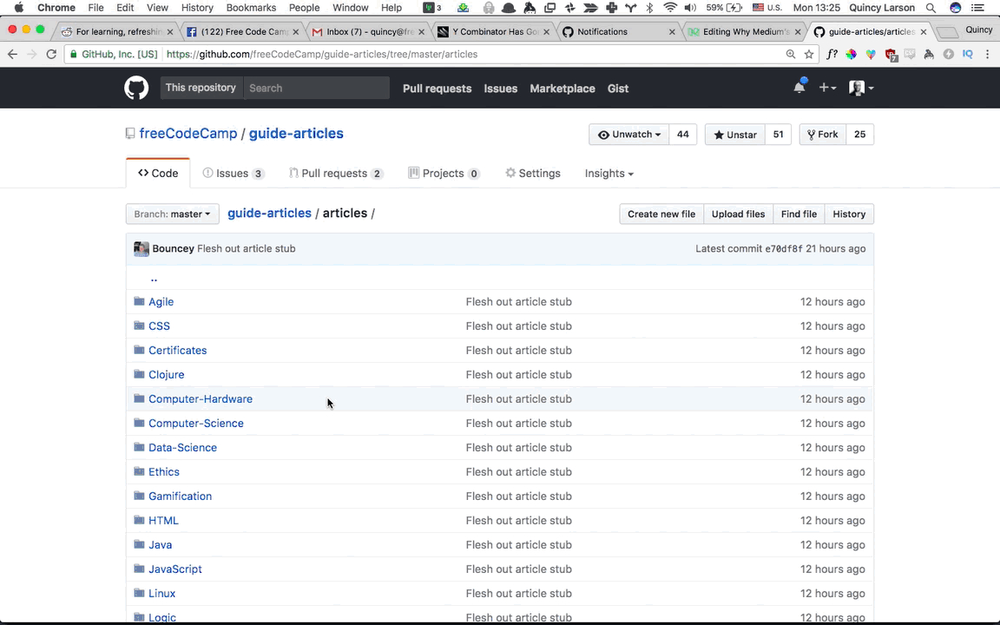
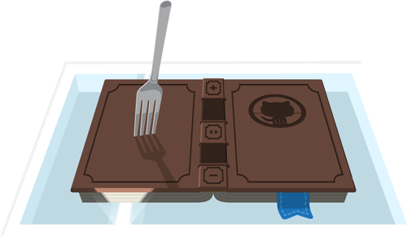
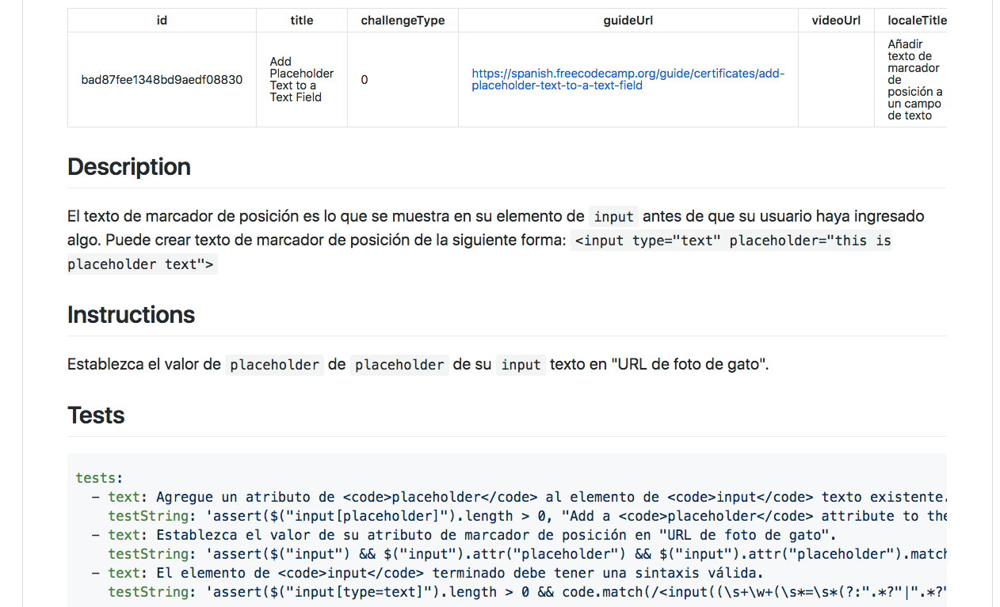
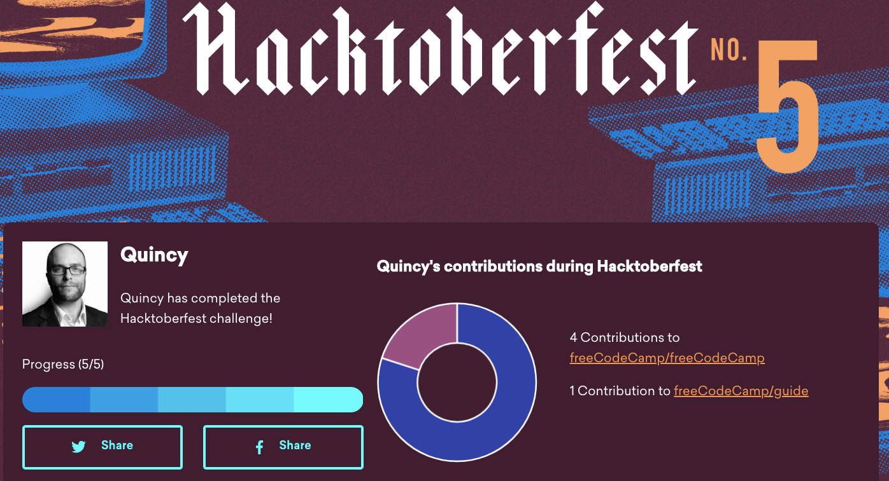

_Note: this article is now up-to-date for getting a 2018 Hacktoberfest shirt._

Every October, Digital Ocean and GitHub ship out free Hacktoberfest shirts to thousands of people around the world.

I’ve gotten Hacktoberfest shirts the past two years, and I wear them with pride.

In this quick article, I’ll show you how you can get a Hacktoberfest shirt — even if you have never coded before.

The bottom line is this: if you can open 5 pull requests by October 31 — and I’ll walk you through how to do this — you can get your own Hacktoberfest shirt shipped to your door for free.

### Step #1: Register for Hacktoberfest

You need a GitHub account. If you don’t have one yet, you can [create one for free in just a few minutes](https://github.com/join).

Then go to the [Hacktoberfest registration page and follow the instructions](https://hacktoberfest.digitalocean.com/sign_up/register). It only takes a moment.

### Step #2: Learn how to make a pull request

Pull requests are a way of contributing your code changes to an open source project. They use a tool called Git, which runs on a social coding platform called GitHub.

GitHub is the center of the open source universe, and is home to projects like Linux and React.js.

It can take months for developers to get good enough to contribute to some of these projects. But the freeCodeCamp community has made it easy for absolute beginners to contribute to our open source project.

**You can contribute to freeCodeCamp right in your browser on GitHub.** You don’t need to install anything on your computer. You don’t even need to know a programming language. You just need to choose an article you want to help improve.

Here’s a short gif showing how you can do this:

The steps are:

1.  Explore the [freeCodeCamp repository](https://github.com/freeCodeCamp/freeCodeCamp/tree/master/guide) and choose an article you want to help improve.
2.  Open that folder’s index.md file by double-clicking it.
3.  Click the pen symbol in the upper right-hand corner to edit it.
4.  Make your changes to it. You can check out [this basic Markdown cheat-sheet](https://github.com/adam-p/markdown-here/wiki/Markdown-Cheatsheet) if you want to see how to add images or videos. You don’t even need to know HTML.
5.  Scroll down and describe your changes in the commit message.
6.  Make sure the “Create a new branch for this commit and start a pull request” radio button is selected.
7.  Click “Commit Changes.”
8.  On the next page, click “Create Pull Request.”
9.  Read the checklist to make sure you’ve done everything, and check the checkboxes, then submit.

We will run some automatic tests to make sure your changes didn’t break anything. Then one of our maintainers will give you feedback on your article. Once everything looks good, we’ll merge your pull request.

We will eventually deploy your contribution to [freeCodeCamp.org](https://www.freecodecamp.org), where millions of people can read and reference it.

Contributing to freeCodeCamp is a good way to ease into contributing to open source. You can also join our [contributor chat room](https://gitter.im/FreeCodeCamp/Contributors) to hang out with other contributors and ask questions.

Also, we recently translated the entire freeCodeCamp curriculum into several major world languages.

If you speak any of these languages, you can help improve our translations. This is another way to open GitHub pull requests and earn a Hacktoberfest shirt.

In addition to English, we have translated freeCodeCamp’s full curriculum into:

-   [Arabic](https://github.com/freeCodeCamp/freeCodeCamp/tree/master/curriculum/challenges/arabic)
-   [Chinese](https://github.com/freeCodeCamp/freeCodeCamp/tree/master/curriculum/challenges/chinese)
-   [Portuguese](https://github.com/freeCodeCamp/freeCodeCamp/tree/master/curriculum/challenges/portuguese)
-   [Russian](https://github.com/freeCodeCamp/freeCodeCamp/tree/master/curriculum/challenges/russian)
-   [Spanish](https://github.com/freeCodeCamp/freeCodeCamp/tree/master/curriculum/challenges/spanish)

We’ve also translated more than 4,000 guide articles on various programming topics:

-   [Arabic](https://github.com/freeCodeCamp/freeCodeCamp/tree/master/guide/arabic)
-   [Chinese](https://github.com/freeCodeCamp/freeCodeCamp/tree/master/guide/chinese)
-   [Portuguese](https://github.com/freeCodeCamp/freeCodeCamp/tree/master/guide/portuguese)
-   [Russian](https://github.com/freeCodeCamp/freeCodeCamp/tree/master/guide/russian)
-   [Spanish](https://github.com/freeCodeCamp/freeCodeCamp/tree/master/guide/spanish)

Soon these languages will be live on [freeCodeCamp.org](https://www.freecodecamp.org), and each will have its own forum, too.

Every month, millions of people use the English language version of freeCodeCamp. We anticipate millions of people using these other language versions, too. So any improvements you can make to these translations will help a lot of people.

### Step #3: OK — now make 4 more pull requests

You can make four more pull requests to freeCodeCamp, or whatever open source project you want. Here’s [a more detailed guide to contributing to open source](https://github.com/freeCodeCamp/how-to-contribute-to-open-source), if you’re feeling adventurous.

### Step #4: Check and see whether you’ve qualified

Once you’ve signed up for Hacktoberfest, you can check your progress on the [Hacktoberfest website](https://hacktoberfest.digitalocean.com).

### Step #5: Wait for your Hacktoberfest 2018 shirt to arrive in the mail

In past years, shirts have arrived in November or December, depending on how far you live from San Francisco.

The Digital Ocean team should eventually contact you asking for your shirt size and shipping address. (Keep in mind they are shipping 10,000+ shirts so this process will take a while.) And yes, they will ship internationally for free.

### Frequently asked questions people ask about Hacktoberfest

#### What kinds of pull requests count toward earning the Hacktoberfest shirt?

Any pull request made to a public repo on GitHub will count. The pull request must contain commits you personally made yourself — not automated commits from bots.

#### What if my pull requests aren’t accepted?

Even if your pull requests aren’t accepted, they should still count toward your 5 pull requests necessary to earn the shirt. The only exception would be if the project maintainer chooses to mark your pull request as “invalid”. They may do this if they perceive your pull request to be low effort, or if it contains plagiarism.

#### What if I don’t make at least five pull requests by midnight October 31?

As long as you registered for Hacktoberfest, you’ll still get some free stickers in the mail. So it’s still worth registering, even if you’re too busy to participate.

#### Are there any in-person Hacktoberfest events I can attend and get help with my pull requests?

There are events all around the world. Here’s [an up-to-date listing](https://docs.google.com/spreadsheets/d/1yjPG_WoF_6ZkrJF7pHZjAdr0ztt-23fNK9DFgNZvB80/edit#gid=0).

You can also [attend a freeCodeCamp study group event in your city](https://study-group-directory.freecodecamp.org).

### Celebrate Hacktoberfest with the global open source community

So far this month, we’ve already merged hundreds of pull requests on [freeCodeCamp’s repository](https://github.com/freecodecamp). And we’re just getting started.

I hope you’ll contribute to the open source community, learn a few new things, and have fun in the process!
