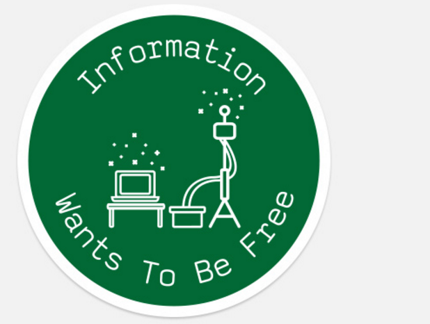
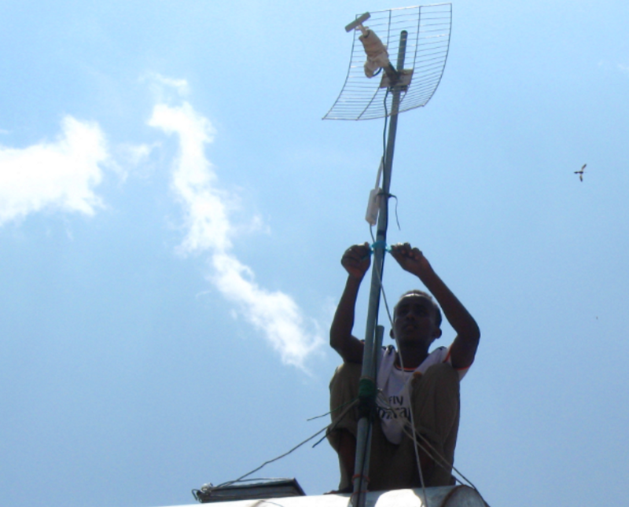
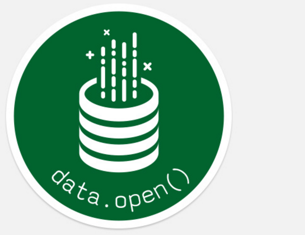
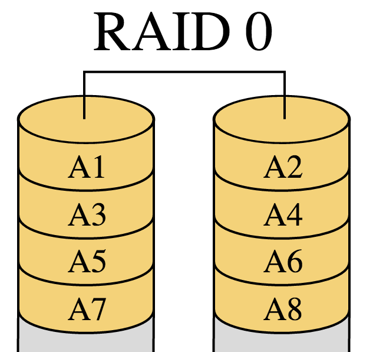
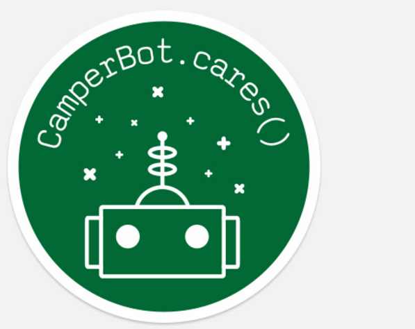
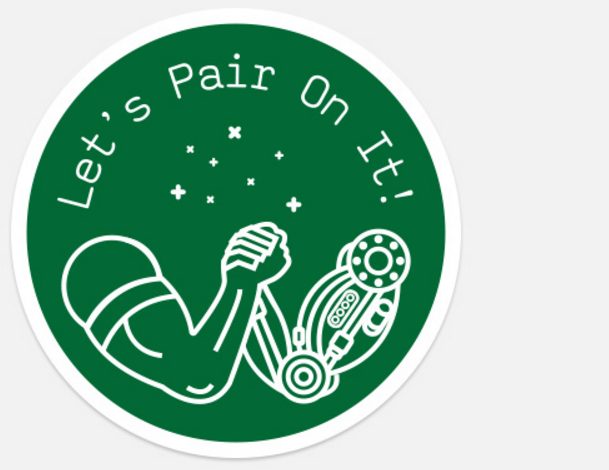

Our open source community derives most of its core values directly from the Hacker Ethic — values such as:

-   universal access to information
-   openness in software and in data
-   proactive sharing of knowledge
-   decentralization of power

The Hacker Ethic stems from beliefs of many software pioneers, such as [Richard Stallman](https://en.wikipedia.org/wiki/Richard_Stallman), [John McCarthy](https://en.wikipedia.org/wiki/John_McCarthy_%28computer_scientist%29), and [Steve Wozniak](https://en.wikipedia.org/wiki/Steve_Wozniak). It was first codified in this book:

[**Hackers: Heroes of the Computer Revolution: 25th Anniversary Edition**  
_Edit description_amzn.to](http://amzn.to/2bIHlYP "http://amzn.to/2bIHlYP")

Since then, these values have shaped the missions of many open source projects and communities, including Free Code Camp.

  

  

In order to help spread these values, we’ve designed some creative commons-licensed laptop decals.

### Information Wants To Be Free

This is one of the most important quotes behind the Hacker Ethic. 

> “On the one hand information wants to be expensive, because it’s so valuable. The right information in the right place just changes your life. On the other hand, information wants to be free, because the cost of getting it out is getting lower and lower all the time. So you have these two fighting against each other.” — Stewart Brand

Though [Stewart Brand](https://en.wikipedia.org/wiki/Stewart_Brand) said this in 1984, several academics had made similar statements decades earlier, in criticism of patent systems.

You can read [the full story](https://backchannel.com/the-definitive-story-of-information-wants-to-be-free-a8d95427641c#.s62frqq65) behind this quote from [Steven Levy](https://medium.com/u/2fff2fb3e70a) himself.

The imagery we chose for this decal is that of a [mesh network antenna](https://en.wikipedia.org/wiki/Wireless_mesh_network). These allow for inexpensive, distributed internet access in rural areas. They represent the values of decentralization of power and access to information.

### data.open()

All across the world, governments are demanding that publicly funded research and data be made available to the public. 

Free Code Camp releases all of our non-personally identifying data as open data. As a result, researchers and data scientists have [explored these datasets](https://www.kaggle.com/freecodecamp/2016-new-coder-survey-/kernels) and written articles about them. We’ve learned much more about our community than we could have on our own.

We strongly encourage all organizations to release as much data as they can as open data.

For this decal we chose the traditional representation of a database — a stack of RAID disks.

And we gave these disks an open top, with data freely flowing out of them.

### CamperBot.cares()

CamperBot is our community’s friendly chatbot. CamperBot also helps out on Github, and on our forum.

To us, CamperBot represents all that is good about technology and how it can politely assist humanity in achieving its goals.

### Let’s Pair On It!

Pair programming is a way for campers to proactively share knowledge, one of the core values of the Hacker Ethic. 

Pair programming is where two people program together on the same computer, either in person or through collaboration tools. This turns programming into a conversation: How should we implement this? Why is this test failing? Can we factor this code out into a re-usable module?

You learn a lot in the process. 

Pair programming also servers as a real-time code review. Research by Microsoft and other companies has shown that pair programming results in significantly fewer bugs.

For this decal, we sought inspiration from one of the most iconic movie handshakes of all.

But since we’re all about technology, we figured we’d turn Arnold’s arm into a cool robot arm (it wasn’t much of a stretch).

### About the Designers

Kosta Cemerikic is based in Belgrade, Serbia. He enjoys coding and improving his knowledge of User Experience. He also does freelance design work. Here’s [his portfolio](http://kosta-xd.dribbble.com/).

  

  

Wes Searan lives in Austin, Texas. He’s spends his time doing front end development and design. He also enjoys racing Motorcross. Here’s his portfolio.

[**Hackers: Heroes of the Computer Revolution: 25th Anniversary Edition**  
_Edit description_amzn.to](http://amzn.to/2bIHlYP "http://amzn.to/2bIHlYP")
