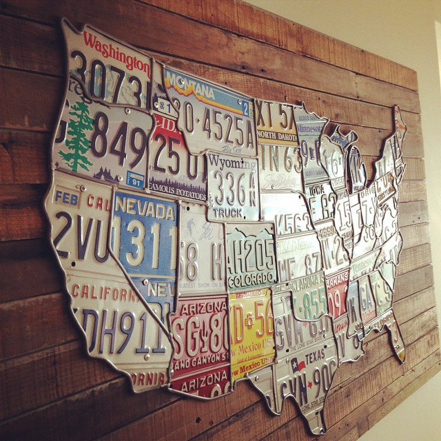
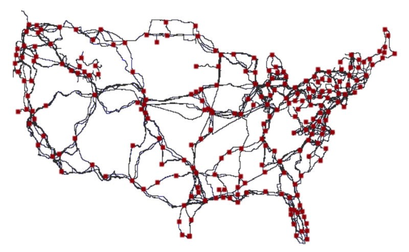
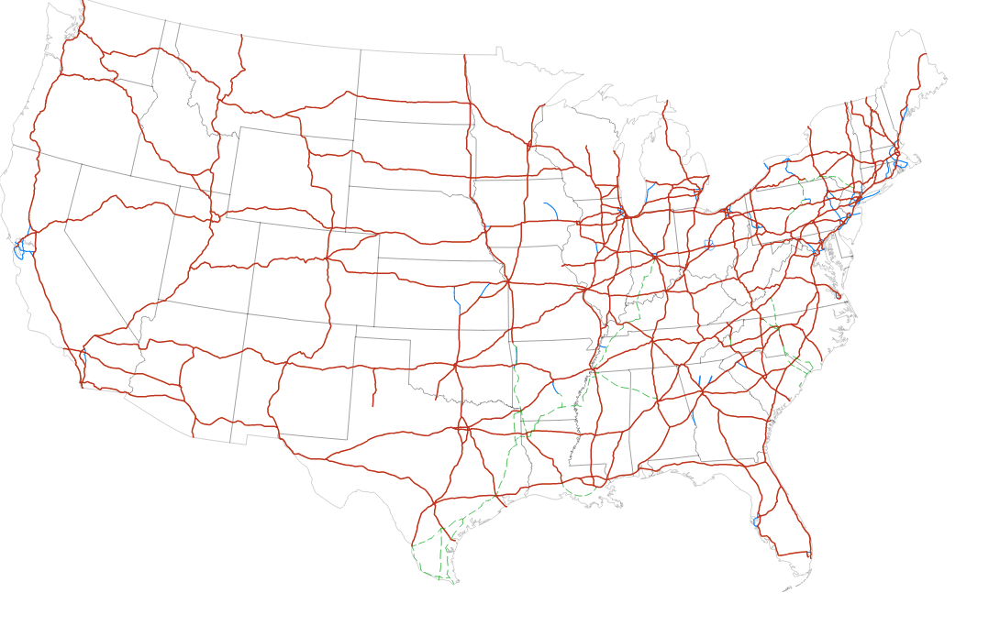

The US is a big place. It’s the third-largest country by land mass. And the infrastructure that connects it is equally immense.

Let’s marvel at the intricacy of these human-made systems.

Together, we’ll explore its internet, transportation, and energy distribution infrastructure — all through rapid-fire data visualizations.

### Broadband Internet Infrastructure

Here are all the places with at least 1 megabit download speed:

](./asset-2.png)

#### Broadband Monopolies

And here are all the places where consumers only have one available broadband provider.

](./asset-3.png)

#### Broadband Speed Test versus Advertised

Not surprisingly, these monopolies aren’t always honest about how fast their internet is. The darker the pink is, the more that broadband companies are overstating the speed of their internet services.

](./asset-4.png)

#### Internet Backbones

The internet isn’t magic — it’s mostly just a whole lot of fiber optic cable. Here’s all the long-haul fiber that carries internet data around the United States. Red squares represent the junctions between “long haul” fibers.



#### The Entire Internet

Of course, in a perfect world, the internet would be completely borderless and free. Here’s what the entire internet looks like as of 10 years ago (it’s even more intricate, now). The individual spokes are IP addresses:

](./asset-6.jpeg)

### Getting Around the Country

The US Interstate system is a network of 77,017 kilometers (47,856 miles) of highway that connects all major cities. President Eisenhower commissioned it in 1956 as a way to transport military equipment and supplies. It took 35 years and an inflation-adjusted $500 billion to complete.

Here’s what it looks like:



But I prefer this stylized representation:

](./asset-8.jpeg)

#### Bridges

Bridges are a big part of our road system. Here are all 600,000 bridges in the US. About 10% of them (the red ones) are [structurally deficient](http://www.artba.org/economics/2016-u-s-deficient-bridges/).

Bridges collapse [all the time](https://en.wikipedia.org/wiki/List_of_bridge_failures#2000.E2.80.93present), often killing people. They need to be maintained and replaced at the end of their service life, though this can be [quite expensive](https://en.wikipedia.org/wiki/Eastern_span_replacement_of_the_San_Francisco%E2%80%93Oakland_Bay_Bridge).

](./asset-9.jpeg)

These days, most people are in a hurry and would prefer to fly.

#### Airports and the Flights Between them

There were more than [8 million flights](http://www.transtats.bts.gov/Data_Elements.aspx?Data=2) last year in the continental US alone. That’s a lot of carbon dioxide emissions!

Here’s what those flights look like:

](./asset-10.jpeg)

#### Riding the Rails

Another way the US moves things around is through its railroad network.

The circles in the map below are Amtrak stations for passenger travel.

](./asset-11.png)

#### Ports and Maritime Travel

When it comes to heavy cargo, moving things around by sea is still the most cost-effective approach.

](./asset-12.jpeg)

### Powering the Country

Here are all the power plants in the United States, and the energy we get from them:

```
+--------------+---------------+--------------------+
|    Color     |   Resource    | % of US energy mix |
+--------------+---------------+--------------------+
| Black        | Coal          | 37%                |
| Blue         | Natural gas   | 30%                |
| Not pictured | Nuclear       | 19%                |
| Not pictured | Hydroelectric | 7%                 |
| Gray         | Wind          | 3.5%               |
| Orange       | Oil           | 1%                 |
| Yellow       | Solar         | 0.1%               |
+--------------+---------------+--------------------+
```

](./asset-13.jpeg)

#### Natural Gas Pipelines

For every mile of interstate highway, there are 6 miles of natural gas pipelines. Natural gas provides 30% of the US’s energy.

](./asset-14.jpeg)

#### Power Grid

But what are all these electrons good for if you don’t have a way to distribute them? Here’s what the US power grid looks like:

](./asset-15.jpeg)

Infrastructure is complex. Improving America’s infrastructure involves everything from filling potholes on main street to launching new arrays of thousands of low-orbit communication satellites, like [Elon Musk is planning to do](http://arstechnica.com/information-technology/2016/11/spacex-plans-worldwide-satellite-internet-with-low-latency-gigabit-speed/).

It will involve continually upgrading billions of discrete components within complex systems, like cells replacing themselves in our bodies.

The next time you pull onto an interstate, flip a light switch, or [tweet out an article](https://twitter.com/intent/tweet?url=https%3A%2F%2Fmedium.freecodecamp.com%2Finfrastructure-is-beautiful-cb0daa1aa76b&text=Infrastructure%20is%20beautiful%20by%20@ossia), pause for a moment.

Contemplate the grand scale of these systems, and the millions of minds and bodies that brought them into existence.

It’s beautiful.

---

If you want to learn more about the history of one vital piece of infrastructure — the internet — I strongly recommend reading [Where Wizards Stay up Late](http://amzn.to/2hmpeFW) by Katie Hafner.

The book traces the creation of the internet from its early days connecting just four universities — UCLA, Stanford, UCSB, and MIT — and talks about how they managed to scale it.

[**Where Wizards Stay Up Late: The Origins of the Internet**  
_Edit description_amzn.to](http://amzn.to/2hmpeFW "http://amzn.to/2hmpeFW")[](http://amzn.to/2hmpeFW)

**I only write about programming and technology. If you** [**follow me on Twitter**](https://twitter.com/ossia) **I won’t waste your time. 👍**
