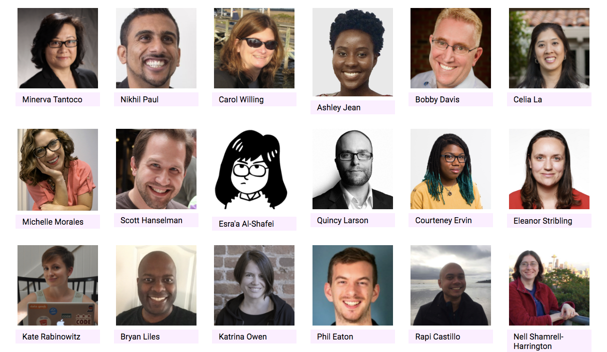
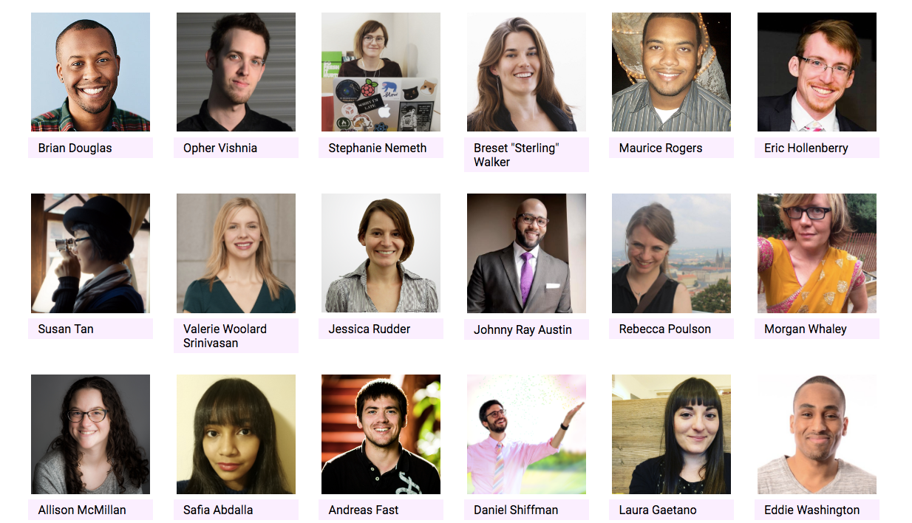
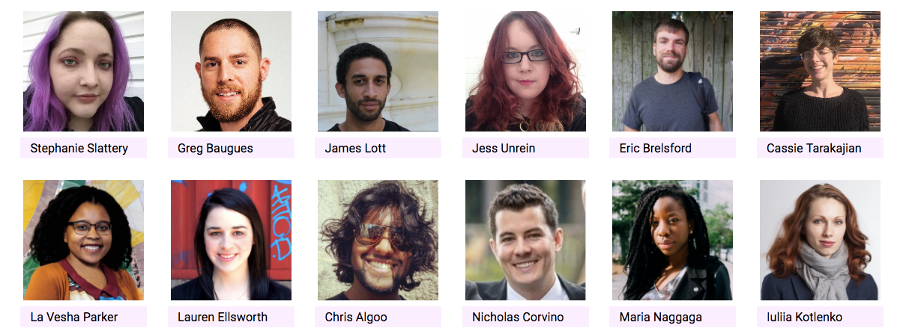

.](./asset-1.jpeg)

I just got back from New York City, where I experienced a new kind of developer conference — one that emphasizes inclusion and encouragement above all else.

Codeland was the vision of a single developer — [Saron Yitbarek](https://medium.com/@saronyitbarek) — and actualized through the hard work of dozens of volunteers and contributors.

Saron runs the [CodeNewbie community](http://www.codenewbie.org/) and hosts the weekly [CodeNewbie podcast](http://www.codenewbie.org/podcast). For years, she’s helped non-traditional learners get into coding, then sustain motivation throughout their transition to software development.

But organizing a two-day conference with dozens of speakers, panelists, and workshop leaders was an entirely different caliber of challenge.

Here’s how she pulled it off.

### Establishing Codeland

Saron first mentioned Codeland to me back in October 2016. By this point, she was already well underway in planning the event. She’d chosen dates and secured a venue: Microsoft’s Times Square campus.

Saron described Codeland as “two days of demos, talks, panels, and workshops from coders of all skill levels and backgrounds.”

Over the next few months, a lineup of speakers emerged, which included people like Minerva Tantoco, the CTO of New York City.

Saron also assembled a team of enthusiastic volunteers, including her tireless husband and CodeNewbie producer, Rob.

Saron went to great lengths to personally ensure the talks and workshops would be as high-quality as possible. During the months leading up to Codeland, she held a series of one-on-one video calls with each of the speakers.

I’ve gone to dozens of tech conferences, and presented at several, and I’ve never experienced this level of individual coaching from anyone involved — let alone the event organizer herself.

This was a single-track conference, so every 15-minute presentation had to be compelling and succinct.

Saron helped me decide on a topic best suited to my domain expertise. Then she coached me through the process of boiling everything down to the bare essentials. I delivered my talk to her several times, and each time she found new ways we could improve it.

Then on Thursday morning, I boarded my flight to New York City, excited to see all that Saron had prepared for me and 300 other attendees.

### Entering Codeland

)](./asset-5.jpeg)

When I walked in, volunteers greeted me and gave me spiral booklet, which included a schedule, biographies of speakers, and a comprehensive code of conduct.

One thing that became immediately apparent was how many women were attending. Even though the event was aimed at everyone, women easily outnumbered men — something I’ve never experienced before at a tech conference.

Codeland’s tickets were relatively inexpensive, so it drew a much wider socio-economic cross-section of developers and people learning to code than a typical tech conference. Attendees also had the option of paying slightly more money to help fund scholarships.

One of the scholarship recipients was [CHUCK PHIPPS](https://medium.com/@chucphi), who’d recently written about [what it’s like to learn to code in your 60s](https://medium.com/startup-grind/i-am-enter-your-age-here-is-that-too-late-to-become-a-developer-58e926799af4).

These scholarships even covered childcare, so that parents could attend.

The venue had a variety of interactive art on display.

After grabbing some coffee and breakfast, about 300 attendees congregated in a room so wide that it needed three projectors. Saron welcomed everyone and, in her typical high-energy fashion, set the tone for what was to come.

The talks spanned a wide array of topics — from how to contribute to open source to how to ask for help from a mentor. Developers shared projects they’d built and organizations they’d formed.

In between talks, attendees didn’t awkwardly reach for their phones. Instead they turned to their neighbors. Everyone I made eye contact with would instantly greet me. Then we’d launch into stories about our own coding journeys, and our near-term goals.

Toward the end of each day, Nikhil Paul — the event’s emcee — would teach everyone some Bollywood dance moves. Everyone in the room would join in an impromptu dance to Bollywood anthems.

<Embed src="https://www.youtube.com/embed/pxzaIDikEBE?feature=oembed" aspectRatio={undefined} caption="" />

[Scott Hanselman](https://medium.com/@shanselman) delivered an epic 50-minute keynote about virtual servers and the cloud. Had we been in a night club, you could’ve easy mistaken his talk for stand-up comedy.

Scott’s talk culminated in him using a virtual machine to emulate an old computer running Windows 3.1 — inside a 3D virtual reality representation of his mother’s basement.

One of my most poignant Codeland moments was at the end of the first day, when we were walking out of Microsoft office. Greeting us on the way to the elevators were Codeland volunteers. And they were clapping and cheering for us!

Day two started with 3-hour breakout workshops on topics like Docker, chatbots, and coding virtual reality games. Then there were panels on topics like work-life balance, and an employer panel lead by recruiters from companies like Google and Genius.

Saron closed the conference by recognizing all the speakers and volunteers. She gave a powerful speech that brought everyone to their feet.

> “Codeland is my love letter to all of you.” — [Saron Yitbarek](https://medium.com/@saronyitbarek)

I’ve been to a lot of tech conferences, but never one like this.

I learned so much from these new developers — about their aspirations, the challenges they face, and their will to break into the field.

I also made new friends, whom I’ll stay in touch with in the years to come.

And I learned a lot about myself, too.

I’m looking forward to returning to that magical place that is Codeland. Until then, much love to everyone involved.

**I only write about programming and technology. If you** [**follow me on Twitter**](https://twitter.com/ossia) **I won’t waste your time. 👍**
