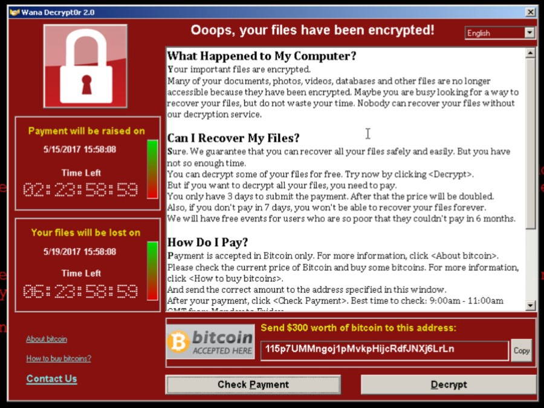
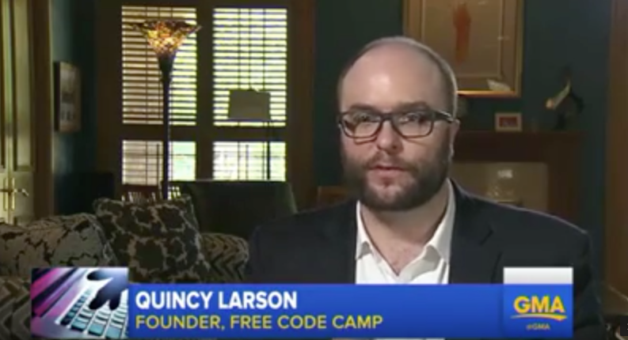
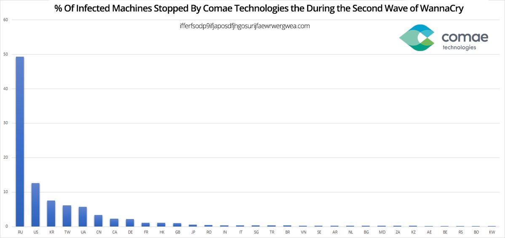

Over the weekend, hundreds of thousands of computers were infected with the “WannaCry” ransomware, in what Interpol is calling the largest ransomware outbreak in history.

People who are unlucky enough to get infected will see a threat on their computer that looks like the image above.

Here’s how ransomware works:

1.  Someone accidentally runs malicious code on their computer (perhaps from an email attachment)
2.  This code (called “ransomware”) encrypts many of the files on their hard drive (or does something else malicious).
3.  The code then demands a ransom. It notifies the person that if they don’t do something (in WannaCry’s case, send the attackers $300 worth of Bitcoin), the software won’t unencrypt those files.

In WannaCry’s case, after 3 days, it escalates the demand to $600. Then after a week, it claims the data will be lost forever. This said, 7 days haven’t yet passed, so we don’t yet know whether the attackers will carry through on this threat.

As far as we know, only computers that are running Windows are vulnerable to WannaCry. But it’s a particularly nasty piece of ransomware in that only one person on a network needs to download it. From there, it can spread through local networks automatically, using ports normally reserved for network file sharing.

WannaCry is able to do this thanks to an exploit called EternalBlue that may have been developed by America’s own National Security Agency (NSA), then leaked last month by hacker group The Shadow Brokers ([2 minute read](https://fcc.im/2r9XEUR)).

Due its particularly virulent nature, WannaCry shut down several organizations over the weekend, including much of Britain’s National Health Service — preventing doctors from being able to use MRI machines, and even turning off the storage refrigerators that kept donated blood cool.

This morning, I went on ABC’s Good Morning America. They interviewed me about ransomware, and asked me what ordinary people can do to protect themselves ([2 minute watch](https://fcc.im/2qkzGW8)).

Here are my basic tips:

1.  If you’re concerned about your files, back them up. Windows and MacOS both have built-in backup tools.
2.  Keep your software up-to-date. Don’t disable auto-update. Developers are constantly fixing security vulnerabilities. Even though it seems like a pain, install their recommended updates.
3.  Don’t open suspicious email attachments.
4.  Don’t rely on tools like anti-virus alone to protect you from these sorts of attacks. You personally need to be vigilant. Security isn’t a product — it’s a process.

If your computer gets infected with ransomware, and you don’t have backups of your files, you may want to go ahead and pay the ransom. While this rewards the criminals, it’s a small price to pay for saving irreplaceable files, such as family photos.

Remember that without the cryptographic key, even the most powerful governments in the world have no way of helping you unlock your files.

Microsoft discovered the vulnerability that WannaCry exploits back in March, and they’ve released patches for all recent operating systems. In the case of WannaCry, if you have a version of Windows from the past five years, and auto-update is turned on, your computer shouldn’t be at risk.

But if you’re still using older versions of Windows, like the 16-year-old Windows XP, you should definitely go download the patch. Here are the directions for this: ([2 minute read](https://fcc.im/2rjW7IX))

WannaCry hit Russia the hardest. Cybersecurity consultancy [Comae](https://fcc.im/2pPXNYR) estimates that nearly half of infections occurred there.

Yesterday, new variants of WannaCry started cropping up: ([4 minute read](https://blog.comae.io/wannacry-new-variants-detected-b8908fefea7e)).

The NSA, CIA, and other government agencies currently devote about 90% of their cybersecurity resources to offensive cyber attacks: ([4 minute read](https://fcc.im/2rjJSfN)).

Many developers are outraged that government agencies have been stockpiling these vulnerabilities, instead of alerting software publishers about them, so that they can quickly patch these bugs.

As the saying goes, sometimes the best offense is a good defense. And that’s precisely the strategy that many developers hope governments will adopt.

Either way, the ransomware situation will get much worse before it gets better. So stay safe out there!

### Here are three other links worth your time (also about ransomware):

1.  Read the story of how one developer discovered a backdoor in WannaCry’s code, and was able to temporarily halt its spread: ([7 minute read](https://fcc.im/2qKleYn))
2.  Security researcher Troy Hunt has written an in-depth analysis of the WannaCry outbreak: ([12 minute read](https://fcc.im/2qkTsRh))
3.  Watch as these bitcoin wallets receive ransomware payments from the ongoing global cyberattack, through a Twitter bot ([2 minute read](https://fcc.im/2qpd8Bv))

**I only write about programming and technology. If you** [**follow me on Twitter**](https://twitter.com/ossia) **I won’t waste your time. 👍**
