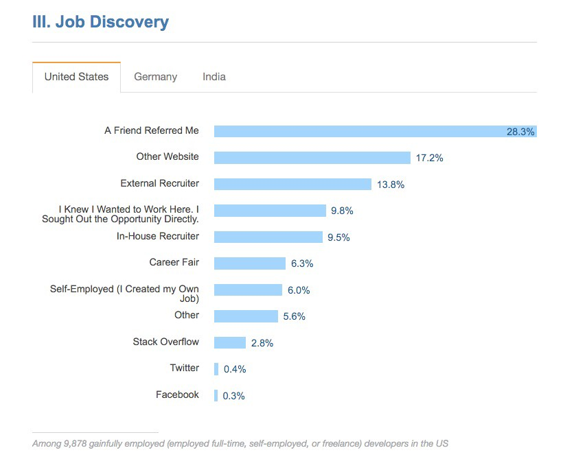

Today, Stack Overflow released the results of their 2016 survey of more than 50,000 developers.

I’ve combed through this big document to bring you the most surprising insights from it. Here we go.

#### **There are at least nine male developers for every one female developer**.

We don’t have enough women in tech. This is news to no one. But a 15-to-1 ratio of males to females? This is much wider gap than most people realize.

And looking at the age distribution of female developers sheds some light on why.

#### There are far fewer female developers in their 30s and 40s.

Most female developers are in their 20s or are over 50+ years old. From this chart, you can see an entire generation of women who are even more under-represented than normal in the field of software development.

There is one positive development on the gender equality front…

#### Early in their career, female developers in the US now make as much as their male counterparts.

Fortunately, there’s one area where software development is extremely diverse: education background.

#### The most popular way to learn to program is still hitting the books yourself.

Most developers learn through some combination of self-study, on-the-job training, and academic study.

Less than half of developers have a technology-related undergraduate or graduate degree.

#### Education doesn’t impact your salary as much as you’d think.

It takes about 5 years to earn a PhD in computer science, but it only gets you an extra 9% salary on top of what you’d make with a Bachelors of Science.

Quitting your job and paying $15,000 to attend a coding bootcamp — for all their selectivity and help with job placement — only earns you $8,692 more than if you’d kept working and learned on your own.

Note that these numbers are for developers with 5+ years of experience who live in the US.

We will dig further into these numbers when Stack Overflow releases their dataset, which they plan to do next week.

So what types of jobs are these developers working?

#### Half of all developers are web developers.

The web is still the platform where most work is done. The combined native development platforms of mobile and desktop account for less than 15% of the jobs.

Some of this may be attributable to the fact that the web is essentially everyone’s back end. Most native apps hook into web APIs. Even Instagram has a much more complicated web back end than the mobile app portion that runs on your phone.

Considering the popularity of web development, which technologies are developers using on the job?

#### JavaScript and SQL are still the most popular technologies (and have been since this survey began in 2013).

JavaScript is still the most extensively used tool, and is popular with developers who specialize on the front end:

In fact, JavaScript is now the most popular language with back end developers, too.

SQL has declined a bit in popularity, due in part to the rise of NoSQL databases like MongoDB (which uses JavaScript as its querying language instead of SQL).

 made this visualization based on Stack Overflow’s data to show the relationships between technologies.](./asset-11.jpeg)

#### Mac OS X is now the most popular operating system for developers.

Windows 7 was the most popular last year, and if you add up all the versions of Windows, it’s still used by half of developers.

Anecdotally, almost all of the developers I see at hackathons in San Francisco now use Macs.

One trend that many developers welcome is the disappearance of joke job titles.

#### Most developers simply call themselves “developers.”

I’ve [already written](https://www.quora.com/Software-Engineering/What-is-the-difference-between-the-different-roles-of-software-development/answer/Quincy-Larson) about how there are many synonyms for “developer”, and how developers tend to put “Software Engineer” on their resume because it sounds more important.

These days, fewer people tend to refer to themselves as “rockstars”, “ninjas”, or “gurus.” “Hacker” is somewhat popular still, though this term has negative connotations with non-programmers, who tend to confuse “hackers” with black hat “crackers”.

But calling yourself a “ninja” is kind of a juvenile thing to do, right? Surely those kids are under-represented in the field…

#### The average age of a developer is 29.6 years old. The median age is 27.

Actually, more than half of developers are under 30. I’ve [written a bit](https://www.quora.com/Which-professions-are-less-prone-to-age-discrimination-than-software-engineering/answer/Quincy-Larson) about why I think this is. I don’t believe it’s simply a matter of age discrimination, though that probably is a factor. Other things to consider:

-   Developers often move into management.
-   Developers make a lot of money, so they may be able to retire younger.
-   Software developers may burn out before they reach older age.
-   In the developing world, where about 80% of people live, software development only recently became a viable career.
-   The world population skews young. The average human being is only 30.

It’s worth pointing out that last year’s Stack Overflow survey found the average age to be only 28.9, so software development may be aging a bit as a profession.

#### The average developer has only been programming for 5 years or less

We are a field of newbies. I doubt there is any other profession where only a quarter of the practitioners have more than a decade of experience (other than maybe professional ice climber).

So remember this the next time you’re tempted to feign astonishment and say “Oh, you haven’t heard of \_\_\_\_\_?”

#### The most common way to get a job is through a friend

India is one of the only countries where personal referrals aren’t the most common way of getting a job (they’re a close second to in-house recruiters).

#### Salary is still the highest priority in employment decisions

German developers prioritized work-life balance slightly above salary. In India, salary was by far the most important factor.

Which brings us to the result that may be the most surprising to people outside software development.

#### Less than a quarter of all software development jobs are even in the software product industry.

Developers are well represented across a wide range of fields. Almost every major company will have developers on staff. It’s quickly becoming [one of the most common job titles in the US](https://www.quora.com/Will-programming-bootcamps-lead-to-lowering-of-average-wages-at-junior-or-intermediate-levels/answer/Quincy-Larson).

Don’t stop at merely reading my analysis — go check out the [full survey](http://stackoverflow.com/research/developer-survey-2016) and share your insights in the comments.

**I only write about programming and technology. If you** [**follow me on Twitter**](https://twitter.com/ossia) **I won’t waste your time. 👍**
