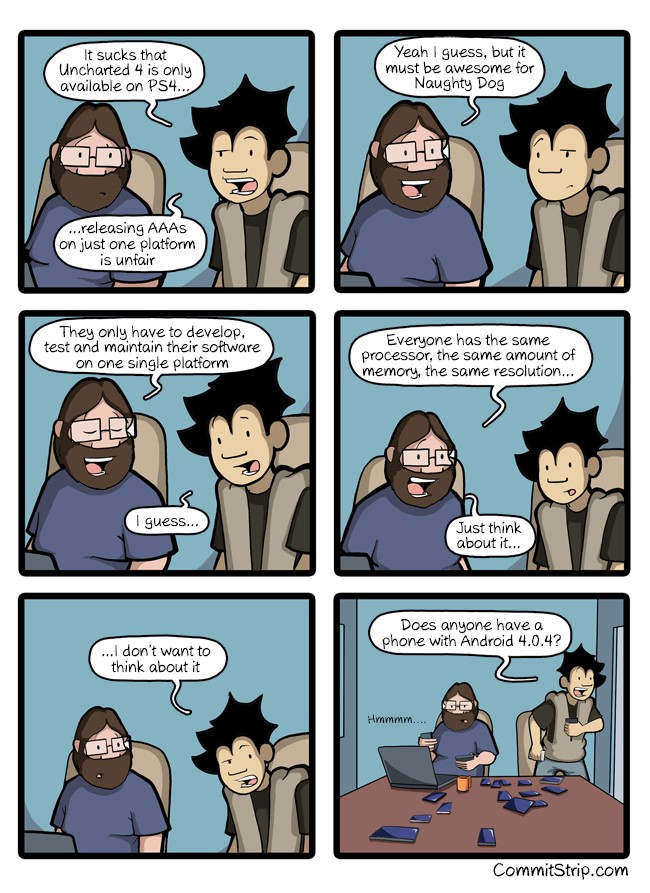
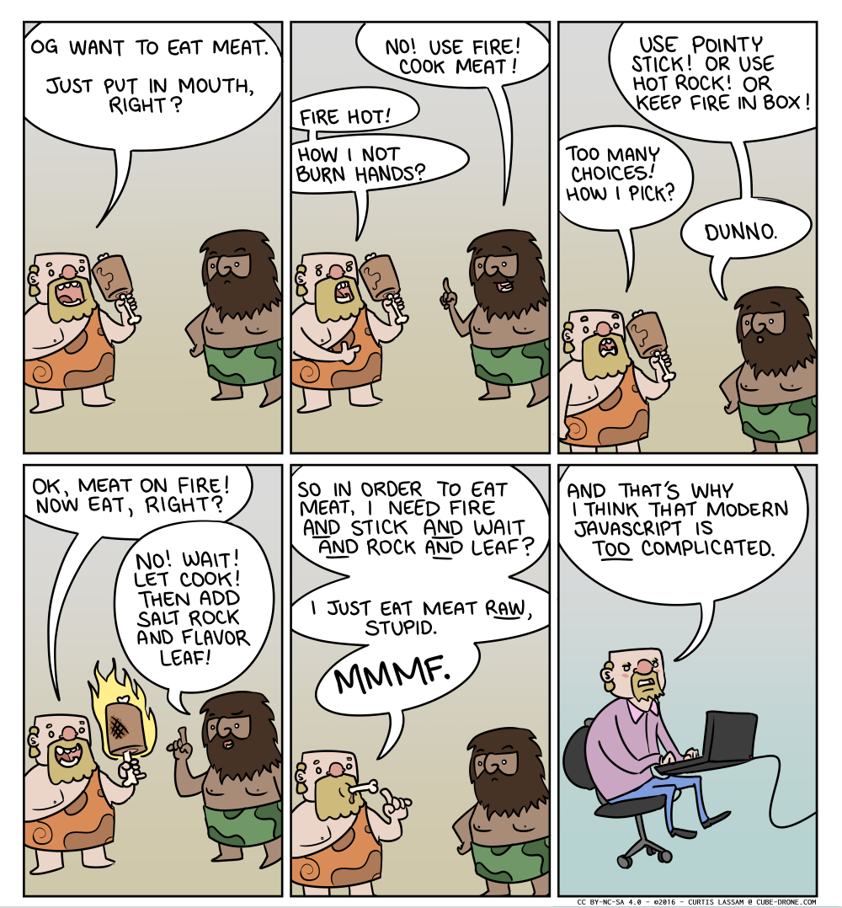

> “The Universe is under no obligation to make sense to you.” — Neil deGrasse Tyson

Yes, JavaScript development is complicated.

Yes, it will continue to get more complicated.

The web is a complicated place. We are finally getting around to doing all the things we should have been doing all along.

As a result, JavaScript tools — and there are a lot of them — are rapidly evolving.

If this evolutionary process frustrates you, blow off some steam by reading this parody of how complicated JavaScript development has become:

[**How it feels to learn JavaScript in 2016**  
_Edit: Thanks for pointing typos and mistakes, I’ll update the article as noted. Discussion in HackerNews and Reddit._hackernoon.com](https://hackernoon.com/how-it-feels-to-learn-javascript-in-2016-d3a717dd577f "https://hackernoon.com/how-it-feels-to-learn-javascript-in-2016-d3a717dd577f")

Which is a parody of another article about how complicated DevOps has gotten:

[**It's The Future**  
_Hey, my boss said to talk to you - I hear you know a lot about web apps?-Yeah, I'm more of a distributed systems guy…_circleci.com](https://circleci.com/blog/its-the-future/ "https://circleci.com/blog/its-the-future/")

But don’t lose sight of the reason why JavaScript development is so complicated: **web development itself is inherently complicated.**

)](./asset-2.png)

We are trying to build applications that run right in a dozen browsers, look good on thousands of different devices, load fast enough for impatient commuters in the subway, and are still accessible enough that blind people can use them.

At the same time, web developers are closing security vulnerabilities all over the place.

We’re lobbying management to abandon bad practices (the average web page is now [as many megabytes](https://www.wired.com/2016/04/average-webpage-now-size-original-doom/) as the 1993 game DOOM).

We’re adapting to browser-based ad block software that blocks a heck of a lot more than just ads.

There are many viable ways to accomplish all of these goals. And a large ecosystem of tools has cropped up — each attacking different problems from different angles.

As the creator of the Extreme Programming methodology said back in 1983:

> “Make it work, make it right, make it fast.” — Kent Beck

Well, for the past 20 years, we focused on making the web work. With duct tape and popsicle sticks when we had to.

JavaScript Developers are finally getting the caliber of tools that other ecosystems have had for a long time. And then some. We should be happy about this.

 survey](./asset-4.png)

The Cambrian explosion of tools you see around you is what rapid progress looks like when it’s not controlled by an Apple or a Microsoft.

Everyone’s scrambling to make it right, and to make it fast, all at once.

This web comic perfectly illustrates the struggle between those of us who have “JavaScript Fatigue” and those of us who have, as Dr. Axel Rauschmayer [put it earlier this year](http://www.2ality.com/2016/02/js-fatigue-fatigue.html), “JavaScript Fatigue Fatigue.”

We’re doing our best to provide constructive advice for deciding among the wide variety of tools. We’re steering new developers away from unproven tools. We’re reminding them that [being a developer is hard](https://medium.freecodecamp.com/one-does-not-simply-learn-to-code-f25bacdc5b62), and that learning new tools is a big part of the job.

If you’re new to JavaScript, remember that all of these new tools are very much a good thing. The open source npm ecosystem is very much a good thing.

They will make you a happier, more powerful developer.

They will help you better serve your end users.

And if you’re one of the many devs going through JavaScript Fatigue yourself, and are worried that you might burn out, well:

> “If you’re going through hell, keep going.” — Winston Churchill

**I only write about programming and technology. If you** [**follow me on Twitter**](https://twitter.com/ossia) **I won’t waste your time. 👍**
