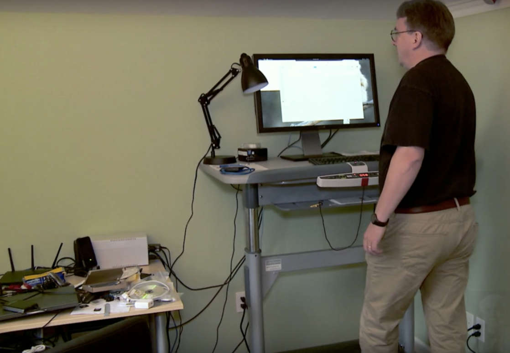
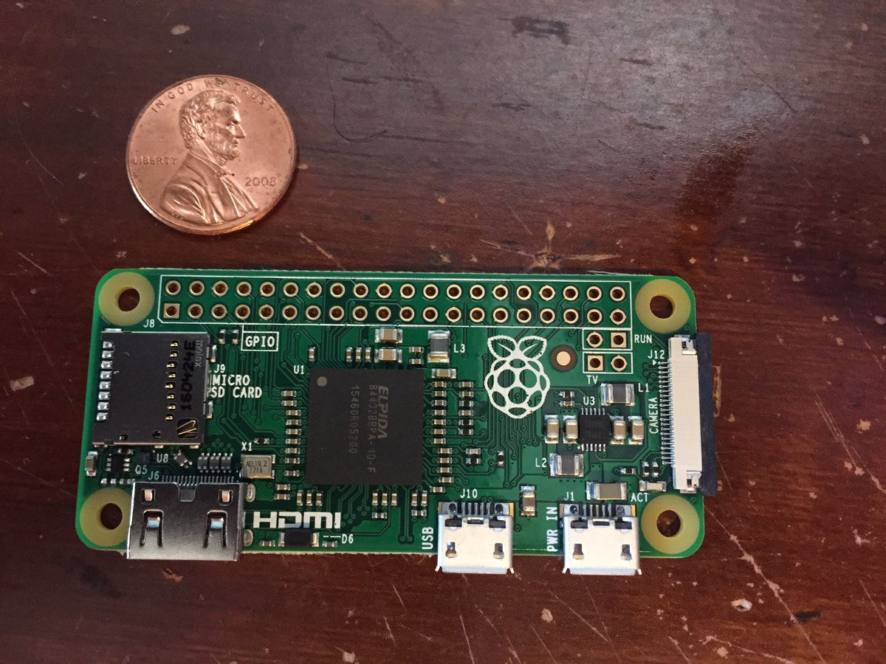

25 years ago this week, a college student in Finland shared his project on an [email list](https://groups.google.com/forum/#!topic/comp.os.minix/dlNtH7RRrGA%5B1-25%5D):

> _From: torvalds@klaava.Helsinki.FI (Linus Benedict Torvalds)  
> Newsgroups: comp.os.minix  
> Subject: What would you like to see most in minix?  
> Summary: small poll for my new operating system  
> Message-ID: <1991Aug25.205708.9541@klaava.Helsinki.FI>  
> Date: 25 Aug 91 20:57:08 GMT  
> Organization: University of Helsinki_

> _Hello everybody out there using minix —_

> _I’m doing a (free) operating system (_**_just a hobby, won’t be big and  
> professional like gnu_**_) for 386(486) AT clones. This has been brewing  
> since april, and is starting to get ready. I’d like any feedback on  
> things people like/dislike in minix, as my OS resembles it somewhat  
> (same physical layout of the file-system (due to practical reasons)  
> among other things)._

> _I’ve currently ported bash(1.08) and gcc(1.40), and things seem to work.   
> This implies that I’ll get something practical within a few months, and  
> I’d like to know what features most people would want. Any suggestions  
> are welcome, but I won’t promise I’ll implement them :-)_

> _Linus (torv…@kruuna.helsinki.fi)_

> _PS. Yes — it’s free of any minix code, and it has a multi-threaded fs.   
> It is NOT protable (uses 386 task switching etc), and it probably never  
> will support anything other than AT-harddisks, as that’s all I have :-(._

“Just a hobby,” he says. “Won’t be big and professional like gnu,” he says.

This kid has no idea that his operating system is about to change software forever.

Today, Linux is the dominant operating system for servers. It’s also the basis for Android, which is the dominant operating system for phones. And it’s 100% free and open source.

Let’s put the last 25 years of Linux in perspective with these 25 stunning facts about Linux:

**Fact #1:** There are 115 million lines of code in The [Linux Foundation’s collaborative projects](http://collabprojects.linuxfoundation.org/). Compare this to the [45 million](https://www.facebook.com/windows/posts/155741344475532) lines of code in Windows XP.

**Fact #2:** The Linux kernel is by far the most active open source project on Earth. Its accepts an average of 185 patches each day.

**Fact #3:** It’s taken about 41,000 person-years to build Linux — the equivalent of about $5 billion in developer salary.

**Fact #4:** The Linux Foundation pays Linus $10 million per year to continue his work on Linux. His net worth is $150 million.

**Fact #5:** Despite this the sums of money involved — and all the systems that rely on Linux — Linus works from home, alone, with his cat. Here’s a picture of him at his treadmill desk:

**Fact #6:** While Linus was serving as in the Finnish military — doing ballistics calculations — he bought a copy of Andrew Tanenbaum’s [Operating Systems: Design and Implementation](http://amzn.to/2bQyDGB)_._ This book described Minix — a simplified educational version of Unix — and opened Linus’s eyes to the Unix philosophy.

[**Operating Systems Design and Implementation (3rd Edition)**  
The book that inspired Linus to create Linux](http://amzn.to/2bQyDGB "http://amzn.to/2bQyDGB").

**Fact #7:** Even though Torvalds wrote 100% of Linux’s first release, his original contributions now account for less than 1% of its total codebase. These days he says he’s too busy merging in code written by other contributors to do much programming himself.

> I do not have a five-year plan. I do not have a moonshot. I’m perfectly happy with all the people walking around looking at the stars saying “I want to go there.” But I’m looking at the ground, and I want to fix the pothole that’s right in front of me before I fall in. — Linus Torvalds

**Fact #8:** Other famous software icons like Bill Gates and Mark Zuckerberg dropped out of college to pursue their projects full-time. Linus not only continued school after the initial success of Linux — he even stuck around to get his masters in computer science.

**Fact #9:** Even though Linus created Git, he [doesn’t accept pull requests](http://www.wired.com/2012/05/torvalds_github/) through GitHub. Linux is listed on GitHub, though, and it has [more than 35,000 stars](https://github.com/torvalds/linux).

**Fact #10:** Linux’s mascot is a penguin named “Tux”:

**Fact #11:** Developers from a wide range of companies contribute to Linux. Here they are, ranked by contributions:

 about Linux’s contributors.](./asset-4.png)

**Fact #12:** 97% of  the world’s supercomputers [run on Linux](http://www.zdnet.com/article/linux-dominates-supercomputers-as-never-before/) — including clusters used by NASA.

**Fact #13:** SpaceX uses a special fault-tolerant design of Linux in each of its Merlin rocket engines. Through this, Linux has helped complete [32 space missions](http://www.spacex.com/missions).

**Fact #14:** In 2009, the government of Munich, Germany switched from Windows to Linux. They claim to have saved more than €10 million in software licensing fees so far. But the switch may have cost them that much or more [in lost productivity](http://www.techrepublic.com/article/after-three-years-of-linux-munich-reveals-draft-of-crunch-report-that-could-decide-its-open-source/).

**Fact #15:** Linux powers the tiny $5 Raspberry Pi computer.

**Fact #16:** Is Linux the king of the world? Titanic was the first feature film produced on Linux servers.

**Fact #17:** Even though video game developer Valve’s founder Gabe Newell has publicly stated that he thinks Linux is the future of gaming, his company’s Linux-based Steam Machine console flopped. Linux’s overall market share has [fallen a bit since 2010](https://en.wikipedia.org/wiki/Linux_gaming#Market_share_vs._installed_base).

**Fact #18:** Dronecode is [Linux for Drones](https://www.dronecode.org/). About 1,000 companies develop drone services that run on top of this operating system.

**Fact #19:** Toyota and Jaguar plan to run their future cars using [Automotive-grade Linux](https://www.automotivelinux.org/).

**Fact #20:** Linux is available in many distributions, or “distros.” Most distros are based off of other distros. The most popular distro is Ubuntu, which is based off of Debian.

Here’s the full Linux family tree:

**Fact #21:** Red Hat is a company that makes an enterprise-focused distribution of Linux. It is the largest company built around open source software, and is on track to make [$5 billion in revenue](https://techcrunch.com/2016/06/21/as-red-hat-aims-for-5-billion-in-revenue-linux-wont-be-only-driver/) this year.

**Fact #22:** Linux doesn’t necessarily come with a graphic user interface (GUI). Many developers interact with it through a command line shell — usually [Bash](https://www.gnu.org/software/bash/). You can choose from a variety of GUI shells, such as Xfce and KDE. When you hear the term “Xubuntu”, it means “Ubuntu with Xfce.” Can you guess what “Kubuntu” means?

Ǝpʞ ɥʇᴉʍ nʇunq∩ :ɹǝʍsuɐ

**Fact #23:** Linux uses the GNU General Public License.

> **“**The licenses for most software are designed to take away your freedom to share and change it. By contrast, the GNU General Public License is intended to guarantee your freedom to share and change free software — to make sure the software is free for all its users.” — GNU GPL preamble

**Fact #24:** Linux uses a “Unix-like” design, where its  monolithic Linux kernel oversees file systems, networking, and process control. The rest of the functionality is handled by modules — many of which are from the [GNU project](https://www.gnu.org/home.en.html).

**Fact #25:** Even Microsoft Windows — Linux’s biggest competing operating system — is embracing Linux. It recently integrated [Ubuntu Bash](http://thenextweb.com/opinion/2016/03/31/bash-windows-incredibly-exciting-frightening/#gref) into Windows 10.

**Bonus Fact:** Linux was inspired by Richard Stallman’s GNU project, the Free Software movement, and the Hacker Ethic. You can read about these — along with the history of other important projects like the Apple I computer — in [Steven Levy](https://medium.com/@stevenlevy)’s classic book [Hackers](http://amzn.to/2bIHlYP):

[**Hackers: Heroes of the Computer Revolution: 25th Anniversary Edition**  
_Edit description_amzn.to](http://amzn.to/2bIHlYP "http://amzn.to/2bIHlYP")

Also, here’s a short interview with Linus where he talks about Linux and Git, and how he created them to solve his own problems:

<Embed src="https://www.youtube.com/embed/o8NPllzkFhE?feature=oembed" aspectRatio={undefined} caption="" />

Here’s to the next 25 years of Linux. May open source software continue to make the world a less buggy place!

**I only write about programming and technology. If you** [**follow me on Twitter**](https://twitter.com/ossia) **I won’t waste your time. 👍**
