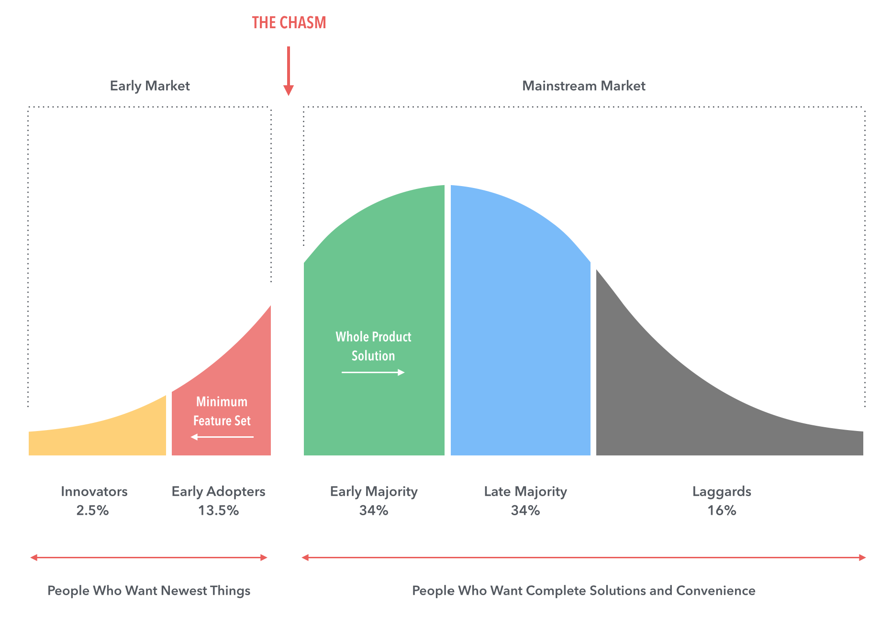
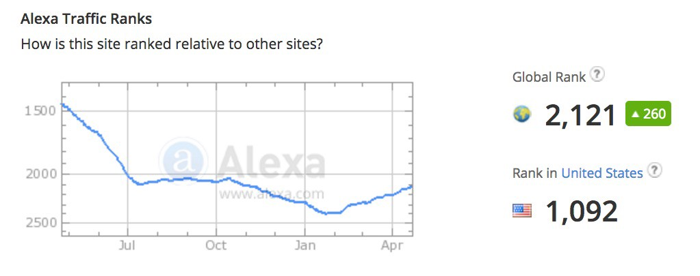
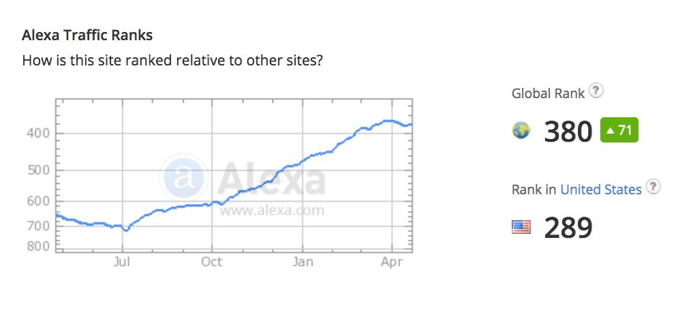

A few days ago, I [wrote a Medium post](https://medium.freecodecamp.com/we-just-abandoned-our-blog-for-medium-you-probably-should-too-33e742a1d49#.ftwgzpuod) that encouraged bloggers to consider abandoning their blogs in favor of writing on Medium.

The most common critical response was that Medium was mostly startup people, and our open source community’s Medium publication had fared so well mainly because startup people want to [learn to code](https://www.freecodecamp.com).

With most new technologies, the early market will be “people who want new things.”

Eventually, the technology will “cross the chasm” to become used by a majority of people. And it looks like Medium has already started to do this.

Startup people were definitely the early adopters of Medium. This is clear from the fact that 72,000 people follow Medium’s “startup” tag.

But increasingly, there are a ton of people following other Medium tags as well. Here’s a list of some of the most popular Medium tags, and their follower count:

-   startup — 72k
-   life — 50k
-   travel — 45k
-   education — 42k
-   design — 41k
-   politics — 39k
-   writing — 38k
-   tech — 36k
-   poetry — 31k
-   marketing — 31k
-   music — 30k
-   business — 25k
-   photography — 24k
-   food — 21k
-   art — 19k
-   relationships — 18k
-   productivity — 17k
-   sports — 16k
-   programming — 13k
-   fashion — 10k
-   science — 9k
-   fitness — 9k
-   journalism — 9k
-   psychology — 9k
-   history — 7k
-   economics — 6k
-   gaming — 6k

There are a lot of teachers, political junkies, musicians, photographers and foodies here, too.

Without these people, Medium never would have reached the levels of traffic it has.

The most popular website for startup people is Hacker News (YCombinator’s news section). Here’s what traffic to YCombinator looks like, in terms of global ranking:

And here’s what traffic looks like for Medium, in terms of global ranking:

That difference in global rank between these two sites translates into about one order of magnitude difference in total traffic.

In other words, only a fraction of Medium’s total visitors are likely startup people. They are an outspoken minority — not a majority.

If you’re blogging about general interest subjects like food, music, and photography, or academic topics like science or psychology, there’s a sizable audience for that here on Medium.

**I only write about programming and technology. If you** [**follow me on Twitter**](https://twitter.com/ossia) **I won’t waste your time. 👍**
