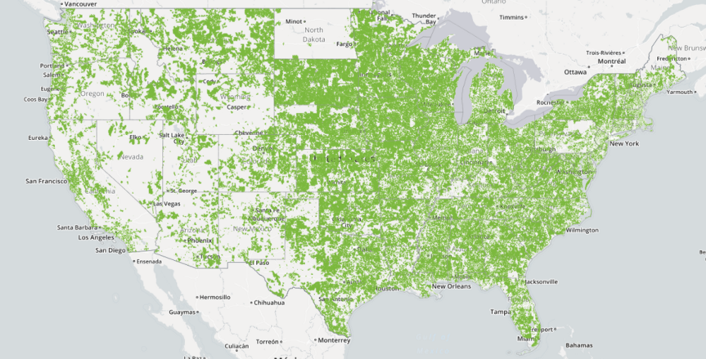
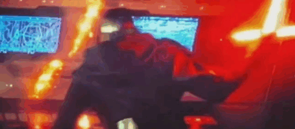

.](./asset-1.jpeg)

> “I find your lack of faith in deregulation disturbing.” — Darth Pai

A few weeks ago, in a galaxy not so far away, Tom Wheeler stepped down as the chairman of the Federal Communications Commission. In his three years at the helm of the FCC, he proved to be a champion of everyday people, and a thorn in the side of telecom monopolies.

Wheeler worked hard to preserve **net neutrality** — the principle that internet service providers should treat all traffic on their networks the same.

Net neutrality made it illegal to block a website, throttle its loading speed, or charge the website money in return for priority access. It was the only thing stopping providers like Comcast from deciding which websites we can access, and which websites we cannot.

This is especially important because — unlike most countries — Americans don’t have a choice of which providers they can use.

Here are all the places where consumers only have one company to turn to for high speed internet (what economists would call a “monopoly”):

These providers have long complained that their monopoly profits aren’t enough. They want to double dip and not only over-charge their broadband customers — like they’ve done for decades — but also shake down every independent website owner on the planet for the privilege of being accessible to those customers.

> “Be careful not to choke on your $79.95 per month, 50-megabit internet.” — Darth Pai

Enter Darth Pai, Sith Lord. A lawyer who previously worked at Verizon, Darth Pai was appointed as an FCC commissioner in 2011. He proceeded to tell anyone in earshot that the government should deregulate providers. His theory was simple: these monopolies would then make a ton more money, which they could then invest in faster infrastructure.

Then, three weeks ago, our new president named Darth Pai chairman of the FCC. He immediately set to work destroying net neutrality.

The last time net neutrality was under threat, the FCC received more than [3.7 million messages](http://www.theverge.com/2014/9/16/6257887/fcc-net-neutrality-3-7-million-comments-made). [Less than 1%](https://sunlightfoundation.com/2014/09/02/what-can-we-learn-from-800000-public-comments-on-the-fccs-net-neutrality-plan/) of those comments were clearly opposed to net neutrality. Pretty much everyone agrees that these monopolies are already over-charging people, and that deregulating them — and thus pretending that they aren’t monopolies — would make this situation much worse.

And yet, here we are, with Darth Pai trying to mind-trick consumers with one hand, while he force-chokes website owners with the other.

> “What is thy bidding, my masters?” — Darth Pai to Comcast, Time Warner, AT&T, and Verizon

During his first 3 weeks in charge of the FCC, here’s some of the damage Darth Pai has done:

-   Darth Pai has effectively killed net neutrality enforcement by dropping FCC lawsuits against AT&T, Verizon, T-Mobile, and Comcast. These monopolies are [zero-rating](https://en.wikipedia.org/wiki/Zero-rating) their own content. (They have their own Netflix-like streaming services. For example, AT&T used its excess profits to literally buy Batman and all its related intellectual property. So when you watch The Dark Knight on AT&T’s own streaming service, it won’t count against your data caps. And the other providers are doing the same thing.)
-   Darth Pai [cancelled a program](https://arstechnica.com/tech-policy/2017/02/advocates-for-poor-people-stunned-by-fcc-move-to-limit-low-cost-broadband/) that helped 13 million low-income households afford internet access.
-   Darth Pai forced the FCC to drop its investigation into media stations who were failing to properly disclose which corporations were paying to air political ads. In the 2016 election cycle, AT&T gave [$10 million to political campaigns](https://www.opensecrets.org/orgs/list.php?cycle=2016). They also spent [$16 million on lobbying](https://www.opensecrets.org/lobby/top.php?indexType=s&showYear=2016). So you can imagine how much they’re spending on political ads, and why they wouldn’t want those numbers getting out.

Outgoing FCC Chairman Tom Wheeler did everything he could to reach Darth Pai, but he was seduced by the Dark Side of the Force.

During Wheeler’s last two years in office, he scheduled a meeting with Darth Pai twice each month. But [every single time](https://twitter.com/MarketplaceTech/status/823606803070074880), Darth Pai would cancel the meeting.

Wheeler lost all contact with Darth Pai, and with it any hope of convincing him of the need for a net neutrality as a simple, fair way to regulate telecom monopolies.

> “When I left you, I was but the learner; now I am the master.” — Darth Pai to former FCC Chairman Tom Wheeler

Without net neutrality, if a small business owners can’t afford to pay Comcast, Comcast will slow down traffic to their websites or shut it off entirely. As a result, users will do what they tend to do: go to websites that are faster because they could afford to pay up — sites like Facebook.

> “You underestimate the power of the Dark Side. If you will not fight, then you will meet your destiny. Paying Comcast protection money each month so that people will be able to access your personal website.” — Darth Pai

And we have no reason to believe that all this extra money flowing into these monopolies will be invested in speeding up their service, because they don’t have any competition. When customers have no choice but to pay providers for internet access, providers have no incentive to improve.

The most realistic outcome is that providers take all that money they extort from websites and just pay it out as dividends to their shareholders.

If you don’t believe me, just listen to how monopolies like Comcast currently treat their customers, then imagine how they’ll treat them when they have even less accountability:

<Embed src="https://w.soundcloud.com/player/?url=http%3A%2F%2Fapi.soundcloud.com%2Ftracks%2F158720628&show_artwork=true" aspectRatio={undefined} caption="" />

### Forming a Rebel Alliance against Darth Pai

<Embed src="https://codepen.io/freeCodeCamp/embed/preview/BpORNb?height=600&amp;slug-hash=BpORNb&amp;default-tabs=html,result&amp;host=http%3A%2F%2Fcodepen.io&amp;embed-version=2" aspectRatio={undefined} caption="" />

So here’s what we need to do. We need to form a Rebel Alliance and stop Darth Pai and his evil Galactic Comcast Empire before they ruin the open internet.

It’s time to show the world that you know all about Darth Pai’s evil plans:

1.  Expose Darth Pai for what he is: a puppet of the telecom lobby. [Share this article on Facebook](https://www.facebook.com/sharer/sharer.php?u=https%3A//medium.freecodecamp.com/meet-darth-pai-the-sith-lord-whos-taken-over-america-s-fcc-1a341baf5d86) and [tweet it to your followers](https://twitter.com/home?status=We%20must%20stop%20Darth%20Pai%20from%20destroying%20the%20internet%20https%3A//medium.freecodecamp.com/meet-darth-pai-the-sith-lord-whos-taken-over-america-s-fcc-1a341baf5d86).
2.  Share some of these excellent articles, too, so people know how much is at stake here:

[**Don't Gut Net Neutrality. It's Good for People and Business**  
_The invention and commercialization of the internet is one of the things that makes America great. And what makes the…_www.wired.com](https://www.wired.com/2017/01/dont-gut-net-neutrality-good-people-business/?mbid=social_twitter "https://www.wired.com/2017/01/dont-gut-net-neutrality-good-people-business/?mbid=social_twitter")

[**Trump’s New FCC Chair Is Screwing Everything Up as Fast as He Can**  
_Less than two weeks after Ajit Pai assumed leadership of the FCC, the agency quietly announced several troubling…_gizmodo.com](http://gizmodo.com/trumps-new-fcc-chair-is-screwing-everything-up-as-fast-1791982230 "http://gizmodo.com/trumps-new-fcc-chair-is-screwing-everything-up-as-fast-1791982230")

[**Google, Ting, Netflix Dare To Suggest That Maybe Giant, Anti-Competitive ISPs Shouldn’t Be Writing…**  
_For years now, we’ve noted how state legislatures are so corrupt, they quite literally let giant ISPs like AT&T and…_www.techdirt.com](https://www.techdirt.com/articles/20170123/07582236547/google-ting-netflix-dare-to-suggest-that-maybe-giant-anti-competitive-isps-shouldnt-be-writing-state-telecom-laws.shtml "https://www.techdirt.com/articles/20170123/07582236547/google-ting-netflix-dare-to-suggest-that-maybe-giant-anti-competitive-isps-shouldnt-be-writing-state-telecom-laws.shtml")

[**Wheeler: GOP, Trump Plan to 'Modernize' the FCC is a 'Fraud'**  
_Wheeler: GOP, Trump Plan to 'Modernize' the FCC is a 'Fraud' In an interview, recently-departed FCC boss Tom Wheeler…_www.dslreports.com](http://www.dslreports.com/shownews/Wheeler-GOP-Trump-Plan-to-Modernize-the-FCC-is-a-Fraud-138861 "http://www.dslreports.com/shownews/Wheeler-GOP-Trump-Plan-to-Modernize-the-FCC-is-a-Fraud-138861")

And if you want to break out the popcorn, watch John Oliver’s hilarious tribute to Net Neutrality:

<Embed src="https://www.youtube.com/embed/fpbOEoRrHyU?feature=oembed" aspectRatio={undefined} caption="" />

Thanks for reading, and for caring about the future of the open internet.

May the Force be with you. May the Force be with the open internet!

**I only write about programming and technology. If you** [**follow me on Twitter**](https://twitter.com/ossia) **I won’t waste your time. 👍**
