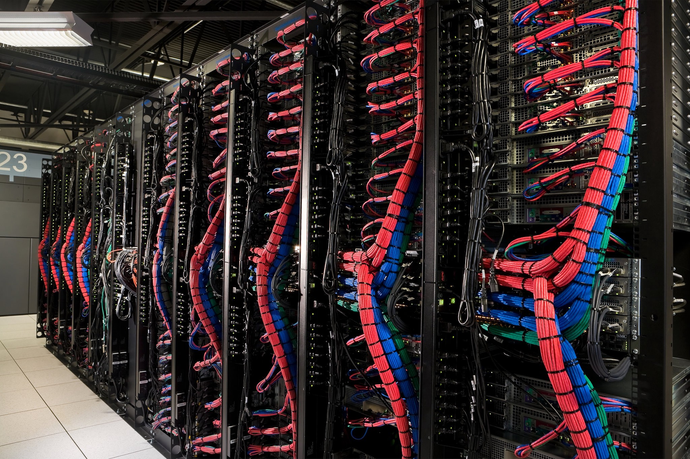

A single corporation — Comcast — controls 56% of America’s broadband internet. And it’s the [most-hated corporation in America](http://www.ibtimes.com/americas-top-hated-companies-comcast-bank-america-mylan-lead-survey-2474375).

Then there’s AT&T, which — together with Verizon, its former subsidiary — dominates 2/3rds of the wireless internet market. 

Together these companies control the most sophisticated lobby on Earth. Last month they convinced hundreds of congressmen to kill a 

What these ISPs want is blindingly obvious. They want more money. Now they can get it from selling your internet browsing history — and other data — to corporations and governments. But that’s not enough. They want to kill the open internet we all know and love, and turn it into something that resembles the much more profitable cable TV model.

  

On its quest to make even more money (after tax profit in 2016 was 

Comcast and a handful of other Internet Service Providers (ISPs) have hi-jacked the FCC — the government agency that’s supposed to be regulating them. They’ve installed one of their own former lawyers, Ajit Pai, as its Chairman. Pai is rapidly tearing apart all the consumer protections the government put in place over the past years.

The ISPs have been using their enormous cashflows to lobby politicians, contribute to their re-election campaigns, and sponsor political ads. And they have the political power to extort even more monopoly rent from consumers than they did before.

And right now, ISPs have their eyes on destroying the most important consumer internet protection of all: **Net Neutrality**.

Net Neturalit 

Currently, the internet is just a network of dumb pipes, which send data without discriminating. This is the same way that your electricity and your water work. The same pipe sends water to your house without asking what you’re going to do with it. Are you going to take a shower? Are you going to run your dishwasher? It doesn’t matter. It’s your water. Do with it what you like.

ISPs want to kill Net Neutrality. And they’ve bought off most of congress.

As part of the ISPs’ push to revoke 

  

My notes:

Myth: If I’m paying for high speed internet, it’s broadband.

Reality: Broadband is now defined as 25 megabits per second downloading and 3 megabits per second uploading. Most Americans don’t get internet that’s that fast.

The definition was changed by the FCC in 2015 to make it harder for ISPs to pretend that 1990s-era speeds were broadband.

Myth #: there are people out there who actually think getting rid of Net Neutrality is a good idea.

Reality: 99% of the 3.7 million people who wrote in during the FCC’s requests for feedback were either strongly in favor of Net Neutrality or at least weren’t opposed to it.

The ISPs have used their money to put together coalitiions of people willing to accept that money, who will say they’re opposed to net neutrality. These include the NAACP ([https://theintercept.com/2017/02/13/naacp-trump-netneutrality/](https://theintercept.com/2017/02/13/naacp-trump-netneutrality/)), and even random roofing companies in XXXX (link). But the reality is that very few people think net neutrality is bad.

The problem is that most people don’t know what net neutrality is, as shown by this heavily biased study conducted by the telecom companies themselves.

 — -

Myth #1: Net Neutrality is a way for the government to “pick winners”

Reality: The government picked the winners long ago. 

56% of Americans have only one broadband option in their area — 

  

Myth #: fines will keep these monopolies from breaking the law.

Reality: Telecoms make so much money that they can treat fines as just another cost of doing business.

For example (IN YEAR), New York’s attorney general, Eric Schneiderman, spent months suing Time Warner Cable for defrauding its customers. They were advertising much faster speeds than they actually delivered. Time Warner may have intentionally neglected to improve their performance so they could strong-arm Netflix and Riot Games (makers of League of Legends) into paying more to reach their customers — and deceived the FCC in the process.

The attorney general won the lawsuit, said Time Warner also worked in secret with the goal of confusing the Federal Communications Commission. (SOURCE)

(FINE AMOUNT)

When you make billions of dollars a year in profit, settling a few hundred million-dollar lawsuits isn’t a big deal. If consumers in your region have no choice but to use your services, your reputation doesn’t matter. Your cash flow can allows you to systematically break the law.

Myth#: Upgrading infrastructure is expensive. If we get rid of Net Neutrality, ISPs will have more money to invest in improving their speeds.

Reality: ISPs distribute billions of dollars each quarter to shareholders. If they really cared about improving their speeds, they would re-invest some of that.

And the infrastructure in question isn’t that expensive to upgrade. You don’t need to lay new fiber optic cable to achieve high speeds. You can achieve tens of megabits per second — as high as 100 megabits in some cases — with conventional copper wiring.

The basic R&D costs necessary are nothing that would necessitate dismantling Net Neutrality to extract more money out of websites (who are already paying ISPs for their own internet access, by the way.)

Myth #: ISPs need to invest in smart routers and inspect packets so they can send data faster.  
Reality: devices need to make these decisions anyway, and the logic can be built into them. The ISP needs only to increase the volume of information (like a power grid increases the amount of power distributed). (widely cited paper: [http://www.ece.ucdavis.edu/~chuah/classes/eec273/eec273-w12/refs/SRC84-e2e.pdf](http://www.ece.ucdavis.edu/~chuah/classes/eec273/eec273-w12/refs/SRC84-e2e.pdf))

ISPs want to selectively slow down traffic from the websites who can’t afford to fork over extra fees. That’s why they want to get rid of net neutrality — so websites will have to pay “protection money.”

Myth #: Net Neutrality will hurt minority communities by “stifling investment in underserved areas.”

Reality: ISPs has funneled millions into civil rights groups like the National Urban League, the NAACP, and the League of United Latin American Citizens. They’ve done this in exchange for their condemnation of the FCC’s Net Neutrality rules.

Net Neutrality has nothing to do with “investment in underserved areas.” The ISPs instead have refused to build rural internet in those places because they claim it’s not profitable enough for them. The IPSs have even lobbied (successfully in many states) to ban public broadband networks. Currently (N% of Americans) don’t have access to broadband.

The bottom line is that these cash-strapped civil rights groups are being played like pawns by ISPs. Giving up net neutrality will harm these groups as much as anyone.

Myth #: We need utlra-fast broadband.

Reality: Even the most data intensive tasks — watching HD video — only require 25mbs. Upgrading infrastructure isn’t as necessary as the cable companies want you to think.

Myth #: intentionally slowing down websites will annoy users, but it won’t make the web unusable.

Reality: a delay of 1/4 of a second is enough to make users leave a website.

Both Microsoft and Google have done independent studies confirming that a delay of as much as 250 milliseconds — the time it takes to blink your eyes — will cause a significant drop off. In practice, if you are a small business and you can’t afford to pay ISPs “protection money” to prevent them from slowing down your website, traffic to your website will plummet.

Myth #5: Providing broadband is somehow harder than providing water, electricity, or other utility.  
Reality: It’s not. What applications need is dumb pipes that deliver bits.

Myth #6: ISPs provide a valuable service in preventing malware from spreading.  
Reality: This is better handled by the software itself. This is the End-to-End argument, and it predates the internet itself. In 1984, this widely-cited article explains how ([http://www.ece.ucdavis.edu/~chuah/classes/eec273/eec273-w12/refs/SRC84-e2e.pdf](http://www.ece.ucdavis.edu/~chuah/classes/eec273/eec273-w12/refs/SRC84-e2e.pdf))

Myth #7: Privacy is still possible on a smart grid.  
Reality: It isn’t. Not only can ISPs use “deep packet inspection” to literally read the contents of what you’re doing — not just the metadata. And if you’re using end-to-end encryption — including calls to domain name servers — which you should — they won’t be able to help you anyway. “network intelligence doesn’t relieve end systems of the requirement to check inbound data for errors and to rate-limit the sender, nor for a wholesale removal of intelligence from the network core.”

Myth #8: Netflix/BitTorrent/Telecom Boogieman of the month is the reason for congestion, and why my internet.  
Reality: The ISPs purposefully slow down your traffic to try and extort rent from content providers. (NY lawsuit against Time Warner)

Myth #9: “Several civil rights groups, such as the National Urban League, Jesse Jackson’s Rainbow/PUSH, and League of United Latin American Citizens, also oppose Title II net neutrality regulations,\[155\] who said that the call to regulate broadband Internet service as a utility would harm minority communities by stifling investment in underserved areas.”

Reality: The ISPs are paying these groups a ton of money to betray their constituents’ interest. At the same time, they’re blocking things like municipal internet efforts and crushing upstarts that would make this more possible.

When you’re holding the deregulation hammer, everything looks like a nail. Net Neutrality also looks like “regulation” that you want to beat down. But it isn’t. Net Neutrality is bare-bones regulation, and the only alternative is actually even more regulation.
