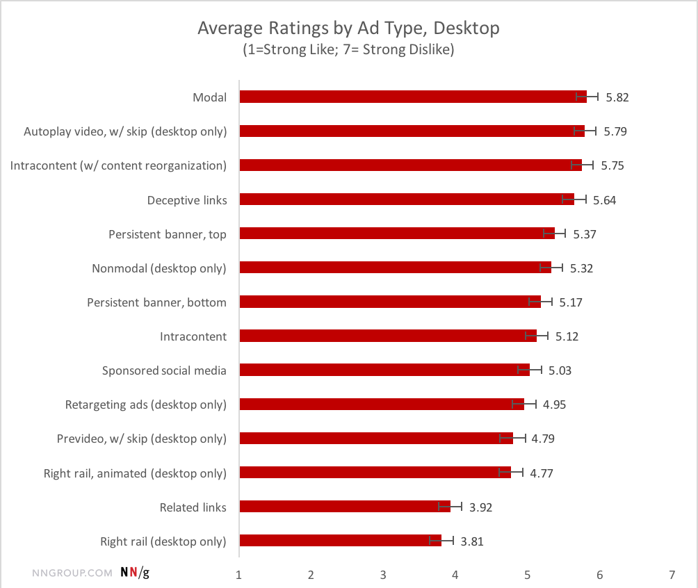
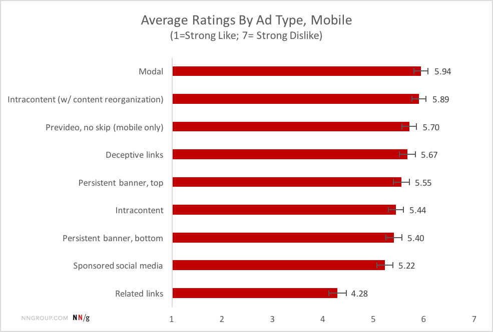
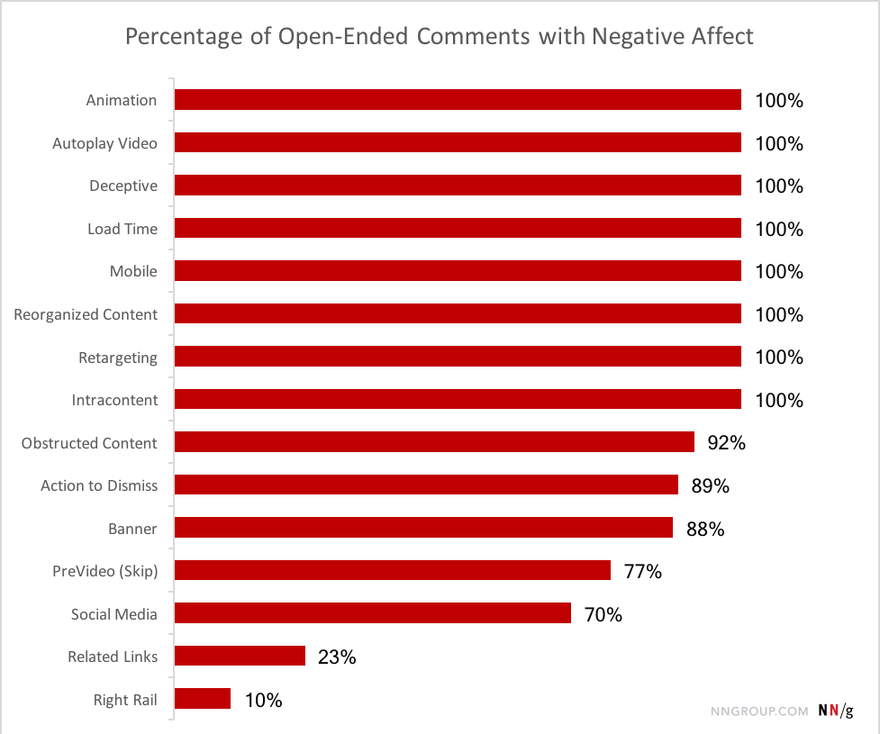
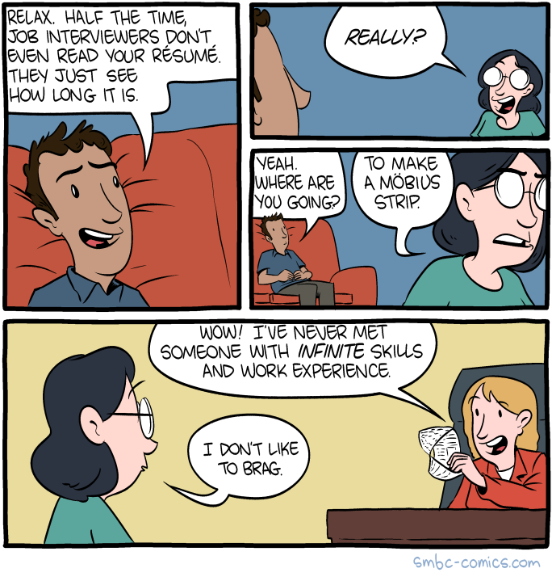
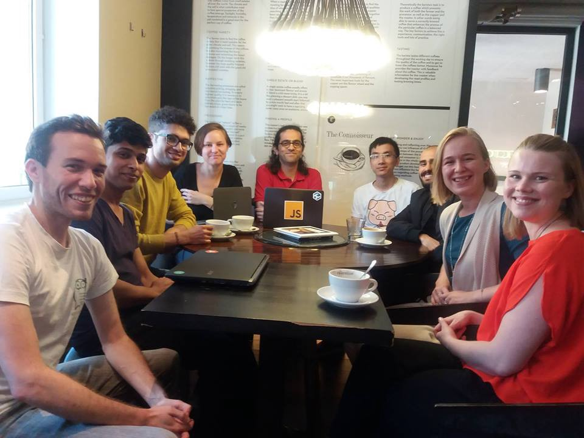

You know that feeling when you’re scrolling through a blog post and then — BAM! — one of those “Sign up for our newsletter” modals pops up?

This is the most-hated type of ad that websites use. And there are plenty of other advertising anti-patterns.

The Neilson Group surveyed 452 Americans who were not employed in IT or advertising, and asked them to rate various types of ads on a scale of 1 to 7 in terms of how much they disliked them.

They did this for both desktop and mobile ads. Here are their results for desktop ad types. (The longer the red bar is, the more hated the advertising technique is.)

And here are their results for mobile ad types:

Nielsen also asked survey respondents to list anything they found annoying about ads in general. Here’s what they said:

If you have a website, I recommend you avoid using pop up modals to try to convince your users to do something. It may work on some people, but it’s clear that most people are annoyed by this.

Here are some other take-aways from the study:

1.  Don’t auto-play videos — especially not with sound. This eats up tons of your users’ bandwidth, and annoys people.
2.  Make the destination of each of your links as unambiguous as possible. When your users click on a link, they’re trusting you to not waste their time. Don’t jeopardize that trust by deceiving them about where the link goes.
3.  Don’t use fixed banners at the top of your page. Allow your users to scroll past content they don’t want to see any more.
4.  Don’t use “intracontent” ads that appear as the page loads, or as your user scrolls through your content. People hate it when the the paragraph they’re reading gets pushed out of view.
5.  Don’t use animated ads. People hate them.
6.  Any ad type that is annoying on desktop will be even more annoying on mobile, where screen space is more limited, clicking on closing X’s is harder, and you have to scroll to find auto-playing videos and shut them off.

If you must run ads, Nielsen recommends using ads on the right side of your content, or “related links” at the bottom of articles. These are least-likely to offend your users.

And just a friendly reminder — [freeCodeCamp](https://www.freecodecamp.com) is completely ad-free and will stay that way! :)

You can read Nielsen’s full analysis here: ([10 minute read](https://fcc.im/2qZ5YHP))

### Here are three links worth your time:

1.  Here are 435 free online programming and computer science courses you can start in June ([1 to 26 minute browse](https://fcc.im/2sdMuyM))
2.  Writing a chess microservice using Node.js and Seneca ([6 minute read](https://fcc.im/2qZlxPT))
3.  Try, Catch, Finally, and Throw: Error Handling in JavaScript ([6 minute watch](https://fcc.im/2qYIena))

### Thought of the day:

> “A pinch of probability is worth a pound of perhaps.” — James Thurber

### Funny of the day:

Webcomic by [Saturday Morning Breakfast Cereal](https://fcc.im/2r0zJ66)

### Study group of the day:

[freeCodeCamp Helsinki](https://fcc.im/2qZfFGf)

Happy coding!

– Quincy Larson, teacher at [freeCodeCamp](http://bit.ly/2j7Q1dN)

If you get value out of these emails, please consider [supporting our nonprofit](http://bit.ly/donate-to-fcc).
