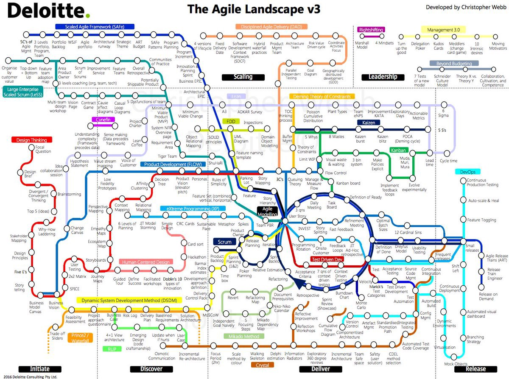

Here are three links worth your time:

1.  Nobody wants to use software ([4 minute read](http://bit.ly/2jeObno))
2.  JavaScript’s Prototypal Inheritance Explained Using CSS ([8 minute read](http://bit.ly/2k3kGZU))
3.  Be careful what you paste from a website into your terminal ([1 minute read](http://bit.ly/2ksUR6a))

### Thought of the day:

> ”Computers are getting smarter all the time. Scientists tell us that soon they will be able to talk to us. (And by ‘they’, I mean ‘computers’. I doubt scientists will ever be able to talk to us.)” — Dave Barry

### Image of the day:

This subway map shows how agile software development methods relate to one another. ([bigger image](http://bit.ly/2jZyMv1))

Happy coding!

– Quincy Larson, teacher at [freeCodeCamp](http://bit.ly/2j7Q1dN)
