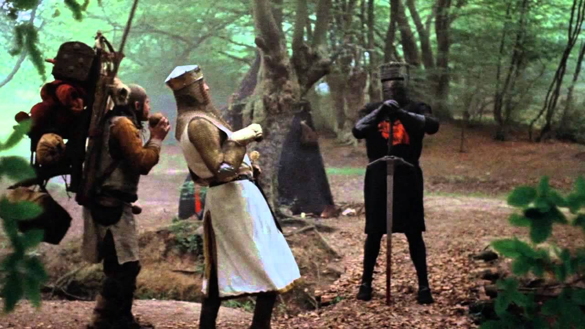

> “And the Lord said unto Moses, Come up to me into the mount, and be there: and I will give thee tablets of stone, and a law, and commandments which I have written; that thou mayest teach them.” — Exodus 24:12

And what did those tablets say?

-   Thou shalt not throttle. 
-   Thou shalt not block. 
-   Thou shalt not charge for priority access.

Actually, those were the commandments the US Federal Communications Commission gave the telecom monopolies in 2015. 

These Bright-Line Net Neutrality Rules were intended to stop the telecom companies from creeping forward and wrapping their tendrils around every aspect of the internet.

Let’s talk about who these telecom companies are, what exactly they do, and how their greed will ruin the internet if we don’t stop them.

_“Most of the original motivations for having an FCC have gone away. Telecommunications network providers and ISPs are rarely, if ever, monopolies. If there are instances where there are monopolies, it would seem overkill to have an entire federal agency dedicated to ex ante regulation of their services. A well-functioning Federal Trade Commission (FTC), in conjunction with state authorities, can handle consumer protection and anticompetitive conduct issues.” — _

  

Here’s why the telecom monopolies want the FTC to take over regulation of their industry: the FTC has no power to enforce anything. 

It’s like wolves arguing to a shepherd that the sheep aren’t don’t need dedicated sheep dogs to protect them, and that the sheep can instead be guarded by migratory birds flying that occasionally fly overhead.

  

>   

**2002:** the FCC decided to treat cable internet access and DSL internet access for regulatory purposes by deregulating cable.

2003: Law professor Tim Wu coined the term “net neutrality”

March 2005: The FCC ordered ISPs to stop blocking Voice over Internet Protocols like Skype.

June 2005: The Supreme Court ruled that the FCC was free to leave cable and DSL internet access unregulated.

> _“They don’t have any fiber out there. They don’t have any wires. They don’t have anything! They use my lines for free — and that’s bull. For a Google or a Yahoo or a Vonage or anybody to expect to use these pipes for free is nuts!” — AT&T CEO Edward Whitacre in 2005 admitting that he wants to charge websites fees for them to be able to reach their users_

  

September 2007 — Comcast blocks BitTorrent. After initially denying that they were blocking it, they finally admit it. They stop blocking it in when the FCC forces them to allow it.

  

> _“The internet is not some truck you dump something on — it’s a series of tubes!” — Alaska Senator Ted Stevens_ [_in 2005_](https://www.youtube.com/watch?v=f99PcP0aFNE) _arguing that companies should have to pay money to send data over the internet_

  

  

  

  

  

  

  

  

  

  

  

  

  

  

  

  

  

  

  

  

  

Prepare yourself for one of the longest, most Monty Python reference-filled articles ever net neutrality. 

Yes — net neutrality. A 

  

Let’s storm the Castle of Aaarrrrggh.

  

We demand a shrubbery.

  

Bring out your dead.

  

  

  

It’s just a flesh wound.

  

His mother was a hamster and his father smelled of elderberries!
