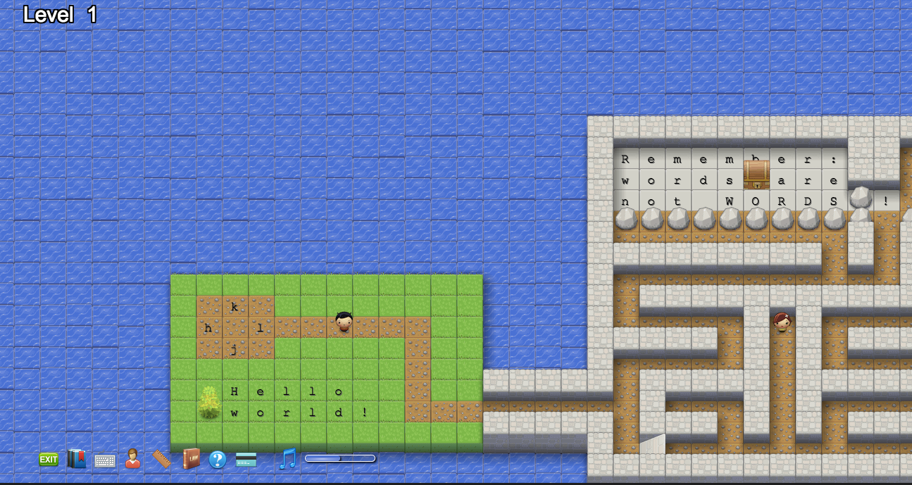

](./asset-1.jpeg)

Vim is a popular keyboard-only code editor originally released in 1991. It is famously difficult to learn, but many developers swear by it — including freeCodeCamp CTO [Berkeley Martinez](https://fcc.im/2rQMbWR).

Vim is installed on pretty much every Linux- or Unix-based computer, and if you accidentally open it, it’s quite difficult to exit.

Stack Overflow [just announced](https://fcc.im/2qSxIN5) that they hit a new milestone: more than 1 million developers have visited Stack Overflow trying to figure out how to exit Vim.

](./asset-2.png)

If you find yourself trapped in Vim, you can usually exit by doing the following:

1.  press escape to enter “Master” mode
2.  then type `:` to enter “Last Line” mode
3.  then type `q` and hit enter.

This should exit. If it doesn’t, repeat these steps using `q!` instead to force-quit.

If you want to save any changes you made to the file, you can add a `w` to these commands (w stands for “write”): `wq` or `wq!`

If you need to change something on a Linux server, and haven’t invested dozens of hours in getting good at Vim, you can open a file with a much simpler built-in editor called Nano by typing: `nano [filename]`

And if you want to get better at Vim, check out [Vim Adventures](https://fcc.im/2rQka1J), a Zelda-like game controlled by using Vim commands.

**I only write about programming and technology. If you** [**follow me on Twitter**](https://twitter.com/ossia) **I won’t waste your time. 👍**
