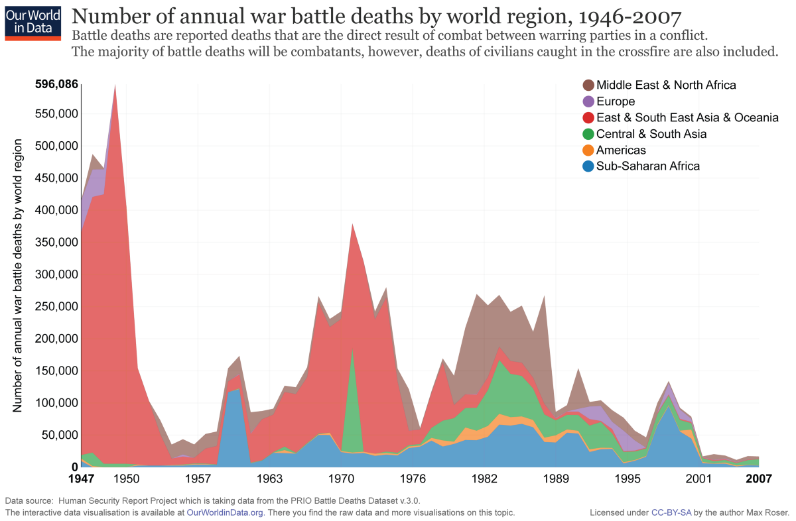

  

  

When you look forward, you’ll see challenges. But when look backward, you’ll see even more challenges that we’ve solved.

And that’s what we’re going to do with this story. I’m going to show you challenge after challenge that we as a species have largely solved. I’m going to explore how we solved these. 

And from these solutions, you can find inspiration to go out and solve the challenges of the day.

  

  

  

  

  

  

  

  

  

  

And if you remove 

  

But unlike Max’s article, I will show you no such mercy. I am going to beat you over the head with just how good we all have it.

  

  

  

  

: More than 2/3 of respondents would prefer to be middle class in our century over being rich in the previous century](./asset-1.png)

  

> The force of economic growth over time has given middle class people in America today things that would have been regarded as miracles a century ago. And having access to those miracles is worth an enormous amount. — Economist Tim Taylor

  

  

Free Love and Cold War

  

  

  

  

  

2016 was the worst year ever, right? Well, if you look at it within the context of human history, it was one of the greatest!

  

  

  

  

  

  

  

  

  

  

  

  

  

  

  

  

  

  

  

  

  

  

  

  

  

  

  

  

Politics

Life expectancy
