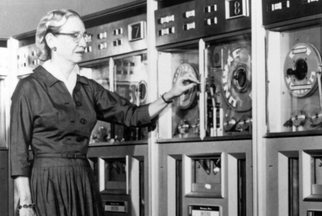

This morning I woke up to dozens of messages from students who had read an article titled “Please Don’t Learn to Code.”

At first, I assumed [Jeff Atwood’s 2012 article](http://blog.codinghorror.com/please-dont-learn-to-code/) had spontaneously reappeared on Reddit. But no — this was a [brand new Tech Crunch article](http://techcrunch.com/2016/05/10/please-dont-learn-to-code) of the same name, which echoed Atwood’s assertion that encouraging everyone to learn programming is like encouraging everyone to learn plumbing.

Here’s why programming — unlike plumbing — is an important skill that everyone should learn: **programming is how humans talk to machines**.

> “Everyone needs computer programming. It will be the way we speak to the servants.” — John McCarthy

#### People have been managing other people for thousands of years.

The ancient Romans built their empire on the backs of slave labor. The British built their empire by imposing their will on the residents of dozens of colonies. And America became the economic force it is today largely thanks to cheap immigrant labor during the industrial revolution.

But here in the 21st century, we no longer get work done by managing people who tend grain fields, import spices from Asian colonies, or install railroads across the Rocky Mountains.

Now we get work done by managing machines.

#### **The nature of work has fundamentally changed.**

Today, it is no longer humans who do most of the work — it’s machines.

Think about it — every day, humans make 3.5 billion Google searches. It’s machines that carry out that work — not humans.

Think about how many man-hours it would take for humans to conduct even a single Google search manually. Can you imagine a bunch of PhD’s phoning each other around the clock deliberating about which documents they should recommend to whom? This work is only even remotely practical if it’s done by machines.

Trip Advisor helps you decide where to go for vacation. Expedia helps you book the right flight to get there. Google Maps directs you to the airport. All of these services are within the reach of average consumers thanks to the hard work of machines.

But machines are only able to do all this work because humans tell them exactly what to do. And the only way for humans to do this is by writing software.

That’s right — computers are not nearly as smart as humans. For computers to succeed at the jobs we’ve assigned them, they need us humans to give them extremely clear instructions.

That means coding.

#### Coding isn’t some niche skill. It really is “the new literacy.”

It’s the essential 21st century skill that every ambitious person needs to learn if they want to succeed.

Don’t believe me? Just look at the legal profession. Software is turning it inside out, and [causing mass unemployment](http://www.abajournal.com/magazine/article/whos_eating_law_firms_lunch) for the lawyers who can’t code.

The same is increasingly true for managers, marketers, accountants, doctors, and pretty much every white-collar job in between.

And that’s to say nothing of the 3 million Americans whose jobs primarily involve driving a car, and billions of people world-wide who do other repetitive tasks that will soon be handled more inexpensively and effectively by machines.

I’m hopeful that these displaced workers will be able to retrain for new jobs through inexpensive education programs like Starbuck’s partnership with Arizona State University — where all of its employees get a free college education (hopefully picking up relevant new skills like software development) — or government-sponsored equivalents.

At the very least, they’ll have access to a free math and computer science education through initiatives like EdX, and a free programming education through Free Code Camp.

#### Program or be programmed.

We have a concept in software development called “the technology steamroller”.

> “Once a new technology rolls over you, if you’re not part of the steamroller, you’re part of the road.” — Stewart Brand

You can’t stop technology. You can only adapt to it.

Once a history-shaping new technology comes out of the genie bottle, you can’t put it back. This was true for airplanes, antibiotics, and nuclear warheads. And it’s true for microprocessors, the internet, and machine learning.

Those who adapt to these permanent waves of changes flourish. Those who shrug them off — or fail to even realize they exist — asymptotically approach irrelevance.

Coding is the new literacy. Like reading was in the 12th century, writing was in the 16th century, arithmetic was in the 18th century, and driving a car was in the 20th century.

And just like how not everyone who learns to write will go on to become a professional writer — nor everyone who learns arithmetic will go on to become a professional mathematician — not everyone who learns to code will go on to become a software developer. But all people who learn these things will be immensely better off as a result of their efforts.

Think of your ability to read the labels on your prescription drugs, or your ability to count the money that a banker hands you when you make a withdrawal. There’s something equally important that you can do if you can code: take tedious parts of your daily life and automate them.

And some people take this basic skill much further, as a way to [amass great personal wealth](http://www.businessinsider.com/a-google-programmer-blew-off-a-500000-salary-at-startup--because-hes-already-making-3-million-every-year-2014-1), or to [make the world a better place](https://www.youtube.com/watch?v=G7UHzdvkd-Q&index=3&list=PLWKjhJtqVAbnQ048Pa8sAqJoVRhx8TJtM).

#### Ships are meant for sailing

> A ship in port is safe, but that is not what ships are for. Sail out to sea and do new things. — Grace Hopper

Computers, at their core, are number crunching machines.

Human brains, at their core, are learning machines.

It may seem like you’ll never be able to code. It may seem like you’re just not wired for it.

And there will probably be a parade of people behind you who’ve tried to learn to code, given up, and are eager to commiserate with you.

And these people will read articles like the Tech Crunch article, and share them on Facebook — like 14,000 people did yesterday — further discouraging the millions of people around the world who are working hard to achieve this new literacy.

But coding detractors are probably incorrect about their inability to learn coding. There’s a growing sentiment among educators and cognitive scientists that any able-minded person can learn to code — just like you can learn to read, write, do arithmetic, or drive a car.

<Embed src="https://www.youtube.com/embed/JC82Il2cjqA?feature=oembed" aspectRatio={undefined} caption="A Khan Academy video about the value of maintaining a [growth mindset](https://en.wikipedia.org/wiki/Mindset#Fixed_mindset_and_growth_mindset) — essentially, believing in yourself." />

Sure, people with dyslexia have a harder time reading, people with dyscalculia have a harder time doing math, and both have a harder time programming. But even these are limitations that can be overcome, and [programmers overcome limitations every day](https://www.quora.com/Can-anyone-learn-how-to-code/answer/Quincy-Larson).

So heed Grace Hopper’s advice. Sail out to sea and learn new things. Put that learning machine in your head to use.

Learn to code. Learn to talk to machines. And flourish.

**I only write about programming and technology. If you** [**follow me on Twitter**](https://twitter.com/ossia) **I won’t waste your time. 👍**
