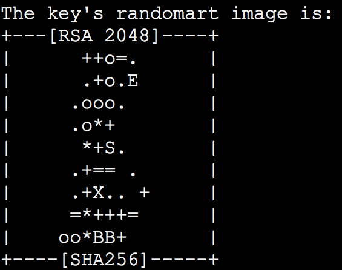

When I first learned how to code, one of my first tasks was setting up an SSH key so I could use encryption to securely connect to my friend’s Linux server.

I ran the command:

```
ssh-keygen -t rsa
```

Then my computer created my SSH keys and spat out this “randomart”:



“What is this?” I asked, squinting at the randomart and trying to bring order out of the chaos.

My friend leaned over my shoulder and said, “Oh, that’s a randomart. It looks like you got a cute little cryptographic Christmas tree.”

I kind of squinted and turned my head. Sure enough, it did look like kind of like a Christmas tree!

It turns out these randomart are quite useful. As jumbled as they may appear, they’re a [lot easier for humans to differentiate between](http://unix.stackexchange.com/a/144727) than long strings of hex code.

Compare these two randomart:

```
+--[ RSA 2048]----+
|        .        |
|       + .       |
|      . B .      |
|     o * +       |
|    X * S        |
|   + O o . .     |
|    .   E . o    |
|       . . o     |
|        . .      |
+-----------------+

Versus:

+--[ RSA 2048]----+
|       .o o..    |
|       o +Eo     |
|        + .      |
|         . + o   |
|        S o = * o|
|           . o @.|
|            . = o|
|           . o   |
|            o.   |
+-----------------+
```

Now try comparing these two strings of hex code:

```
2048 1b:b8:c2:f4:7b:b5:44:be:fa:64:d6:eb:e6:2f:b8:fa 192.168.1.84 (RSA)

Versus:

2048 1b:27:ac:a5:76:28:2d:36:63:1b:56:4d:eb:df:a6:48 192.168.1.84 (RSA)
```

See what I mean? Therefore randomart. QED.

### A strange holiday tradition

Fast forward to last week. [Michael D. Johnson](https://medium.com/@CodeNonprofit) was trying to convince me that our open source community should design an ugly sweater for the holidays.

I’d never owned an ugly sweater except for one my aunt had knitted for me. And I didn’t even realize that it was an ugly sweater until years later, when I was flipping through my grandma’s scrapbook and encountered horrifying picture of myself wearing it.

Still, Michael convinced me that ugly sweaters [were indeed a thing](http://newsfeed.time.com/2011/12/22/a-brief-history-of-the-ugly-christmas-sweater/).

“People throw ugly sweater parties!” he told me. “You put on the ugliest Christmas sweater you can find, then go drink [eggnog](https://en.wikipedia.org/wiki/Eggnog) together!”

A quick Google search confirmed he was right. I had been living in a bubble all these years, and had missed out on the splendor of ugly sweater parties.

### Designing the ugly sweater

So I brainstormed for a while. What was the ugliest thing I could imagine related to programming? Minified CSS? A C++ stack trace?

That’s when I remembered my first SSH key randomart, and my friend’s comment about how it looked like a Christmas tree.

I hopped on the phone with [Wesley Searan](https://dribbble.com/Searan), a graphic designer in Austin, Texas. Wesley and I threw design ideas back and forth for a few days.

I did the agile thing and [tweeted out](https://twitter.com/ossia/status/803266288009129984) a rough draft of our design to get feedback from our community.

People wanted us to remove the XMAS 2016 (which I’d used in place of the RSA 2048) so they could wear the sweater subsequent holidays. And they wanted T-shirts and hoodies as well. So we made those available.

As always, we made these assets creative-commons licensed, and put them up on Free Code Camp’s [assets repo](https://www.github.com/freecodecamp/assets) for everyone to play with.

Here’s what [the finished sweater](https://www.freecodecamp.com/shop) looks like, complete with cheesy background:


So now you can throw your ugly Christmas sweater party, or just wear one to family gatherings. You’ll be the geekiest-looking person there (which is a good thing!) in your awesome SSH key randomart ugly sweater.

These will be available in [our community’s shop](https://freecodecamp.com/shop) for the next few days, so pick one up.

Happy encrypting!

---

Thanks for taking time out of your busy day to read my article. If you liked it, click the 💚 below so other people will see this here on Medium.


